    
As a follow-up on my previous post, I wanted to go into further detail on how the Angular application was built; right from the ground up.

<svg preserveAspectRatio="xMinYMin meet" class="svg-content" viewBox="0 0 620 300" id="angularjs_project_2"></svg>
<script type="text/javascript" src="/user/pages/01.blog/angularjs_project_2/angularjs_project2.js"></script>
<br>

===

!!!! If you haven't read [Part 1](http://www.gregorykelleher.com/blog/angularjs_project), I recommend giving that a browse, as it gives some background into what I'm about to discuss. Or if you'd like, check out the complete codebase on [Github](https://github.com/gregorykelleher/MuHub_Angular_App).

Although just a quick recap, the application is called [MuHub](https://cs353-project.firebaseapp.com/#/login) and it's an online student tool for Maynooth University students. The application originated from a designated group project as part of one of my university modules.

In my previous blog post I mostly stuck to discussing the project workflow, source control methods and the overall development environment we built around the application.

However in this post I wanted to delve deeper into the application's inner-workings and explain how this thing got off the ground!

###AngularJS & Angular Material

If you haven't already guessed from the title, this app is built around AngularJS v1 and leverages the Angular Material Framework.

The [Angular Material Framework](https://material.angularjs.org) was chosen because it could provide many of the convenient UI components for building the interface, freeing attention to focus on the functionality alone.

What results is a beautiful, responsive application that conforms to Google's Material Design Specifications. 

Importing Angular Material was just a matter of `npm install angular-material` and adding it as the `ngMaterial` dependency.

```js
angular
.module('app', ['ngMaterial','ui.router', 'main', 'firebase', 'ngMap', 'ngSanitize'])
```

It's fair to say the Material Framework was used extensively throughout the application! 

Unfortunately it's still in development for Angular v2, hence why we stuck with Angular v1. We figured working with tools that are still under active development could potentially lead to trouble. The sort of trouble that only rears its head halfway through development...


The above image is the landing page for the application upon login. Immediately one can discern that we chose a card-based layout with tab navigation - a very typical Material UI design.

The Angular Material framework provides the necessary directives for building this interface responsively - through the use of unique `md-grid-list`, `md-grid-tile` and `md-card` tags.

!!! For those familiar with [flexbox](https://css-tricks.com/snippets/css/a-guide-to-flexbox/) in CSS, grids with Angular Material are almost the exact same.

This is just a minor insight into Angular Material, but I'll touch upon it more once I get into more detail on things.

###Firebase


Firebase was chosen as the backend database for the application. It was my first experience with a non-relational database based on JSON but I slowly built up speed with it.

I was surprised how seamlessly Firebase integrated with the app and how quick it was to get setup. The *Firebase CLI* is well worth a mention too. It allows you to manage, view, update and deploy from the shell with ease.

Like most things, it's installed with `npm install -g firebase-tools`.

Simple commands such as `firebase init` would generate the necessary `.firebaserc`, `firebase.json` and `database.rules.json` files for your project.

Then with the project intialised, you can get going with `firebase serve` to throw up a local server or even `firebase deploy` to deploy remotely on Firebase servers.

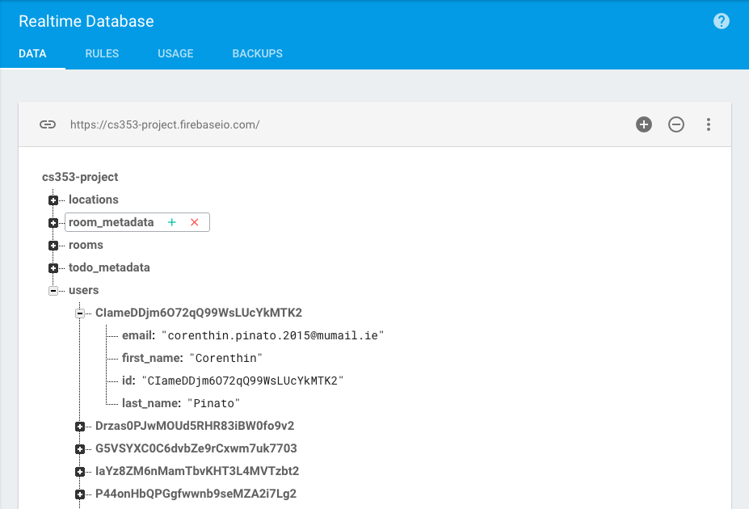

Above you can get an idea about how data is structured in a hierarchical way as a tree of JSON objects. Unlike say, a SQL database, there's no tables or columns in sight!

This was a complete flip on what I knew about databases so I had to change my thinking pattern when it came to Firebase. For one, I had to learn best practices when it came to structuring my data in a non-relational manner. 

For example, I soon ran up against the issue of repeatedly nesting data down a rabbit-hole of nodes. This is a bad idea because when Firebase fetches the data at the specified location, it will also retrieve all of its child nodes. Not great in terms of efficiency then.

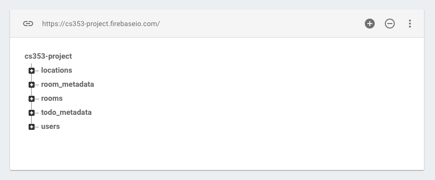

To counter this, I kept the data structure as flat as possible (denormalisation) in order to avoid constantly iterating down, through node and node. See the image above for context.

### AngularFire

But now with Firebase setup - how do you interrograte the database and take advantage of Firebase's features through AngularJS? The answer is [AngularFire](https://github.com/firebase/angularfire).

AngularFire is the binding Firebase has for AngularJS. It provides several Angular services that open up some useful Firebase functions, including but not limited to:

| Service | Description |
| ------:| -----------:|
| `$firebaseObject` | synchronised objects |
| `$firebaseArray` | synchronised collections |
| `$firebaseStorage` | store and retrieve user-generated content like images, audio, and video |
| `$firebaseAuth` | authentication, user management, routing |

With tools like these, you can enable true three-way data binding between the DOM, your Angular logic and the Firebase backend.

!!! You can add it as a script or simply install with NPM using `npm install angularfire --save`

I used AngularFire extensively throughout the application and I even created two short & useful factory methods to call the FireBase Authentication and Database services, `Auth` and `Data` respectfully.

```js
/* Angular Firebase Services */

.factory('Auth', ["$firebaseAuth", function($firebaseAuth) { return $firebaseAuth(); }])
.factory("Data", function() { return firebase.database().ref(); })

```

For instance, in my Angular controller code I could then call on these custom factory methods to provide the necessary Firebase methods I needed. 

For example, I often needed to get the current user's unique identifier (UID) for validation. 

I could do this in a single line with: 

```js
$scope.current_user_id = Auth.$getAuth().uid;
```

Or similarly, I could use `Data` to pick up on the child node called _users_ in my Firebase database. Now with the current user's UID I found with `Auth` I can target that user's data contained in the _users_ node.

```js
Data.child('users').child($scope.current_user_id).once('value', function(item) ...
```

Putting it all together, I can write a few lines of code to gather all the users in my data minus the current user. I can then use this example for displaying all the contactable users the current user has access to. Since it wouldn't make sense to be able to contact yourself, I remove the current user from the list.

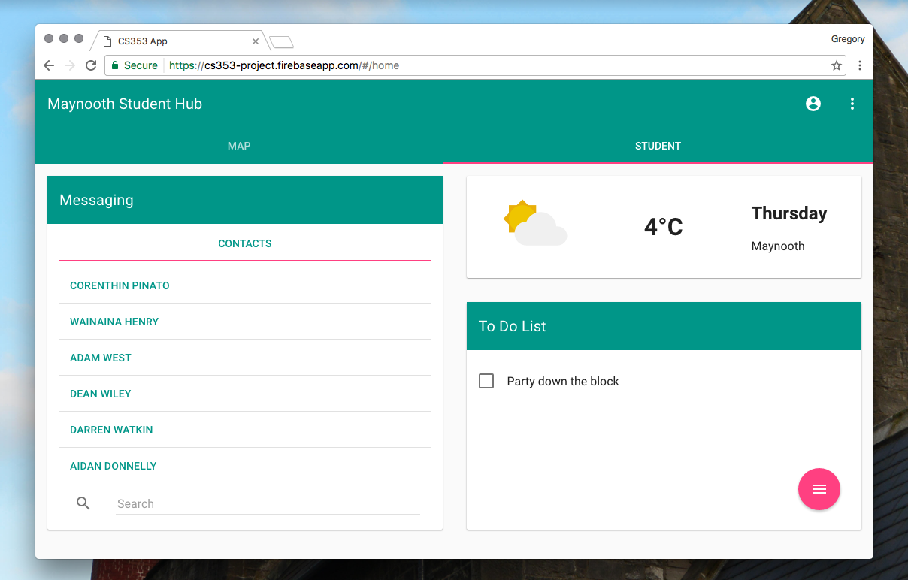

```js

var room_list = $firebaseArray(Data.child('users'));

$scope.current_user_id = Auth.$getAuth().uid;
$scope.users = [];

// remove current user from list; for display purposes only

room_list.$loaded()
	.then(function() {
	angular.forEach(room_list, isCurrentUser);
});

var isCurrentUser = function (user, uid) {
	uid = $scope.current_user_id;
	if (user.id != uid) {
		$scope.users.push(user);
	}
}

```

As you can see in the example above, I use the `$firebaseArray` service to get an array of data from the _users_ node. 

I use the `$loaded` promise to wait until the data is loaded to take action. I then iterate over the `$firebaseArray` and execute the callback function `isCurrentUser` to check for a matching UID in the database.

Until I find a matching UID I continue to push each non-matching user into my `$scope.users` array. Pretty straightforward and super useful.

###Angular UI Router

Another package I installed via NPM was _Angular UI Router_ (which is akin to _ngRoute_). It's an add-on routing SPA (single page application) framework which allows users to navigate the application.

Using UI-Router, I could restrict and extend access to each of the application's views based on user privileges. So rather than changing your application views based on simply the route URL, it's based on the *state* of the application instead.

```
$stateProvider
	.state('home', {
		url: '/home',
		views: {
			'dash_toolbar': {
			templateUrl: 'app/views/dash_toolbar.html',
			controller: 'dash_toolbar_controller',
			controllerAs: 'dt'
		},
		'dashboard': {
			templateUrl: 'app/views/dashboard.html',
			controller: 'dashboard_controller',
			controllerAs: 'dc'
		}
	},
	resolve: {
		currentAuth: ['Auth', function(Auth) {
			return Auth.$requireSignIn()
		}]
	},
})
```

In the above example you can see I have my `home` state with `resolve` further down. Inside `home` I have my different views listed with associated controllers. 

However, in order to access `home` the user must first be validated, hence the `resolve` functionality which requires user to sign in beforehand.

```
<body ng-app="app">
    <div class="container">
        <div ui-view></div>
        <div ui-view="dash_toolbar"></div>
        <div ui-view="dashboard"></div>
    </div>
</body>
```

With UI-Router I can condense the different views down into a mere three divs for the `login`, `dash_toolbar` and finally, the `dashboard`.

###NgMaps

The landing page for the application is the dashboard which is dominated by an embedded Google Map. This map is set to display the Maynooth University campus by default. To the left-hand side of the map is a list containing the number of locations on campus.

The search bar at the bottom of the list will also filter through the locations to display the location relevant to the query.

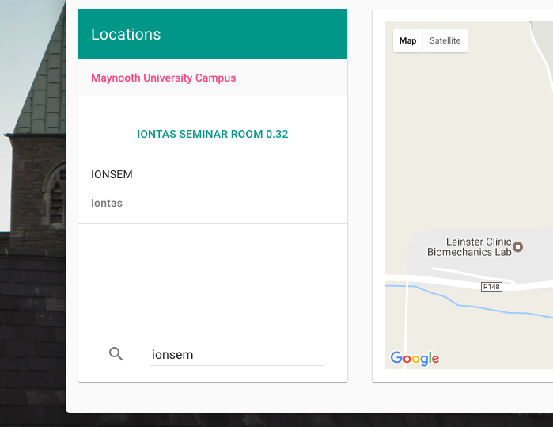

The map functionality is handled by `NgMaps` which is a special directive injected into the Angular app as a dependency.

In the `dashboard.html` view you can see the center I've set for the map as well as the level of zoom.

```
<md-card-content flex>
	<ng-map center="[53.383,-6.602]" layout-fill zoom="16">
		<marker id="marker" position="{{location.coords.lat}},{{location.coords.lng}}"></marker>
		<info-window id="info">
			<md-list flex>
				<md-list-item class="md-3-line">
					<div class="md-list-item-text" ng-non-bindable="">
						<h3>{{location.room_name}}</h3>
						<h4>{{location.room_code}}</h4>
						<p>{{location.building}}</p>
					</div>
				</md-list-item>
			</md-list>
		</info-window>
	</ng-map>
</md-card-content>
```

The `<marker></marker` tag is generated when a location in the list is clicked. Its position (longitude and latitude) is provided by the Angular expression: `{{location.coords.lat}},{{location.coords.lng}}`.

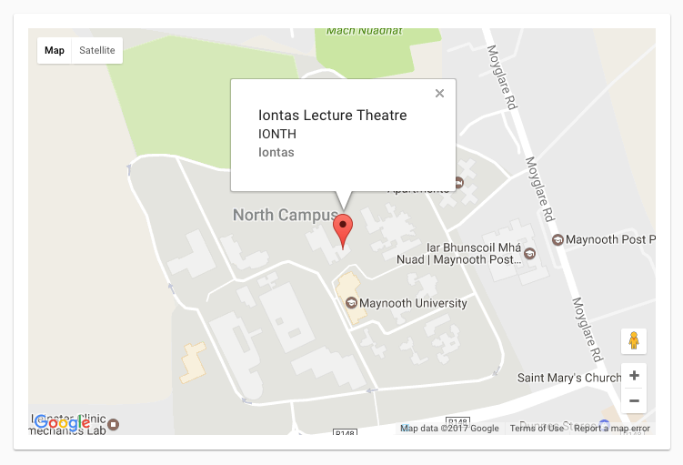

And then, when the marker is displayed on the map, an info window appears above the marker showing the location's info. That data is again imparted from the Angular controller.

Going to the Angular controller then, I've created a dedicated function that takes `NgMap` as a parameter as well as `$firebaseArray` and `Data` like we've seen before.

The map is setup with `.getMap()` and the locations are pulled from Firebase using the AngularFire services I mentioned earlier.

The `addMarker` function I've defined takes a location from the list as its parameter `item`. Then `item` is, in turn, assigned to the scope variable `location` which is provided to the DOM.

Finally the map is re-centered and panned to the new location.

```
function map($scope, NgMap, $firebaseArray, Data) {
		
	NgMap.getMap().then(function(map) {
		$scope.map = map;
	});

	// pull location data from firebase
	$scope.locations = $firebaseArray(Data.child('locations'));

	$scope.addMarker = function(item) {

		// display marker and info window
		$scope.location = item;
		$scope.map.showInfoWindow('info', 'marker');

		// dynamic map re-centering
		var coords = new google.maps.LatLng(item.coords.lat, item.coords.lng);
		$scope.map.panTo(coords);
	}
};
```

For quite a short and simplistic piece of code I feel it works pretty great. It's perfectly succinct and expressive, demonstrating how satisfying it is using AngularFire with AngularJS.

###Features

The application has many more features than I have time to discuss in depth, but I'll quickly run through everything worth mentioning.

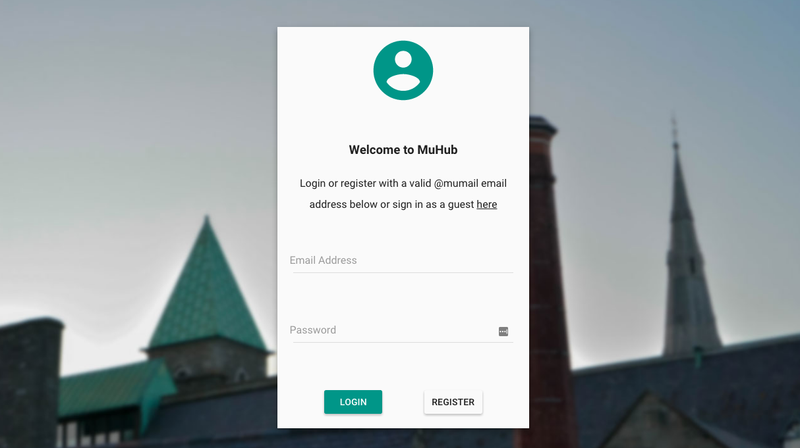

####Login

The login page is the first page the user views upon launching the application. The user, if already registered may sign in. Otherwise they can register, which requires email address verification before their account can be validated.

An additional feature I added to allow anyone to view the app was to include a *Guest* login that didn't require the user to be registered.

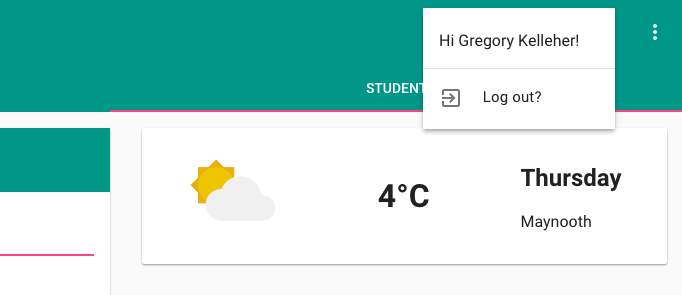

Once the user is logged in, their name is also displayed in the upper menu alongside the option of signing out.

```js
//logout user on btn

$scope.logout = function() {
	firebase.auth().signOut().then(function() {
		$state.go('login');
		toast.display("You've been logged out")
	}, function(error) {
		toast.display("Your log out was attempted", error);
	});
};
```

In the snippet of code above you can see that I'm using `firebase.auth().signOut()` to sign the current user out. UI-Router like I've shown before, handles the state change and brings the user back to the login page. I've also made a handy `toast` factory to display a message to the user.

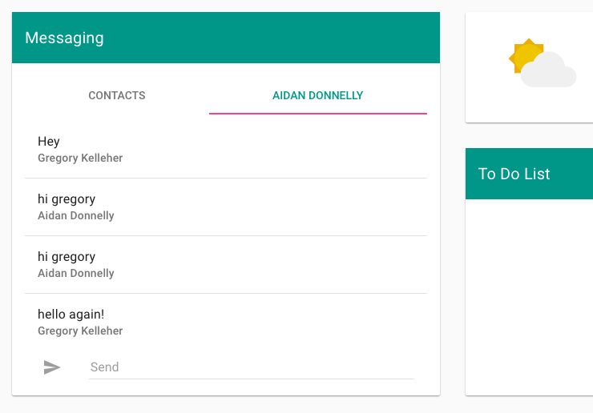

###Messaging

Possibly the most complex feature was developing the messaging feature. The aim was to enable registered users to send and receive messages to each other. 

In hindsight, it would have been useful having used something like [FireChat](https://firechat.firebaseapp.com) to build this feature, but it ended up being built from scratch.

It works and messages are updated and sent in real-time. Perhaps there's a better way but it's still impressive having built it from the ground up. All the data is held in Firebase of course.

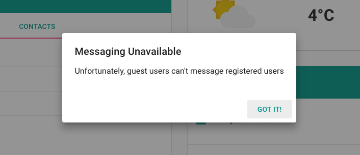

Lastly, when I added the guest feature I wanted to disallow guests from being able to message registered users. Without being registered, a prompt dialog appears for the user.


####To-Do List

Another feature I worked on was integrating a to-do list where users could add and delete reminders. it's fairly simplistic of course but it ties in quite well.

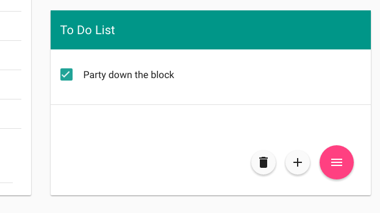

In the lower right-hand corner there's a fab button which displays actions upon hover. For instance, only if a list item is selected will the bin icon appear in the menu.

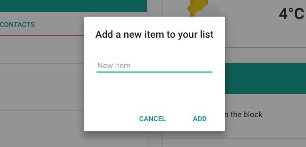

Adding new items is also handled with a prompt dialog provided by the Angular Material framework.

####Weather

Finally there's the weather card. It displays up-to-date weather data using the [Apixu](https://www.apixu.com/) API. Believe it or not, I had to try several weather APIs before settling on Apixu.

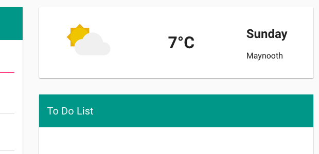

Many API's are served over HTTP rather than HTTPS and Angular doesn't particulary like 'mixed content' as I found, refusing to serve. Therefore I had quite a bit of hassle finding a suitable API until Apixu.

###Conclusion

This application serves as one of my very first forays into AngularJS and I've been pleasantly surprised.
Albeit this is AngularJS v1, I still feel very confident progressing onto Angular v2.

For a first attempt, having a functioning example that successfully includes multiple packages is quite deserving and I feel a bit proud. Choosing to use AngularFire and the Angular Material framework were great decisions and made things much easier to work with when it came to Firebase and the like.

On that note, it was a first for everything really. I had very little experience with any of the tools I began with, and maybe that shows in my code! There's certainly things I'd like to go back on and improve if I had time.

I look forward to improving on my newly learnt skills and I'm definitely enjoying this new line of coding. Hopefully I'd like to better my JavaScript coding and move into TypeScript (with AngularJS v2) or maybe React JS. Whatever's ahead, I'm already looking forward to it!


