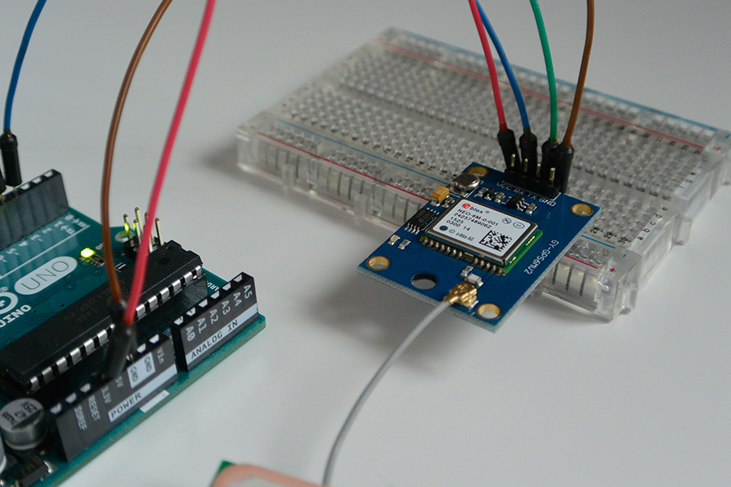
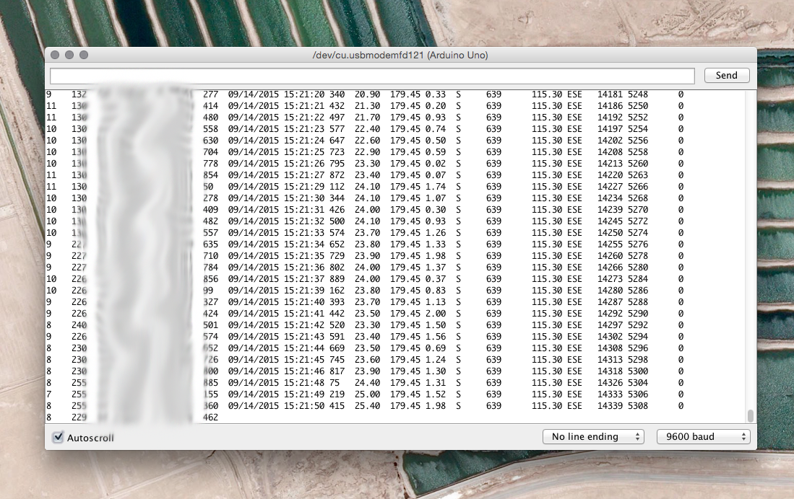
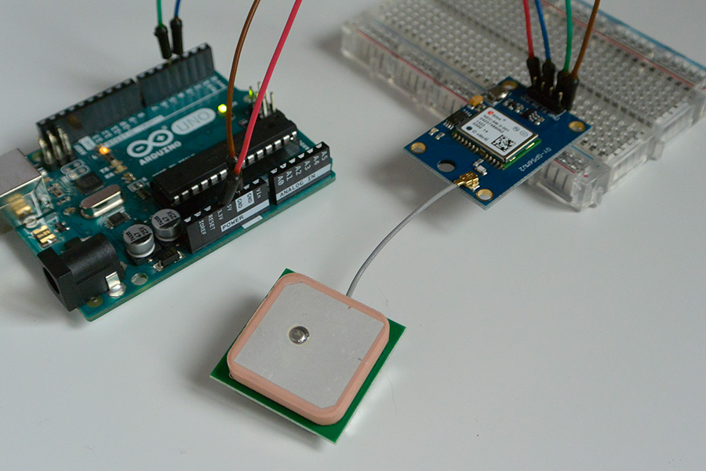
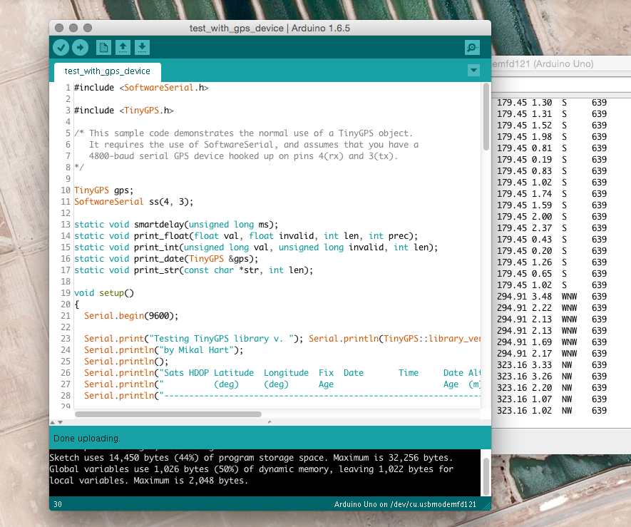

While most components you'll likely use with Arduino are relatively cheap, sometimes there's the odd part that comes at a premium that's outside your budget. Here's my experience with the alternative.


===

I wanted to write a quick post about choosing to buy cheap (usually chinese) components over brand-name options & discuss both the advantages and disadvantages of each. 

Firstly, as some background, I've just commenced work on my latest project (which is still top-secret!) and I needed to keep to a tight budget despite the high costs of some components. 

The most expensive component I required was a GPS module. I already own one, yet because they're so expensive I didn't want to squander it by permanently embedding it into a small project. Most, and including the one I had orignally cost upwards of €50 to buy. 

This was well outside my budget and I needed to consider other options. Thankfully, sites such as [DealeXtreme](http://www.dx.com) and [AliExpress](http://www.aliexpress.com) offer similar components at a giveaway price. 

Instead of the €50 plus I could've spent on a new GPS module, I chose to buy a GY-GPS6MV2 module for a little less than a tenner. Of course, the old adage is still true - _if something sounds too good to be true, it probably is_.

If you're not experienced with what you're buying or still feel like a rookie, you're probably best off with the safer option. That said, there's very little risk in buying something that's so cheap. 

In fairness, there's a lot more wrapped up in the price when buying the more expensive option than just the product. Brand names such as Sparkfun tend to invest more in resources to complement the product and you're likely to find more support and community help too. 

Here are a few of the disadvantages to consider when buying low-priced components:

<br></br>

###Disadvantages

<br></br>

| Disadvantage | Description |
| ------:| -----------:|
| Lack of resources    | Uncommon components usually don't have the strong backing of a community or brand behind him and may come with their own 'idiosyncracies' that make them difficult to work with | 
| Quality | You get what you pay for. Cheaper pieces feel cheap and sometimes the soldering isn't that great. Really it's what you should come to expect |
| Shipping   | It takes a long time - 3 weeks plus, for things to arrive. Keep that in mind | 

None of this is terribly new - it's the same for anything you buy. However, it's important to be conscious when purchasing components. Sometimes, you're better off with the pricer option to avoid the occasional headaches. 

Anyhow, before I return to the _raison d'être_ behind my blog post I'll just list the advantages - opting for the cheaper option:

<br></br>

###Advantages 

<br></br>

| Advantage | Description |
| ------:| -----------:|
| Learning Experience   | Who doesn't like a challenge? Datasheet in chinese or no datasheet at all? Once in a while, there's an upfront cost in time tinkering with things to get it working. In the end, at least you learn from your experiences |
| Price | Have I mentioned the price yet? You can save up to 90% on some things! |
| Quantity | Since these products are so cheap, you can afford to buy more than one if you felt like it. Especially handy if it's something that can be easily blown or you need a spare | 

<br></br>

###Case Study

<br></br>



As I mentioned, for this project I happened to require a new GPS module for my project. I decided to buy the GY-GPS6MV2 on AliExpress based on the price and also from what I read online. 

!!! Before buying a product - especially a cheaper option, look up online to see if anyone else has tried using it before. You can easily discover if it's defected in some way or difficult to interface with. 

I was pleasantly surprised with the GY-GPS6MV2 module - notably for something at such a low-cost. Besides the module itself, you'll also need a four-pin header to solder on. Easy to solder too.  

!!! If you felt like it, there's a pad at the back of the module where you could attach the antenna

| Pins | Description |
| ------:| -----------:|
| VCC  | This should be connected to 3.3V on the Arduino |
| GND | Connect to ground on the Arduino |
| TX | This needs to be connected to a software serial port - pin 4 in my example | 
| RX | Again, this also needs to be connected to a software serial port - pin 3 in my example | 

<br></br>

###Getting Started

<br></br>

Starting with the code first, download the TinyGPS library [here](https://github.com/mikalhart/TinyGPS) and boot up the **test_with_gps_device** example sketch. 

Below is a snippet from the sketch. Note how I changed the baud rate of **ss.begin** from 4800 to 9600, since the module runs at 9600. 

```c

void setup()
{
  Serial.begin(9600);
  
  Serial.print("Testing TinyGPS library v. "); Serial.println(TinyGPS::library_version());
  Serial.println("by Mikal Hart");
  Serial.println();
  Serial.println("Sats HDOP Latitude  Longitude  Fix  Date       Time     Date Alt    Course Speed Card  Distance Course Card  Chars Sentences Checksum");
  Serial.println("          (deg)     (deg)      Age                      Age  (m)    --- from GPS ----  ---- to London  ----  RX    RX        Fail");
  Serial.println("-------------------------------------------------------------------------------------------------------------------------------------");

  ss.begin(9600);
}

```

Having wired-up the board, changing and uploading the code, you can open the Serial monitor at **9600** to see if the GPS is working. If you're lucky, you should see a steady stream of data coming through telling you of your location. 



!!!! Note that the LED on the module is not a power LED so don't feel disheartened if it doesn't light straight away when you power your board. It's an indicator - blinking when it has a satellite lock.



If you're unlucky like me, you might have a serial monitor filled with asterisks. Don't despair! If you're seeing the blinking light onboard, that's a good sign. If you can determine that it's receiving data, it's likely you've done something wrong on setup. 

<br></br>

###Debugging Hints:

<br></br>

|  |  |
| ------:| -----------:|
|   | Have you wired it up correctly? Note that pin 4 (RX) goes to TX and pin 3 (TX) goes to RX. That's what caught me out first time round |
|  | Make sure you're supplying it with 3.3V and no more than 5V. Double-check you haven't blown it! |
|  | Sometimes if your soldering's a little sloppy you could have a solder bridge which is causing issues | 
|  | Have you the right baud rate set? The module runs at 9600 so change the code to suit | 
|  | SoftwareSerial? Every Arduino IDE version since 1.0 has been based on the [NewSoftSerial](http://arduiniana.org/libraries/newsoftserial/) library so check if you're including that correctly | 

<br></br>



In case you're wondering about the inclusion of SoftwareSerial, it's down to the Uno having only two physical ('hard') serial ports - pin 1 (TX) and pin 0 (RX). 

The GPS requires the use of the TX and RX of the Arduino, but how are you going to view the data over the serial monitor then? The data must be read in on a software serial port (usually pins 4 & 3 or pins 11 & 10) and then sent back over the hard serial ports - pin 1 & pin 0. 

<br></br>

###Conclusions

<br></br>

Well, there you go. I hope I threw some light on choosing between cheaper options versus more expensive solutions. I'm quite pleased after saving myself €50 on a new GPS. It's early days yet but I'm impressed how simple the GY-GPS6MV2 was to setup. 

Stay tuned for more posts as I embark on my next Arduino project!


