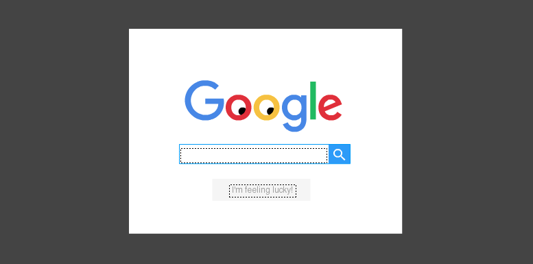
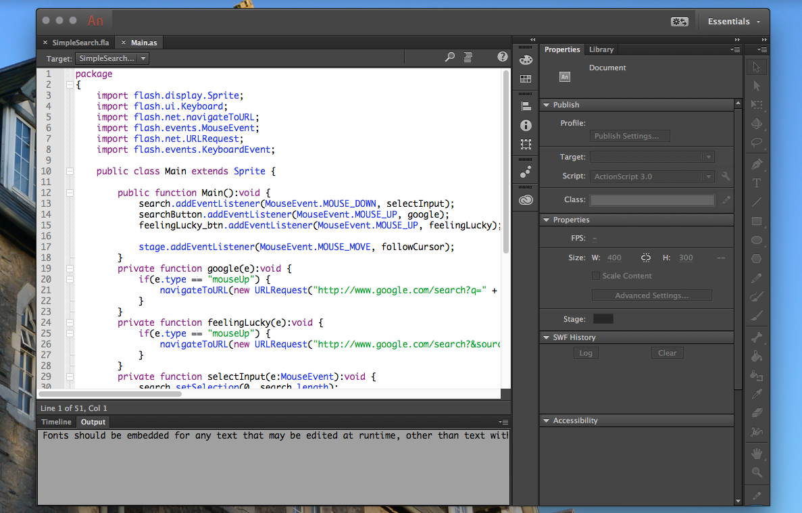
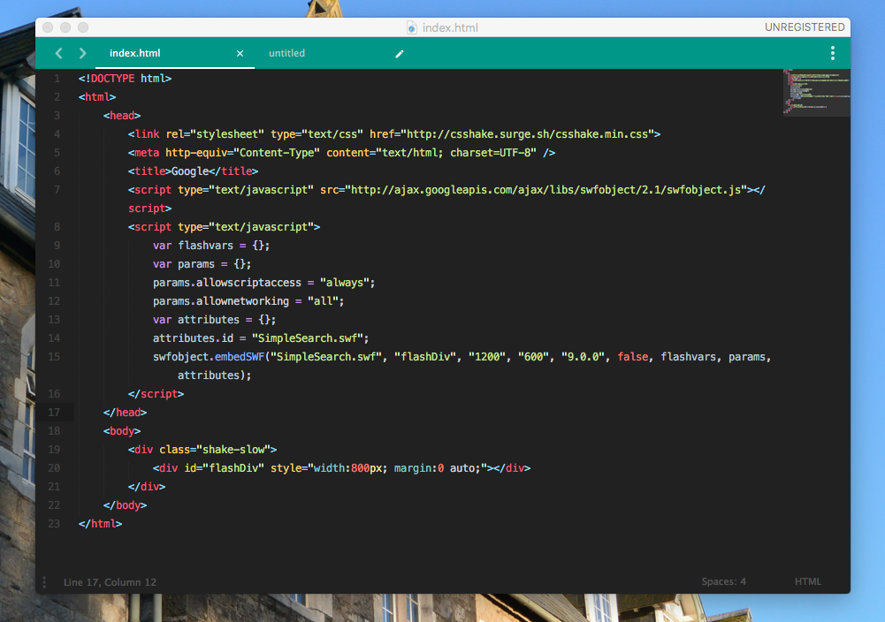
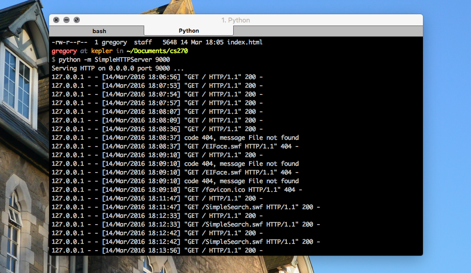
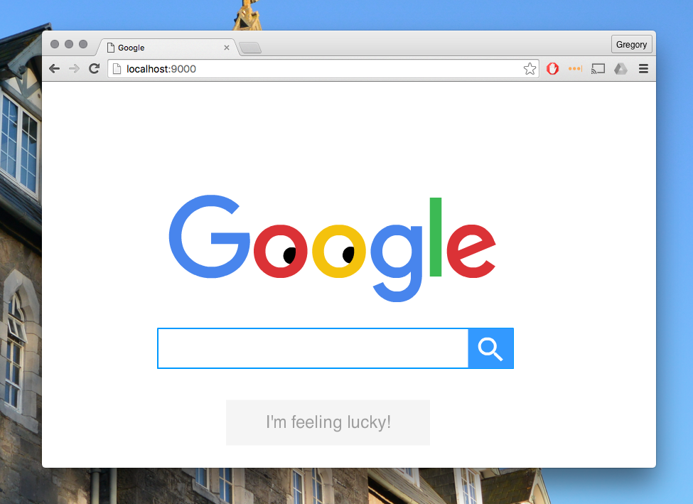
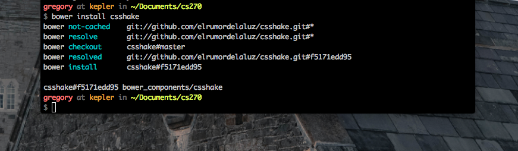
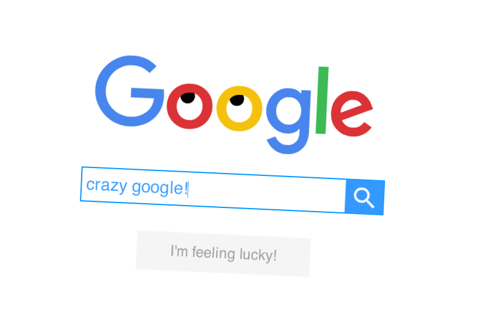

As part of my first assignment for **Media Programming**, I was tasked with creating a Flash tutorial of an Actionscript technique. What follows below are the steps I took in building it.

 

===

###Original Tutorial Technique 

Searching for tutorials online, I generally found resources to be quite sparse - although I did eventually stumble upon a [guide](http://www.danfergusdesign.com/classfiles/oldClasses/VCB331-richMedia1/exercises/inputOutputText.php) for creating input text fields with Actionscript that caught my attention. 

The tutorial detailed how to capture text input from the user while the Flash program was running. This information could be stored by the program and acted upon in various ways. Of course, this technique has numerous applications and I was interested in taking advantage of this feature in my own project.

I didn't recreate the tutorial but I followed through on the steps the author took in creating the Flash piece. Overall, it's quite a simple project so I won't run through it in full but I'll detail the workings of the technique.

Firstly create a textbox inside the Flash document and set it to `input text` and assign an instance name. Also create a button symbol and set an instance name for that too. Finally create another textbox and set it to `dynamic`. Give it an instance name as well. 

Now move to frame 2 add a new text field. Make this one a `dynamic` text field. Give it the instance name `output_txt`. 
Create a new button. Give the button the instance name `back_btn`.

Now create another layer above the first layer and name it `actions`. This layer will separate our code from our composition. 

On the first frame of your Flash project, open up the Actions window and enter the following:

```js
stop();    
var myText:String;    
next_btn.addEventListener(MouseEvent.CLICK, nextClick);    

function nextClick(myNextEvent:MouseEvent):void {
    captureText();
    this.nextFrame();
}    
function captureText():void {
    myText=input_txt.text;
}  
```
The reason `stop()` is included at the top of the Actionscript is to prevent the Actionscipt from running beyond the first frame and to keep the program static.

Below that, `var myText:String;` is the variable to hold the user input text from the textbox. The button directly below it is used to register the user clicking on the button and calls the `nextClick(myNextEvent:MouseEvent)` on that event. 

The `nextClick(myNextEvent:MouseEvent)` function in turn calls the `captureText()` function and then advances the playhead to the next frame.

Lastly, the `captureText()` function reads the text currently in the `input_txt` field and assigns it into the `myText` variable.

Now click on the second frame of the actions layer and open up the actions window yet again. Enter the code:

```
output_txt.text = "Hello "+myText+"!"; 

back_btn.addEventListener(MouseEvent.CLICK, backClick);    

function backClick(myBackEvent:MouseEvent):void { 
    this.prevFrame(); 
}  
```

This snippet of code displays the text entered on the first frame by outputting the `myText` variable from before. The second button allows the user to return to the first frame.

###Adaptation of Original Tutorial

There were a few important things I wanted to do differently than in the original tutorial. Firstly, I knew I had to create a separate Actionscript file rather than work simply on the actions layer. Neither did I want to work between frames. It would be better practice to have a completely static project and work on the one actionscript class in a separate window.

I also felt the original tutorial was too basic and limited in scope. There is so much more that's possible with capturing user input. I was intrigued with linking the `navigateToURL` and `URLRequest` to a button that would act on user input but I was stuck to find a suitable application.

Playing around inside Flash for awhile and manipulating URLs I learned I was able to send search queries through Google by appending the user input to the end of the URL like so:

`"http://www.google.com/search?q=" + search.text`

I was also able to do the same with the `feelingLucky_btn` by changing the URL to:

`"http://www.google.com/search?&sourceid=navclient&btnI=I&q=" + search.text`

With this information I set about building my own search engine, 'piggy-backing' Google and using the original tutorial as my guide.

###Step 1 - The Composition

Like before, open up Flash and create a new document. Import the Google logo svg file (easily found online) and place on the stage. Below the logo insert a textbox and change it to an input field.

 

Draw a rectangular frame around it with a blue stroke and no fill. To the right of it, draw a shape, change its name, convert to a button symbol and change the instance name accordingly.

Finally create another button like before and name it `feelingLucky_btn`.

###Step 2 - The ActionScript 

Now to the code. Create a new ActionScript class, call it `Main` and import the following:

```
import flash.display.Sprite;
import flash.ui.Keyboard;
import flash.net.navigateToURL;
import flash.events.MouseEvent;
import flash.net.URLRequest;
import flash.events.KeyboardEvent;
```

Change the line: 

`public class Main {`

to the following:

`public class Main extends Sprite {`

Now to change the `Main()` function.

```
public function Main():void {
      search.addEventListener(MouseEvent.MOUSE_DOWN, selectInput);
      searchButton.addEventListener(MouseEvent.MOUSE_UP, google);
      feelingLucky_btn.addEventListener(MouseEvent.MOUSE_UP, feelingLucky);
    }
```

There are three lines of code here, each for the composition elements made earlier - the `search` input text field, the `searchButton` and the `feelingLucky_btn`.

Looking at the `search` input text field first, it selects the current text of the text field for easy input. The `searchButton` watches for a mouse click on the element, as does the `feelingLucky_btn`.

The functions inside the `.addEventListener`, i.e. `selectInput`, `google` and `feelingLucky` are the next pieces of code to write.

```
private function google(e):void {
  if(e.type == "mouseUp") {
    navigateToURL(new URLRequest("http://www.google.com/search?q=" + search.text));
  }
}
```

The first function is the core function for the program. It executes the user input `search.text` (appended to the URL query) by first creating a `new URLRequest` and then calling the `navigateToURL` function that was imported earlier. 
This line of code is only called of course if the type is `mouseUp`, indicating a button click. 

The great thing about this function is that it's easily adapted for the `feelingLucky_btn` since it's just a simple change to the URL:

```
private function feelingLucky(e):void {
  if(e.type == "mouseUp") {
    navigateToURL(new URLRequest("http://www.google.com/search?&sourceid=navclient&btnI=I&q=" + search.text));
  }
}
```
Finally there's the `SelectInput` function that is called when a click is registered on the `search` button. It's similar to the `captureText()` function of the original tutorial but is a little more sophisticated. 

```
private function selectInput(e:MouseEvent):void {
  search.setSelection(0, search.length);
}
```
Using the text Input field instance name, it sets selection to the entire search term inputted by the user - ensuring the whole input is captured. 



In terms of functionality, this is the project complete. But it's not quite _crazy_ enough just yet...

###Step 3 - Making it crazy

While I was happy with how the Flash program worked, it felt a little stale. I remembered back to my CS270 lectures and the Google Doodles demonstration. That's what inspired me to include the 'googly' eyes within the logo. 

Unfortunately, it wasn't as easy as I would have hoped and I struggled to implement exactly what I wanted. I never got my code following the cursor movements properly so I fell back to another tutorial I managed to find. 

There's a reason why I found it so hard. Apparently it takes a little more maths than I had propositioned. While I had included the necessary components, my function was a little off. I'll do my best to document this additional functionality below.

Firstly, add in the following:

```
stage.addEventListener(MouseEvent.MOUSE_MOVE, followCursor);
```

This line of code creates a listener - not for any object, but for the entire stage. It follows the mouse cursor across the stage and calls the `followCursor` function:

```
private function followCursor(event:MouseEvent):void {
  var coordy1 : Number = mouseY - eye1_mc.y;
  var coordx1 : Number  = mouseX - eye1_mc.x;
  var angleRadians1 : Number  = Math.atan2(coordy1,coordx1);
  var angleDegrees1 : Number  = angleRadians1 * 180 / Math.PI;
  eye1_mc.rotation = angleDegrees1;

  var coordy2 : Number = mouseY - eye2_mc.y;
  var coordx2 : Number = mouseX - eye2_mc.x;
  var angleRadians2 : Number  = Math.atan2(coordy2,coordx2);
  var angleDegrees2 : Number  = angleRadians2 * 180 / Math.PI;
  eye2_mc.rotation = angleDegrees2;
}
```
This is the code I needed to borrow from the other tutorial to finally get my eyes working properly. In principle, it's the rotation of the eye that needs to be manipulated, rotating at a certain angle, altering each time the mouse moves based on the `eventListener` declared before.

There's quite a bit of Trigonometry here that really isn't worth getting into and gets a bit off topic. However, it's necessary to understand that it's used in determining the angle with which the eyeball should rotate, in regards to the `Mouse_Move listener` of course. The code is also duplicated for the second eye.

###Step 4 - Testing it in the browser

Testing it in the browser is fine enough but ultimately I wanted my Flash program to be hosted online. Therefore I exported my Flash project as a movie (.swf) and placed it inside a new directory alongside an `index.html` file.



Opening up my `index.html` I inserted the following, including proper referencing to my Flash file:

```
<!DOCTYPE html>
<html>
    <head>
        <meta http-equiv="Content-Type" content="text/html; charset=UTF-8" />
        <title>Google</title>
        <script type="text/javascript" src="http://ajax.googleapis.com/ajax/libs/swfobject/2.1/swfobject.js"></script>
        <script type="text/javascript">
            var flashvars = {};
            var params = {};
            params.allowscriptaccess = "always";
            params.allownetworking = "all";
            var attributes = {};
            attributes.id = "SimpleSearch.swf";
            swfobject.embedSWF("SimpleSearch.swf", "flashDiv", "1200", "600", "9.0.0", false, flashvars, params, attributes);
        </script>
    </head>
    <body>
        <div>
            <div id="flashDiv" style="width:800px; margin:0 auto;"></div>
        </div>
    </body>
</html>
```

I then fired up a localhost server using python to try it out:

`python -m SimpleHTTPServer 9000`




And it worked! It also looked pretty great too. Yet I still felt it needed more _crazy_. Back inside my directory I installed something called `csshake` using `bower`.



I then updated the html by including the links to the CSS stylesheet and including the `class="shake-slow"` to the div containing my Flash program. 



###Conclusions

Overall I'm very happy with the outcome. I feel I've delivered on the brief while incorporating creative touches that add to the user appeal. It performs properly but also has charm - it's engaging for the audience but doesn't comprimise on functionality.

While I was building it I began leaning to a more child-friendly interface - making my buttons bigger and text larger. It's meant to be playful and stimulating - encouraging audience interaction with the piece. I feel this has a lot in common with the Google Doodle examples I saw in class, and I think I've emulated that well here.

On a technical note, It wasn't too tricky for the most part. Besides ActionScript, it's important to note that I also integrated HTML, CSS and python in my project. For me, I felt it was important I made my project web-enabled as ActionScript is intended. It also proved that Flash could integrate well with other web components and gave me more to incorporate into my project.

I also used a CSS package for the additional shaking but it's also possible I could have done this in ActionScript too. 

On the ActionScript side of things, the program works well. The only snippet of code I found difficult to write would be the eyeball rotations - I hadn't expected trigonometry to come up! The URLRequests, EventListeners, navigateToURL and MouseEvents .etc were all familiar to me from class and I had no issue in implementing those elements. 

Lastly, I hope this tutorial is helpful and encourages others to explore Flash like I've done. It's certainly been fun using code in this creative manner. 

<a href="http://bit.ly/1pQsZrt" class="btn">Download Source</a> 


