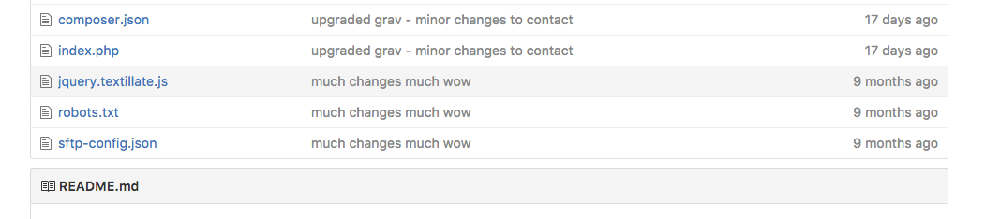

Well, this ain't good. Note to self, back-up. Then back-up your back-up :(

===

Sigh. I guess I should start from the top. Once upon a time I was doing routine work on my website as well as someone else's and I was a little stretched at the time.

In my flurry of pulls and pushes to Github, and in my imprudent manner I carelessly forgot to _uninclude_ my `sftp-config.json` file for my website. Yes, that very file that contains my credentials for the server. It's hard owning up to that but I really did. I pushed straight to my public repository with everything too.

In other words, for quite a while (and if you were so acute) you might've 'chanced' upon my credentials which are like the keys to the castle, in a sense.

Anyways, this all comes back to me after someone giving me a nudge to rectify the blatant exposure. I swiftly thanked them and set about making my repository private and removing all traces of the issue. Next thing of course I changed the credentials and went about searching for 'more holes in the wall' so to speak.

And this all leads to the present. The point when solving the initial problem has only uncovered more problems. I have a tendency for waffling on but I'm going to skip over the technicalities for once to avoid further embarrassment and save precious key strokes.

Frankly, I was doing a lot of breaking and fixing which is typical stuff. The only issue was I doing this under the pretense that I had a reliable and working back-up. Preferably one that wasn't as old as I discovered.

Not even Github had everything I needed, and after one thing leads to another I end up losing quite a considerable amount of work. Especially the most recent posts that hadn't been backed up.

Instead of leaving this on a negative note (which would be too simple) I'll try put a positive spin on it. To be completely honest, as useful as some of my posts had been (at least to me) I never felt that could constitute something unique that I had done. 

In future I feel I'd like to write more on real things I've built or written myself, instead of simply writing an _instruction guide_ for something I've been doing.

Outside of work I hope to start working on a personal project and I'll be sure to have some new stuff up from CTYI this year too. Besides, I should also have an Angular application to build over the summer too. Hey, it's a new year so I'll try my best to keep to my belated resolution.

