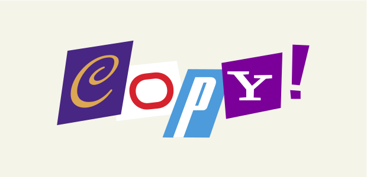

Just another essay I managed to dig up during my searches. I enjoyed reading it again and it's worth sharing.

===

  

> Preface: This essay was written as part of an assignment discussing whether,  _'The effects of convergence can be seen to impact on the notion of copyright'_

  

### Assignment - Effects of Convergence

Copyright is a noble ideal. In its truest form it aspires to promote and foster the creation of new bodies of work, whilst granting legal protection to original authors & creators. 
The significance of copyright law has not been lost in our digital age, however its founding aspirations have diverged from its original purpose and it’s maladjusted in a pivotal time for media convergence.

The misalignment of copyright law has been proven historically through the research of Paul J. Heald (2013), who studied the repercussions of myopic copyright protections and its deleterious effects on the availability of 20th century books. 
His findings reveal a curtailment of publications from the enactment of copyright protections in 1923 that only served to suppress the market for books. In his own words he writes,

> _'Copyright correlates significantly with the disappearance of works rather than with their availability'_ (Heald, 2013).

Shockingly, the effects of such legislation mean that today, there are as many books available from the 1910s as there were from the 2000s, and the number of publications from the 1850s is double the figure available from the 1950s (Heald, 2013). This represents an immense void in our cultural history that cannot be restored.
Hence the exigency for the present. If these are the dramatic consequences of draconian copyright laws in the past, what does this evince in our age of convergence?

Unsurprisingly, one doesn’t have to look far to find a parallel contemporary illustration. In 2004, Google began scanning books - both copyrighted and uncopyrighted alike, building an online catalogue available for the public good.
Google’s intention of creating a digital platform for a prodigious archive of human literature is a prime example of where technological convergence facilitates this requisite.

In this manifestation, Google circumvented the established distribution network of publishers and authors, offering over 25 million unique publications from a single platform (Heyman, 2015). In turn actively expanding this vast repository of content to new audiences and channels.

This of course was not without its critics, with the Authors Guild suing Google in 2005 on the allegation of violating its member’s copyright. A striking example of contemporary convergence threatening the established order.

In the landmark case, Google was deemed legal in a decisive ruling, that found Google’s venture to be fair use. And in the words of the presiding judge, Denny Chin (2013), _'transformative'_, because, _'words in books are being used in a way they have not been used before'_ (_Authors Guild Inc._ v Google Inc., 2013).

In veiled terms, he’s describing the profound and transformative impact convergence is having on the expansion of content. In his decision, he also writes, 

> _'[that] it advances the progress of the arts and sciences, while maintaining respectful consideration for the rights of authors and other creative individuals, and without adversely impacting the rights of copyright holders'_ (Chin, 2013).

While this ruling can be espoused as a triumph for the proper interpretation of copyright law in response to the influence of convergence, legislative reforms have not proven so expeditious in the past.
Copyright law has failed to keep pace with the unyielding growth of convergence, which in turn has engendered the formation of flexible protections and freedoms since legislative process has failed to adapt copyright for the digital age.

Creative Commons is one such organisation which releases licenses free of charge to the public. Described as being on the forefront of the Copyleft movement, it aims to promote and expand upon the range of creative works available to the public, seeking to build a richer public domain.

In the words of one of its founders, Lawrence Lessig (2004), 

> _'Overregulation stifles creativity. It smothers innovation. It gives dinosaurs a veto over the future. It wastes the extraordinary opportunity for a democratic creativity that digital technology enables.'_

Lessig (2004) also maintains that today’s culture has become subjugated to traditional content distributors (or _'prohibitionists'_ in the words of Henry Jenkins [2006]) which desire to maintain and strengthen their monopolies on cultural products, and that Creative Commons role is in providing alternatives to these restrictions.

These prohibitionists according to Henry Jenkins (2006) only wish to strengthen their grip on content, intransigent to the shifting sands of convergence and the growing participatory culture associated with it.

The reason being that although media companies,

> _'[are] increasingly dependent on active and committed consumers to spread the word about valued properties in an overcrowded media marketplace (...) they are terrified of what happens if this consumer power gets out of control'._ (Jenkins, 2006).

This prohibitionist stance is frequently affiliated with a syndicate of media companies, typically dominated by old media (film, television, the recording industry), but is also shared by other groups outside of entertainment which have been affected in much the same way by convergence.

For example, the world of scientific research has benefited enormously by the effects of convergence and the concomitant expansion of Copyleft freedoms such as Open Access.
Open Access is an online repository for the publication of research output, free of many restrictions on use. Or in the description offered by Chris Patil and Vivian Siegel (2009),

> 'What if everyone in the world were in your lab – a ‘hive mind’ of sorts, but composed of countless creative intellects rather than mindless worker ants, and one in which resources, reagents and effort could be shared, along with ideas, in a manner not dictated by institutional and geographical constraints?

The spectacular growth of Open Access since the advent of the web can be attributed to two pivotal events.
The first being _'digitisation'_ and its impact on communication channels. With global reach and scope, new means of collaboration we’re now possible to achieve.

As Robert J. Simpson (2009) remarked on the Internet and Open Access,

> 'the Internet represents an opportunity to change this system, one which has created a 300-year-old, collective long-term memory, into something new and more efficient. With new online tools, scientists could begin to share techniques, data and ideas online to the benefit of all parties, and the public at large.'

The system being referred to is the scientific publishing model of Academic Journals and the second reason for Open Access’s ascendance.

As a distributive system for research publications, the modus operandi of these institutions is often expensive and laborious. From submission, reviewal, revisions, acceptance and finally publishing, the overall distribution is limited and restrictive.

Another leading flaw in this model is the ratcheting prices of journal subscriptions that have continued to outpace inflation by up to 250% in the last thirty years alone (EFF, n.d.). Across fifteen disciplines, the average price of one journal subscription is over $1000 per annum (Shockey, n.d.).

These distributive models are relics of pre-convergence. Academic Journals do not produce the material, nor do they write the papers or even employ the reviewers. They simply hold monopolistic sway over scientific research which is counter to the scientific culture of discovery and proliferation of knowledge.

In a system where the government funds scientific research through taxpayer’s money, and scientists conduct research and write papers, there is little rationale for the gratuitous distributive restrictions enforced by Academic Journals.
Yet, it’s only through the direct influence of convergence that copyright freedom advocacy has come to challenge this obsolescent model.

And in truth, the strongest proponents of copyright freedoms are the products of convergence and participatory culture themselves. Key organisations and communities in the Copyleft movement such as Wikipedia, Mozilla and others have their own stake in the copyright reform debate.

The strongest illustration of their combined influence came on January 18, 2012 in response to the controversial SOPA bill, which sought to expand the powers of U.S law enforcement on online copyright infringement.

Under the proposed legislation, copyright law would have expanded existing criminal laws to include unauthorised streaming of copyrighted content, imposing a maximum penalty of five years in prison (_Stop Online Piracy Act_, 2011).

Proponents of the bill included the usual suspects of media magnates and associations which claimed the bill would serve to protect intellectual-property, the media industry, jobs and revenue, and as such, it was an imperative to bolster enforcement of copyright protections (Scott, 2011).

Naturally, members of the Copyleft movement strongly opposed such a bill, and on that fateful day, Wikipedia, Google, Mozilla and thousands of other websites coordinated a global service blackout, in protest of the bill.
It’s estimated that over 162 million people viewed Wikipedia’s banner that day, with a petition at Google also gathering more than 4.5 million signatures (Waugh, 2012). In addition, many more took the time to write to their representatives and lawmakers urging them to protest the signing of the bill.

The January protests drew publicity and response from around the world, exposing the new political might conferred in the tech industry, with the New York Times going so far as to claim the protests to be _'a political coming of age for the tech industry'_ (Wortham, 2012).

Perhaps more interesting still is the response of the bill’s proponents and their utter disbelief in the powers demonstrated by convergence. Chris Dodd, as chair of MPAA (Motion Picture Association of America) went so far as to say that the coordinated service blackout was, _'an abuse of power given the freedoms these companies enjoy in the marketplace today'_ (Lee, 2014).

The RIAA (Recording Industry Association of America) also claimed in a statement,

> _[that] it's a dangerous and troubling development when the platforms that serve as gateways to information intentionally skew the facts to incite their users and arm them with misinformation (...) and it's very difficult to counter the misinformation when the disseminators also own the platform'_ (Wortham, 2012; Farrell, 2012)

There’s an element of irony in their statements, considering these are so often the victims of the same allegations by their opponents belonging to the Copyleft movement. Nevertheless, it doesn’t make them wrong. They are simply witness to their own diminishing role in persuading public opinion, as the powers of their once dominant industry have begun to wane under the pressures of convergence.

Although it’s common for these established media companies to be unaccommodating on copyright or the ideas of participatory culture, it’s becoming harder for them to ignore their customers evolving demands. The prohibitionist stance is losing ground to the more nascent _'collaborationist'_ approach, adopted especially by new start-ups and multimedia companies (Jenkins, 2006).

As Henry Jenkins (2006) writes on this phenomenon,

> _'new media companies are experimenting with new approaches which see fans as important collaborators in the production of content and as grassroots intermediaries helping to promote the franchise.'_

These companies are choosing to recognise and embrace the unique relationship they have with their customers, leveraging their influence to publicise and spread their brand. In this symbiotic relationship of sorts, customers are reciprocated with early access to new content, extra privileges and increased exposure .etc.

One notable example of a company pivoting towards a collaborationist approach is GoPro Inc. The popular camera maker is a favourite amongst bmxers, surfers, skydivers and those with a passion for extreme sports. This promising customer base with its massive volume of user generated content is a strong asset for GoPro with untapped potential, offering a way for the company to distance itself from simply being a ‘hardware’ company and diversify its business model.

Furthermore, GoPro is acutely aware of the demise of the once dominant Kodak company and its ill-famed unwillingness in adapting to the convergence of digital and analog film (Hiltzik, 2011).

GoPro however has spelt out its ambitions in becoming a multimedia company, making the intuitive leap from physical products to digital content (GoPro Inc., 2014). In this age of social and technological convergence, GoPro is well placed to take full advantage of these newly-defined channels for content distribution, transforming its audience into its very own distribution network.

Another more subtle reason for GoPro’s transition towards embracing convergence is that it understands the threat posed by it. GoPro is primarily a camera company of course, but it cannot deny that most people today carry smartphones with embedded megapixel cameras.

Hence instead of smartphones being a competitor to their cameras, GoPro views them as being complementary, since users can access the GoPro app and use their phones as remote controls for their GoPro cameras for instance (GoPro Inc., 2014).

Besides the highlighted marketing partnerships, sponsored and professional content, GoPro is also actively involving more user-based content within its publishing model - usually without user permissions. This isn’t uncustomary for companies today but it does bear the question - what does the user earn in this relationship - and how does it affect copyright?

Users today are unwittingly or unwillingly part of a company’s distribution platform and must come to terms with their personal rights over their own content. A company such as GoPro could be portrayed as empowering the user through content exposure or in fact, exploiting the user’s content for their own advantage. 

This issue is compounded by the fact that there’s rarely an option for the user to opt out of a company’s marketing plan.

Especially for such a profitable and successful company such as GoPro. If it were deemed to be making profits unfairly off the backs of its customers, it could put the company’s image in jeopardy - inviting customer scrutiny through social publishing platforms such as Facebook, Twitter, YouTube .etc that its distributive network relies upon.

This issue of content ownership is more nuanced still when content itself is generated through the company’s own platform.

Take Instagram for example. While it doesn’t claim ownership of any content users post, under its very broad terms and conditions, the user is giving Instagram the right to use any of their photos for free, for any purpose, anywhere in the world. 
Instagram can also grant those rights to a third party (Deosaran, 2015). These rules are important to consider when one acknowledges that Instagram has over 400 million users and over 40 billion images (Instagram, 2016).

However, much of the criticism surrounding Instagram’s copyright culture isn’t targeted at its policies but rather the behaviour of its users. Increasing backlash from users over image theft & copyright infringement has lead Instagram into clarifying its terms of services (Holpuch, 2012). Yet critics still claim that Instagram isn’t doing enough to protect user property. 

In a time when user-generated and non-professional content is fast becoming a crucial part of the overall media mix, it’s no longer acceptable for it to suffer from a lack of strong copyright controls. This urgent issue over content ownership is a prime example of where convergence can in fact complicate the matter of copyright.

Perhaps the worst manifestation and most stinging example of this growing issue is the reappropriation of Instagram users’ photos by the controversial artist Richard Prince. His recent exhibition - 'New Portraits' comprises entirely of Instagram photos belonging to others. 

If this is provoking in itself, it must hurt to know that some of his pieces sold for $90,000 at art fairs (Contrera, 2015). Richard Prince was able to take people’s photographs without their permission, blow them up, exhibit them in a public place without credit and then make a profit on the back of it. All without much fear of repercussion.

Such is the state of copyright today. Recalling that one of the most important tenets of copyright law being the element of commercial gain, $90,000 is hard to justify in this circumstance. Not unexpectedly, he’s been sued numerous times for copyright infringement in the past but the complex issue of ‘fair use’ and appropriation mean prosecution has always been of remote concern.

It’s remarkable to think that even in our age of convergence, the underpinning principles of copyright law have remained much as they were originally envisioned. Such was its significance then (as is now), that copyright law is enshrined in the U.S constitution, _'to promote the progress of science and useful arts by securing for limited times to authors the exclusive right to their respective writings'_ (U.S Constitution, 1789).

However the ideals of copyright law have remained unchanged through history, our relationship with copyright has only become more complex with growing convergence in our digital age. As consumers and creators, we cannot lose sight of our copyright rights and its societal worth. Now more than ever, and amidst growing governmental and corporate pressure on copyright law, users must stand for a return to copyright’s core values. 

In a historical era for copyright, the laws being signed today in response to convergence will shape and define our views on copyright in times ahead. Hence the growing imperative to pivot and adapt copyright, ensuring the protection of consumers and creators in the digital future to come.

  

### References

Cleland, S. (2011) ‘SOPA Fixes Isolate Opponents, especially Google’. _Forbes_ [online]
14 December 2011. 
Available [here](http://www.forbes.com/sites/scottcleland/2011/12/14/sopa-fixes-isolate-opponents-especially-google/#2044622b746d)
(accessed 24 February 2016).

Contrera, J. (2015) ‘A reminder that your Instagram photos aren’t really yours: Someone else can sell them for $90,000’. _The Washington Post_ [online] 25 May 2015. 
Available [here](https://www.washingtonpost.com/news/arts-and-entertainment/wp/2015/05/25/a-reminder-that-your-instagram-photos-arent-really-yours-someone-else-can-sell-them-for-90000/)
(accessed 24 February 2016).

Deosaran, N. (2015) _Who owns your Instagram content? Norton Rose Fulbright_. 28 January 2015.
Available [here](http://www.socialmedialawbulletin.com/2015/01/who-owns-your-instagram-content/)
(accessed 24 February 2016)

Electronic Frontier Foundation (1990) Open Access [online]
Available [here](https://www.eff.org/issues/open-access)
(accessed 24 February 2016)

Farrell, M. (2012) ‘Internet’s big names unite against Anti-Piracy bills’. _Boston Globe_ [online]
19 January 2012. 
Available [here](http://wayback.archive.org/web/20120119053134/http://bostonglobe.com/business/2012/01/19/internet-big-names-unite-against-antipiracy-bills/15UqDwprL2SMnmxfal29JL/story.html)
(accessed 24 February 2016).

GoPro Inc., (2014) Form S-1 Registration Statement [online] 2014. 
Available [here](http://www.sec.gov/Archives/edgar/data/1500435/000119312514204902/d552193ds1.htm)
(accessed 24 February 2016).

Heald, Paul J., (2013) _How Copyright Keeps Works Disappeared. Illinois Program in Law, Behavior and Social Science Paper No. LBSS14-07;_ Illinois Public Law Research Paper No. 13-54.

Heyman, S. (2015) ‘Google Books: A Complex and Controversial Experiment’. _The New York Times_ 25 October 2015.
Available [here](http://www.nytimes.com/2015/10/29/arts/international/google-books-a-complex-and-controversial-experiment.html?_r=0)
(accessed 24 February 2016).

Hiltzik, M. (2011) ‘Kodak's long fade to black’. _Los Angeles Times_ [online] 4 December 2011. 
Available [here](http://articles.latimes.com/2011/dec/04/business/la-fi-hiltzik-20111204)
(accessed 24 February 2016).

Holpuch, A. (2012) ‘Instagram reassures users over terms of service after massive outcry’. _The Guardian_ [online] 18 December 2012. 
Available [here](https://www.theguardian.com/technology/2012/dec/18/instagram-issues-statement-terms-of-service)
(accessed 24 February 2016).

Instagram (2016) Instragram Press [online]. 
Available [here](https://www.instagram.com/press/?hl=en)
(accessed 24 February 2016).

Jenkins, H. (2006) ‘Prohibitionists and Collaborationists: Two Approaches to Participatory Culture’. _Confessions of an Aca-Fan_. 19 July 2006.
Available [here](http://henryjenkins.org/2006/07/prohibitionists_and_collaborat.html)
(accessed 24 February 2016).

Lee, N. (2014) _Facebook Nation: Total Information Awareness, 2nd Edition_, Tujunga CA: Springer.

Lessig, L. (2004) _Free culture: The Nature and Future of Creativity_. New York, NY: Penguin Group (USA) Inc.

Patil, C., Siegel V., (2009). _This Revolution Will Be Digitized: Online Tools for Radical Collaboration. Disease Models & Mechanisms_ 2.5-6 (2009): 201–205. PMC. 

Shockey, N. (n.d.) Right to Research Coalition [online]
Available [here](http://www.righttoresearch.org/bm~doc/right-to-research-coalition-rfi-submission.pdf)
(accessed 24 February 2016).

Simpson, R. (2009) Open Science. _Orbiting Frog_. 16 June 2009.
Available [here](https://orbitingfrog.com/2009/06/16/open-science/)
(accessed 24 February 2016)
The Authors Guild, Inc. v. Google Inc. (2013) 

U.S. Government, _Stop Online Piracy Act (2011)_, H.R. 3261, District of Columbia: House Judiciary Committee 

Waugh, R. (2012) ‘U.S Senators withdraw support for anti-piracy bills as 4.5 million people sign Google's anti-censorship petition’. _Daily Mail_ [online] 20 December 2012. 
Available [here](http://www.dailymail.co.uk/sciencetech/article-2088860/SOPA-protest-4-5m-people-sign-Googles-anti-censorship-petition.html)
(accessed 24 February 2016).

Wortham, J. (2012) ‘A Political Coming of Age for the Tech Industry’. _New York Times_ [online] 17 January 2012. 
Available [here](http://www.nytimes.com/2012/01/18/technology/web-wide-protest-over-two-antipiracy-bills.html?_r=0)
(accessed 24 February 2016).

