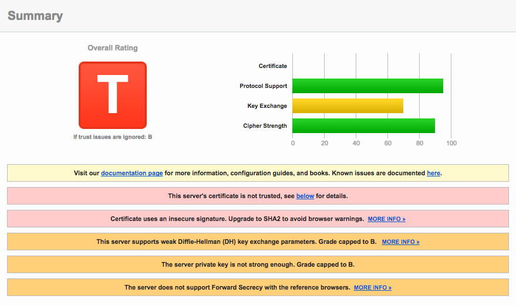
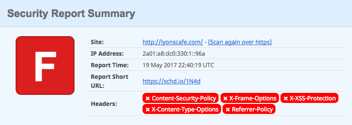
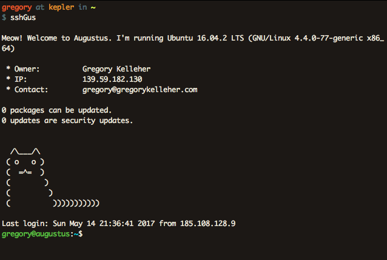
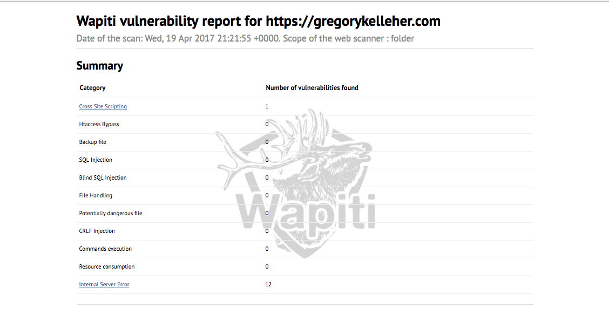
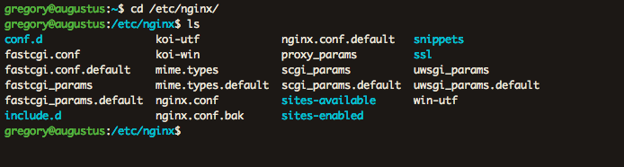
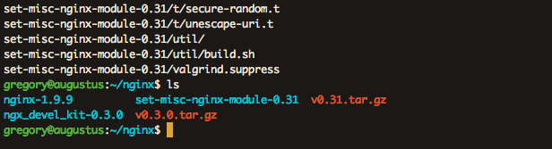
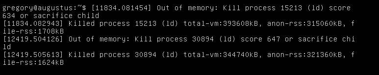
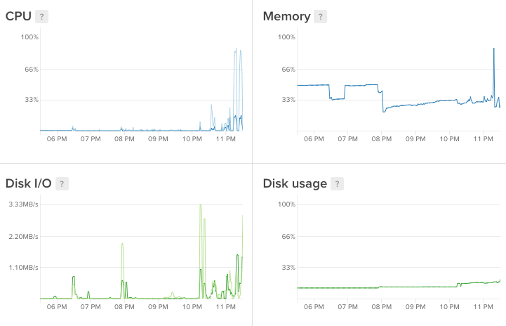
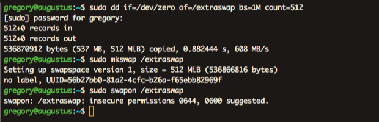
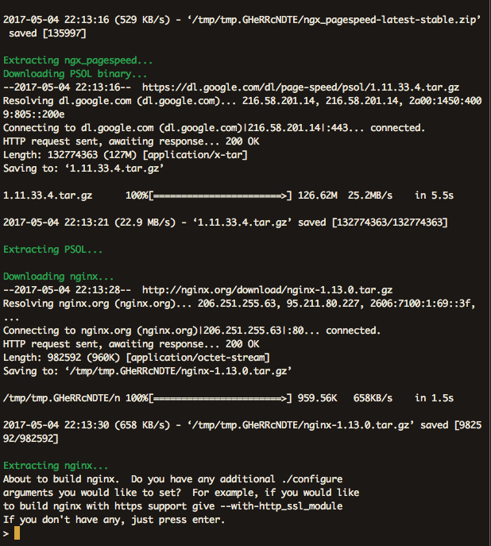

It's about time. I've finally pulled the trigger and moved across to a new VPS. Read about my transition to Digital Ocean and how I've upgraded to the latest Nginx build.


===

Migrating to Digital Ocean had always been at the back of my mind, but I could never find the time nor the prompt to do so. Prior to transferring, my hosting had been with [Blacknight](https://www.blacknight.com/) (an Irish hosting provider) whose service had always been second-rate; to put it mildly.

In truth, it was time I took my training wheels off and properly configured my own web server. Being my own SysAdmin would grant me full responsibility for my server, enabling me to configure it just the way I wanted. 

[Digital Ocean](https://www.digitalocean.com) was the obvious choice. Besides my €50 in credit, (courtesy of [Github's student pack](https://education.github.com/pack)), it's a great choice as a hosting platform since it's designed with developers in mind.

To anyone less initiated with Digital Ocean, it's a VPS (virtual private service) provider offering an affordable and straightforward cloud server that's easily customisable. I chose the cheapest option at €5 a month. 

For that price, I essentially get a linux box (or in Digital Ocean's terms, a droplet) installed with Ubuntu 16.04 LTS. It's configured with 512MB memory, 1 core CPU, 20GB SSD with a total of 1TB transfer.

This is more than enough for the handful of websites that I need to run, but let's go back to how things were happening on Blacknight before.

### How things used to look

The real catalyst that spurred the move to Digital Ocean were the results I received after testing my domains on [Qualys SSL Labs](https://www.ssllabs.com/ssltest/). Unsurprisingly, Blacknight's SSL security grade left much to be desired and gave me the desperate nudge I needed.

The screenshot from my test is below, but be warned, the results aren't pretty.

! Note that the results of the following tests are actually from another domain I host since I'd already transferred gregorykelleher.com from Blacknight before I could take screenshots. Although the results below are identical since all my websites shared the exact same configuration on Blacknight.



At a glance, my website's grade was capped at a 'T' due to the _server's certificate is not being trusted_ error. This is due to the certificate provided by Blacknight being self-signed by parallels.com. Qualys SSL Lab marks it as not being trusted as it doesn't recognise it as a legitimate CA (Certificate Authority).

I suspected parallels.com was self-signing due to the fact that I haven't explicitly requested an SSL certificate for my website. Sure enough, Blacknight has a [page](https://www.blacknight.com/ssl/) where you can purchase SSL certificates.

Since I've multiple websites including sub-domains, I'm in the market for an SSL certificate that supports mutiple domains and multiple sub-domains obviously. Taking a quick glance at the prices listed on the page, it would cost me **€199.99** per annum just to cover this website alone!

Okay, so off to a rocky start with SSL but that's not the end of it. There's still much more that could be improved. As a matter of fact, here's a short list:

| Issue  | Description  			|
| ------ | ------------------------ |
| Certificate 						| Not trusted and uses insecure signature `MD5withRSA`   |
| Forward Secrecy					| Limited browser support and uses a weak key `RSA 1024` |
| Strict Transport Security (HSTS) 	| Not implemented 										 |
| HSTS Preloading 					| No HSTS so hence, no preloading either 				 |
| Public Key Pinning (HPKP) 		| Not implemented 										 |
| Common DH primes 					| Yes, common parameters which is a security risk        |
| EC Support					 	| No support for curves									 |
| Session resumption (caching) 		| No support 											 |
| OSCP Stapling 					| No support 											 |
| HTTP/2 							| No support 											 |
| ALPN and NPN 						| No support 											 |

If the above doesn't make any sense just yet, it's okay. All will be revealed shortly. To put it simply for now, the above are _security enhancements_ that are currently misconfigured, non-supported or just not implemented on Blacknight's server. 

My aim is to fix these issues and enable all these enhancements and more on my own web server. Thereby improving my website's overall security settings and hopefully bumping up my Qualys SSL Lab grade.

But before that, time to look at another excellent website called [securityheaders.io](securityheaders.io) from [Scott Helme](www.scotthelme.co.uk).

!!! Scott Helme is a security researcher and I highly recommend reading his blog that discusses SSL/TLS and the latest in network security. He's the de facto voice on such topics and a lot of what I'll talk about borrows from his work.

His website securityheaders.io analyses the HTTP security headers sent in a response and provides a rating based on the level of protection offered by the sender.

The results for my website hosted on Blacknight exposed the following results:



You can't sugarcoat that. It's awful. But at least there's plenty of room for improvement. Again, I'll go into more detail on what each header means when I get to them.

### Setting up Nginx on Digital Ocean

Getting up and running with Nginx is a breeze on Digital Ocean, thanks in part to the excellent documentation that they supply. I won't go into much detail since it's mostly covered by Digital Ocean and a lot of it is good sense. 

For instance, you can assume I set up my SSH keys, turned off `PermitRootLogin` and `PasswordAuthentication`, configured my firewall correctly .etc.



Other such security measures that I took (that mightn't be so familiar) include installing [Fail2Ban](http://www.fail2ban.org/wiki/index.php/Main_Page) and [tripWire](https://linux.die.net/man/8/tripwire).

Fail2Ban is a piece of software that monitors your log files (e.g. `/var/log/auth.log`) for any dubious attempts to breach the system. 
For instance, if an external host is repeatedly making login attempts on port 22, then fail2Ban will ban that host's IP after a number of login failures.

It's decent protection against the likes of a brute-force attack that might try to flood the system with malicious connections.

TripWire is another useful tool, technically called a _host-based intrusion detection system (HIDS)_ that concerns itself with the system's internals. It sits in the background, observing changes made to the file-system and storing any suspect modifications. It's pretty handy and I've it set to email me if it's ever alerted.

I thought I'd also mention [Wapiti](http://wapiti.sourceforge.net/) here too. It describes itself as a _web application vulnerability scanner_ that will audit the security of your web applications. Simply out of interest, I downloaded it and ran it against my website.


It will go ahead and test each page inside my website directory, looking for XSS, SQL or file disclosure vulnerabilities and injecting payloads here and there. At the very end it will generate a report for you to browse.



You can see from above that I pass every test with only a single error. This error is an XSS vulnerability on my website's contact page, which I've since patched.

But what about Nginx? Yes, that comes pre-installed on Digital Ocean's Ubuntu droplet thankfully. 



For my Nginx setup, I've separated things into different files and directories, allowing me to share configurations between different websites instead of duplicating needlessly.

So for instance, I've placed common configurations I want across all my websites inside `include.d/common.conf`. And then inside `snippets` I have the SSL configurations for each of my sites. Included there is also my very important `ssl-params.conf` file which lists my server's SSL specifications. 

Likewise, inside `ssl-available` I have a config file for each website's server block. I created symbolic links from these files to the `sites-enabled` 
directory to enable them for Nginx to pick up on.

Having this file-based _separation of concerns_ if you will, means I can keep all my config files nice and clean.

### Upgrading NGINX

Digital Ocean's Ubuntu droplet comes with Nginx pre-installed, however it isn't the latest version. In order for me to enable all the features I wanted, I had to compile Nginx from source. No lie, this is a little awkward and it's quite unusual these days to compile things yourself.

Hence I had to use `wget` to fetch the tarball for the latest Nginx build (`nginx/1.11.13` at time of writing) as well as any additional Nginx modules I wanted to include, extracting them into a new directory `/home/gregory/nginx` for installation purposes.



!!! Apparently since version 1.9.11 of Nginx, they've introduced dynamic modules which can be optionally loaded at run-time. You can also check what modules have been built with the current Nginx installation using `Nginx -V`

```bash
--add-module=/home/gregory/nginx/ngx_pagespeed-latest-stable 
--add-module=/home/gregory/nginx/ngx_brotli 
--add-module=/home/gregory/nginx/ngx_devel_kit-0.3.0 
--add-module=/home/gregory/nginx/set-misc-nginx-module-0.31 
--with-openssl=/home/gregory/nginx/openssl-1.1.0e 
--sbin-path=/usr/sbin/nginx
 ```

Above are the configuration arguments for the new packages I wanted included in my Nginx build. `pagespeed` and `brotli` are two packages I've installed to improve the performance of my server. I'll go into them more in my next blog post.

I'm installing the packages `set-misc` and `devel_kit` for the purposes of enabling nonce support with Nginx. I thought it might be useful for when I go to include my CSP (_Content Security Protocol_) headers later.

I'm also upgrading to the latest OpenSSL release **openssl-1.1.0e** because it includes the new ChaCha20-Poly1305 cipher-suite I want.

!!! ChaCha20-Poly1305 is an AEAD cipher-suite, which stands for _Authenticated Encryption with Associated Data_. AEAD is a form of encryption that provides confidentiality, integrity and authenticity simultaneously.

Besides AES-GCM, ChaCha20-Poly1305 is (currently) the only other AEAD cipher-suite available. And since TLSv1.3 is on the way (which supports only AEAD cipher-suites) there's better reason to switch.

I'm choosing ChaCha20 over AES-GCM, since it's well regarded as being a very fast cipher with performance advantages on mobile in particular. With more and more traffic reaching this website on mobile, it's a sound choice. Similarly, Poly1305 is also new. It's a MAC or _Message Authentication Code_ that is used for integrity checking, putting the authentication in AEAD.

Before building my new Nginx version then, I configured it using `./configure` including the original arguments as well as the new arguments I have. Notice that I've included `--sbin-path=/usr/sbin/nginx` to the end which points to the existing Nginx executable, giving it the correct installation location.

!! I had a few errors configuring with missing system dependencies. This didn't take much more than a quick Google search and apt-getting anything I didn't have installed. 

Finally, all that's left to do is to hit `make` followed by `sudo make install` to compile. Couldn't be simpler.



Oh no. That says it all. You can see from above that the installation process was terminated. That image is actually from a Digital Ocean console VNS connection. Originally I was SSH'd into the server and saw a `SIGKILL: signal 9` error which was from the Linux scheduler. The PID matched my Nginx installation process.

The graphs below show the toll it took on my droplet. Notice the sharp peaks during the installation.



At this point I was a little stuck. My little droplet didn't have enough memory to install Nginx. The naïve solution would've been to upgrade to the €10 droplet with more memory but I had a different idea instead.

Memory doesn't just refer to RAM, it's also ROM. Disk space is memory, albeit much slower. Using a concept called _swapping_ you can utilise disk space to add more 'virtual memory' into handling your process. 

!!! Swapping is when a page of memory is copied from RAM into a preconfigured swap space on the disk. The amount of virtual memory available to a process then is the physical RAM plus the additional swap space added.

Swapping is useful in once-off cases such as mine, when the system requires more memory than is physically available. However, it's not always recommended since it's slower than accessing physical memory. As well as that, using swaps on an SSD (like on Digital Ocean) isn't a great idea either. SSD is flash memory and excessive swapping or _thrashing_ can cause hardware degradation over time. 

Aware of these facts, I went ahead and created a small temporary swap file on my system with the following commands.



The `dd` command with `of/swapfile` creates an empty file called `extraswap` of 512Mib. The `if=/dev/zero` indicates to read from `/dev/zero`, a special file that provides null characters to populate the file. The `bs=1M` is the rate of read and write, 1M at a time in this case.

You can see from the image it's warning of insecure permissions. And for good reason too. Data existing in memory could very easily contain sensitive material. Of course this is a huge vulnerability \*cough\* [Heartbleed](http://heartbleed.com) \*cough\* but it isn't critical for what I'm doing.

Running the Nginx installation procedure again, I got green lights all the way down, completing my upgrade. Finally.



That final installation completes my upgrade to the latest Nginx build and concludes this post. Having the most up-to-date version means I can begin enabling the latest features in Nginx. Check out my next [post](https://gregorykelleher.com/nginx_security) where I return to the Nginx configuration files and begin my updates.
