Yesterday, I finally had the chance to set up my new Intel Galileo (Gen 2). Not an easy task as I found out!


===

I've been looking forward to getting it up and running for some time. I had acquired it just a week or so ago but hadn't had the time to play with it since.

The reason why I've been so eager to meddle about with it is because it's my first real jump into the nascent world of 'IoT'.
The Intel Galileo therefore, is Intel's answer to this 'brave new world'. It also happens to be their first incursion into the domain of microcontrollers, long dominated by the likes of Arduino. 

And as Intel's first jump into the market, it's not a bad board. However it's rather hard to justify it in some respects. While it does boast about its features, there's very little that people haven't seen before. 

Other already popular & established (linux-enabled) boards such as the PcDuino or the BeagleBone Black (both of which balance comfortably between being an 'Arduino-like' board versus a 'raspberry Pi-like' board) can claim many of the specs present on the Galileo. Furthermore, they're both cheaper. 

That's not to say the Intel Galileo doesn't have anything new to offer, and I certainly haven't overlooked its strongest attribute - its 32-bit Pentium-class SoC; the Quark processor, which can run up to 400MHz.

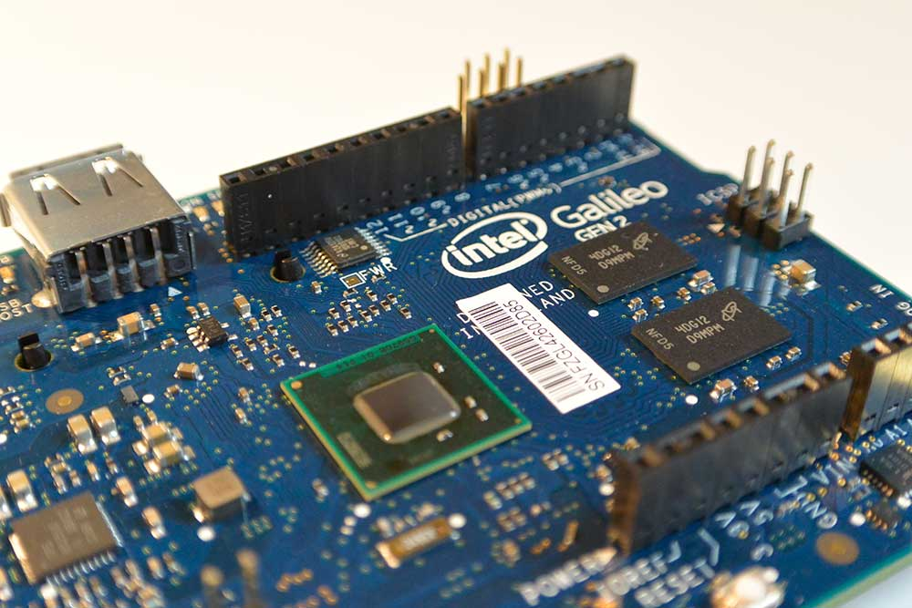

Consequently, it's the first board released on the market built around this very special chip. Coming from the Atmega328 on my Arduino, it's a huge leap in processing power! 

Most development boards similar to the Galileo (if not all) are driven by ARM-based processors onboard. That makes perfect sense, & indeed ARM chips dominate when it comes to mobile & embedded devices. They're cheaper, more power-efficient & have less consumption.

However, the Quark is certainly faster & more powerful & fundamentally different, since it's derived from Intel's x86 processors, usually seen in desktop computers - running Windows or OS X.
Moreover, the Quark chip (being x86 architecture) is a CISC (Complex Instruction Set Computing)
processor which is a more powerful & complex set.

On the contrary, ARM processors are RISC (Reduced Instruction Set Computing) which is a smaller, simpler instruction set architecture. The difference being that something which takes an ARM processor a few cycles to complete, might take an x86 just one.

The downside to having a CISC architecture is that any large instruction set requires more hardware, which requires more power to run. Hence the Galileo does run quite hot, even doing minimal processing or lying idle.

In addition to its processor, the Galileo also has 512 KB SCRAM built-in, 256 MB DDR3 RAM, 11KB EEPROM & a µSD card slot. So definitely no shortage of memory then...

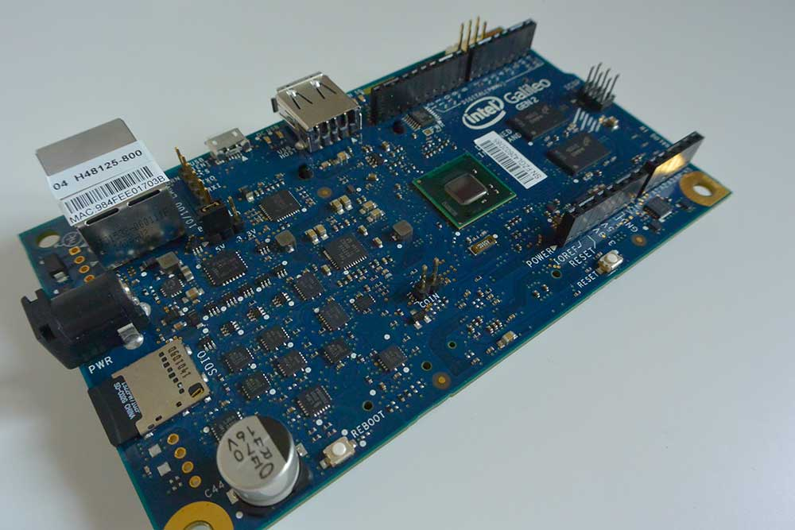

While that's all good news, the rest of the peripherals are a mixed bag. For starters, there's a micro USB 2.0 (client) for serial communication, but not for power. For power then, you're going to need use the 7V ~ 12V DC jack. 

There's also the µSD card slot like I mentioned, to hold your linux image. That's important and in reality, it's necessary. Without it you're booting the much 'leaner' default SPI Linux image already onboard, which is a bit lacking to say the least. One of the biggest drawbacks being it won't retain your uploaded program once it losses power. 

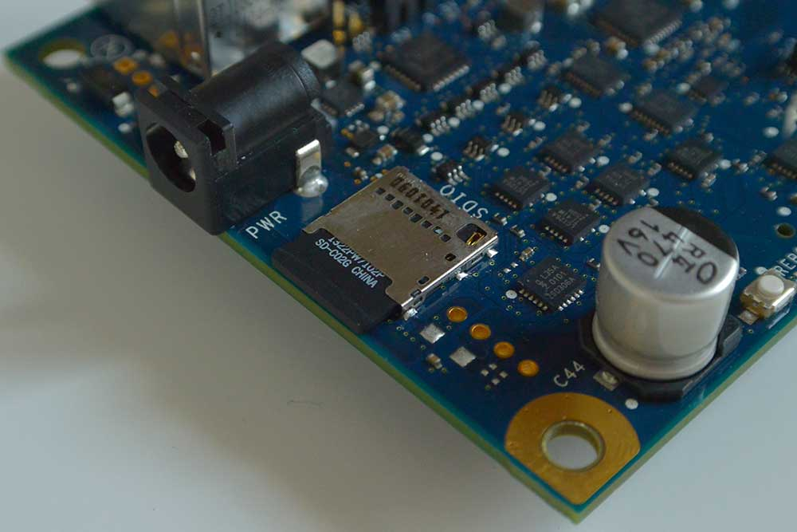

That said, once you've mounted the bigger linux image (Yocto), the Galileo is brimming with new features.

Going back to the peripherals, the Galileo also has an ethernet port, a shield-compatible Arduino Interface, SPI Flash (for storing firmware/bootloader, along with the latest sketch), USB host and a battery terminal (to keep RTC). Although it also notably lacks bluetooth.

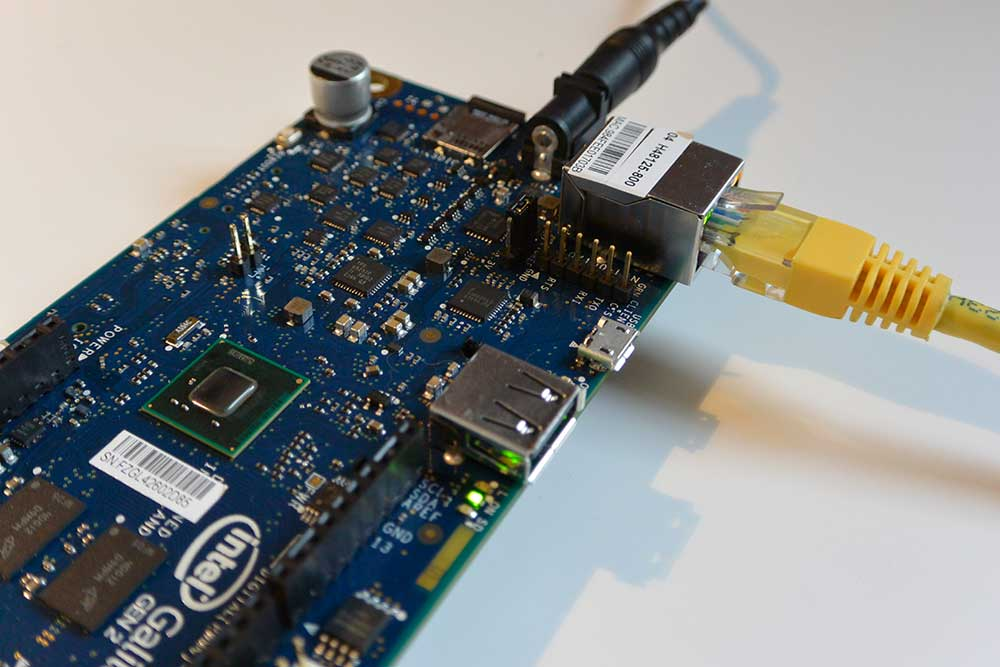

!!!! On the Galileo Gen 2, almost all the Arduino IO headers are connected directly to the Quark chip, meaning the pins can now achieve 2.97MHz, making it possible to run shields and sensors that couldn't have been used before. 

On the back there's also a mini-PCIe connector. Huh? Yup, never seen that before. It's an odd solution for enabling wifi on the board but I suppose it's versatile. It can work with full or half-sized mini-PCIe cards.

!!! Note that if you've got a half-sized mini PCIe card, you'll need an adapter bracket. 

In case you haven't realised it, Intel's 'IoT' board doesn't come wifi-enabled, which for me, was the biggest letdown and it means you're going to need to fork out a little more money for a PCIe card. 

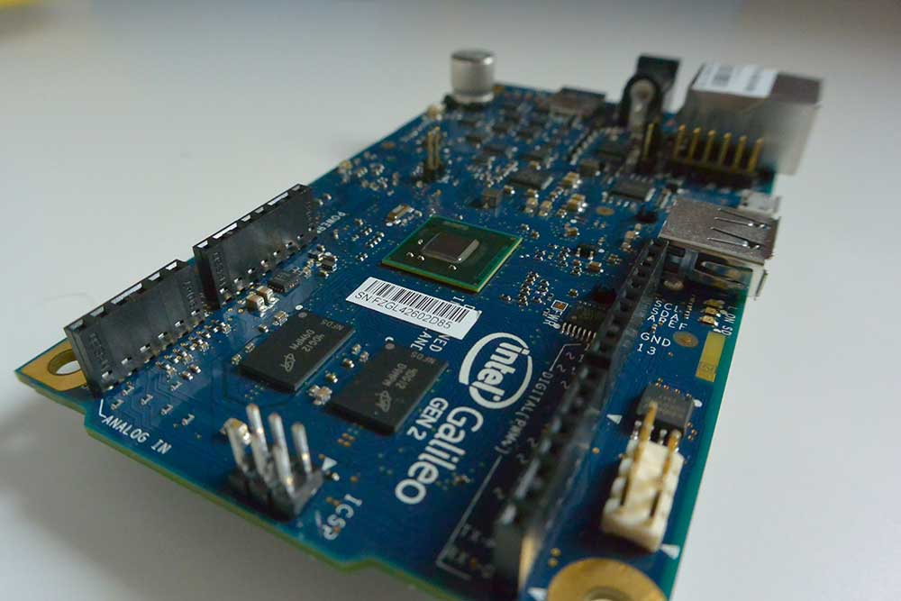

That's not all though. Another drawback for me was the decision to remove the MAX 3232 (responsible for converting the RS-232 levels), so now there's no longer any built-in circuit to convert the TTL levels. Instead, you'll have to spend some more money on an FTDI cable if you want to have access to the Linux console. 

! While this is a big drawback, there is a work-around to send Linux system calls to enable a shell prompt via the standard Galileo USB cable. Although this method is awkward & disables the ability to upload further programs through the IDE.

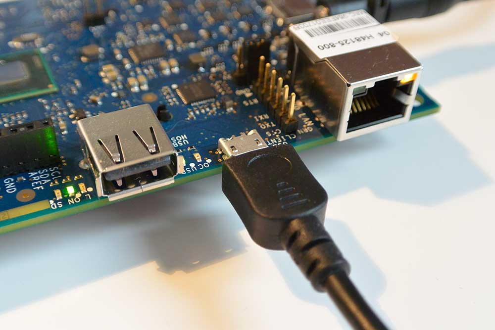

As you're probably guessing, the Intel Galileo is full of little frustations, owing to its own 'idiosyncrasies'. Honestly, I've never had so many cables on my desk for one board!

Mentioning cables, I think it's important to note that you must plug them into the Galileo in a certain order or else risk damaging your board. The power needs to be plugged in via the DC jack before you plug in USB. 

As an extra factor, you can only plug in the USB when the green LED is lit for USB on the board. This can take a bit of time to boot.

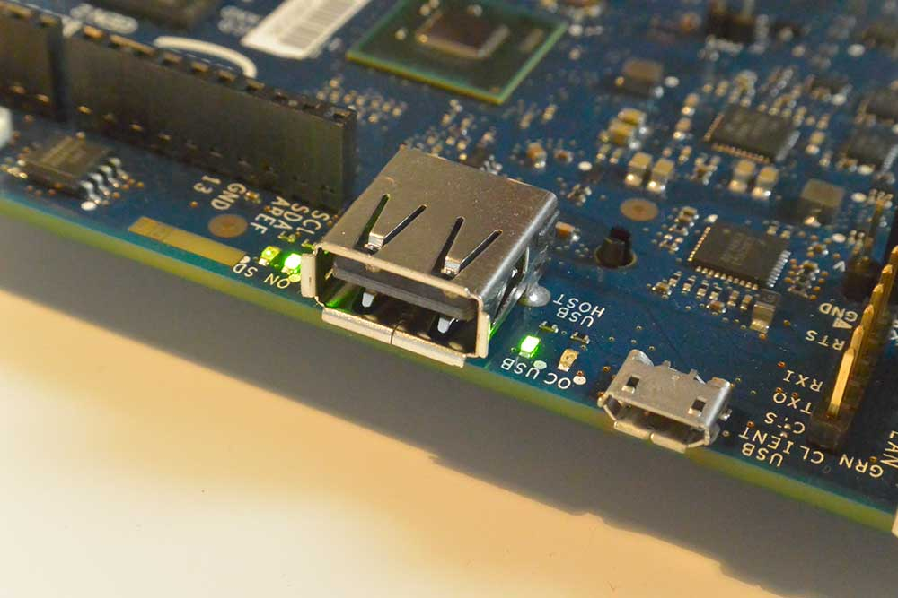

After having played around with it, I've slowly realised why it's been overshadowed by the Edison...

Frankly, the additional costs of €20 for an FTDI cable, the cost of a micro USB cable, along with more for an ethernet cable and a µSD card has been a bit much. 

And that's only to get started. It's roughly another €10 for the wifi PCIe card and more for a card adapter.

Considering the Galileo's starting price of around €70 - €80, it's a hard sell.

Anyhow, I did spend the day setting this board up and truth be told, it wasn't easy. That said, I've (somewhat) enjoyed the 'intrinsic' challenges afforded by the Galileo. It's easy to mock but it's been a learning experience for me. 

### Linux Console

After I had mounted my new linux image to the µSD, I plugged my FTDI cable into the headers and opened up the terminal.

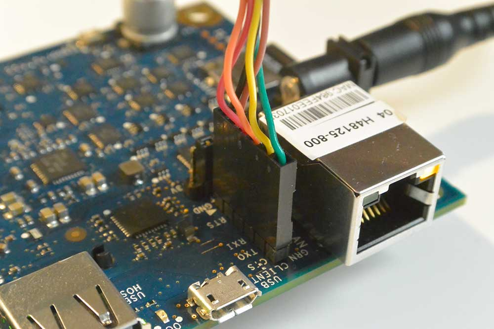

 !! Make sure to check that pin 1 (usually black) of the FTDI cable connects to the GND pin on the board.

 Inside the terminal then, I checked which serial port the Galileo was on by using the following command:

 `
 ~$ ls /dev/tty.usb*
 /dev/tty.usbserial-xxxxxxxx
 `

 Then I accessed the console (with 115200 as the baud rate) simply by using:

 `
 ~$ screen /dev/tty.usbserial-xxxxxxxx 115200
 `

! Note that these are instructions for OS X only. Other operating systems may differ

Inside the console then, you should be prompted with a login. Simply use 'root'.

!!! Intel Quark SoC X1000 was code-named Clanton and hence the name for the prompt: root@clanton 

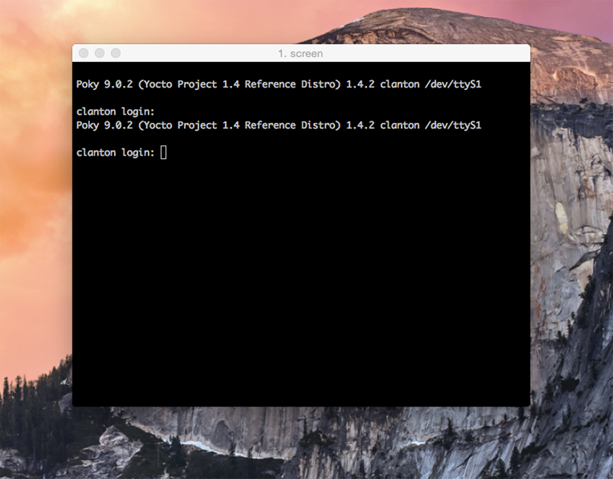

Feel free to look about and explore. You can even run python right from where you are. 

Display how you're feeling by typing: 

`
yes I Love Linux
`

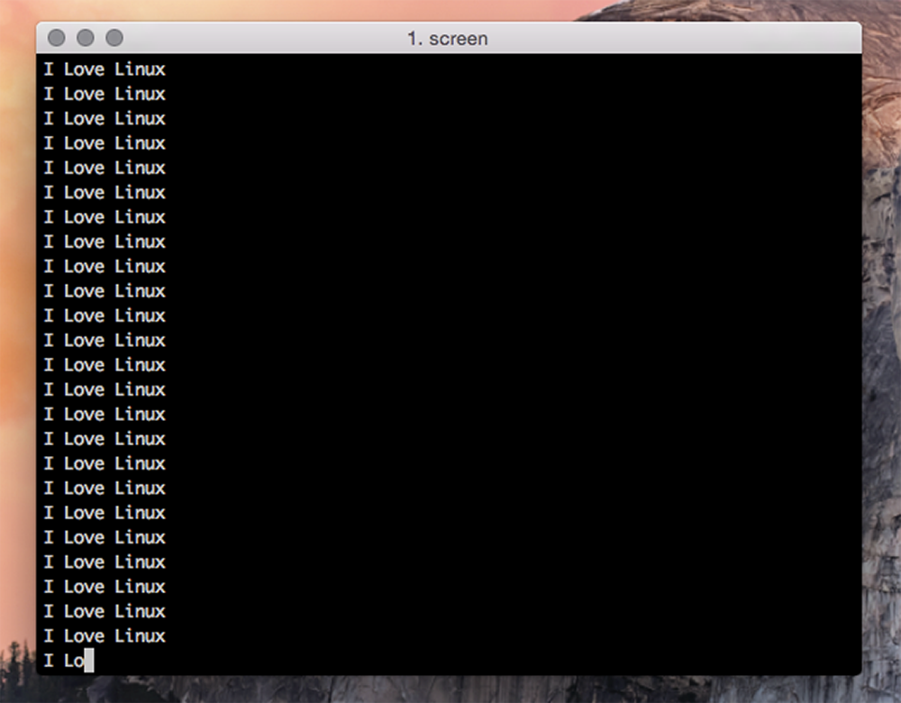

Or if you want to check out which board you have you can run the following command:

`
~$ cd /sys/devices/platform/GalileoGen2
cat modalias platform:GalileoGen2
`
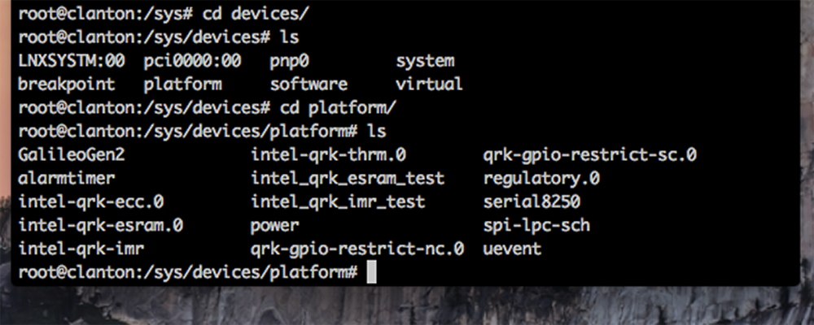

Finally you can check out the busybox software utility. It provides a whole load of different commands that can be executed inside Linux. Just type 'busybox' to access them. 

`
~$ cd /sys/devices/platform/GalileoGen2# busybox
`

### Sample Arduino Sketches

After playing about inside the console, you can remove the FTDI cable and plug in the usb cable to upload some sketches. 

You can find the example sketches [here](http://www.intel.com/support/galileo/sb/CS-035178.htm).

They're really great examples because they demonstrate how you can access Linux commands, right inside your sketch. 

For example, the first sketch I uploaded shows you how to use the onboard temperature sensor to read the temperature of the Quark chip.

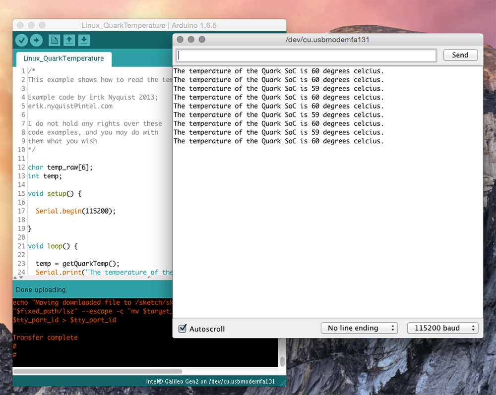

The bit inside the sketch that accesses the temperature sensor looks like this:

```bash
FILE *fp;
 
	fp = fopen("/sys/class/thermal/thermal_zone0/temp", "r"); 
	fgets(temp_raw, 5, fp);
	fclose(fp);
  
	int temp = atoi(temp_raw);
	temp /= 100;
	return temp; 
```

You can also do linux system commands to create a python script. This one writes the numbers 0-9 to a file, called log.txt, one number per second. 

It then executes the python script in the background, and regularly reads the contents of the logfile in the sketch while the python script is updating it.

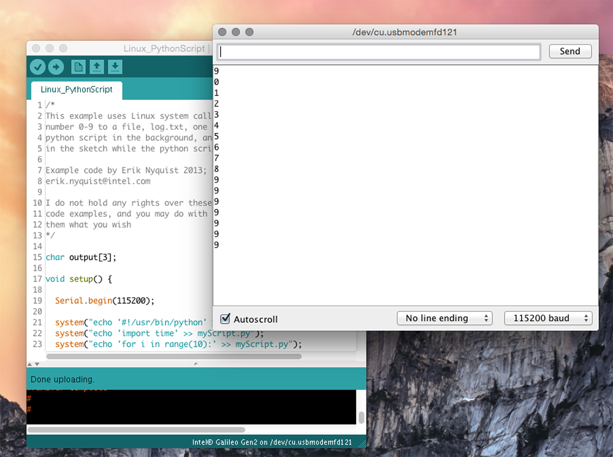
Finally, this last example shows you how to print text to the Galileo's serial ports using Linux system calls.

```bash
system("echo \"hello, world!\" > /dev/ttyGS0"); //Serial (IDE Serial Monitor)
system("echo \"hello, world!\" > /dev/ttyS0");  //Serial1 (Arduino header UART)
```
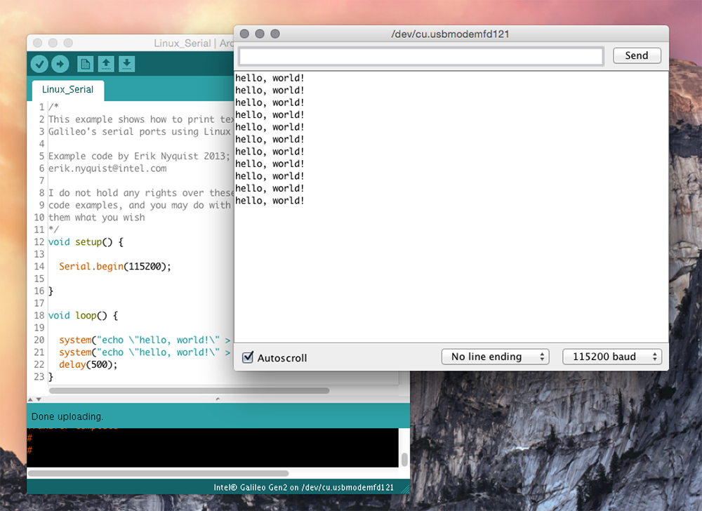

### Conclusion

While I have gone into the advantages of the Galileo a great deal, I'm left feeling a little bit lost trying to recommend it. It's certainly not a 'plug in and play' board & doesn't come working out of the box. If you're someone migrating from an Arduino platform or wanting to get into 'IoT' then I can't say you'll be too enthused by this board.

For less money & no 'hidden costs', you could easily buy an Arduino Yún, which for the price is the best board on the market - if you're looking for a Linux-based board with wifi connectivity.

And honestly, that's what you want out of the box. Wifi & Linux. Default. No need in buying additional cables, PCIe cards or having to mount your own linux image. Frankly, it feels as if Intel got a bit lost on the memo, forgetting they were building an 'IoT' board.

Sure, the Galileo has a few more specs on the Yún, but is it really worth the hassle? Maybe if you really felt you needed an x86 processor, you could buy the Intel Edison. For a little bit less than the Galileo, you've got an ultra small computing platform with integrated bluetooth & wifi. 

Having said that though, be prepared to shelve out more for a breakout board, along with a host of other available interface boards for extra functionality. And those interface boards do come at a premium.

In a way, the Galileo is a little bit behind the curve too, considering the trend is for ever smaller IoT boards, especially for easy embedding. Just look at newly released boards such as the Sparkfun ESP8266 Thing or Particle's Photon. These are also in direct competition to the Intel Edison. 

Nevertheless, I still like the Intel Galileo & I'm not going to throw it aside any time soon! Of course I'm going to continue using it but I can still acknowledge its shortfalls. It's a very capable board & I look forward to uncovering its potential.

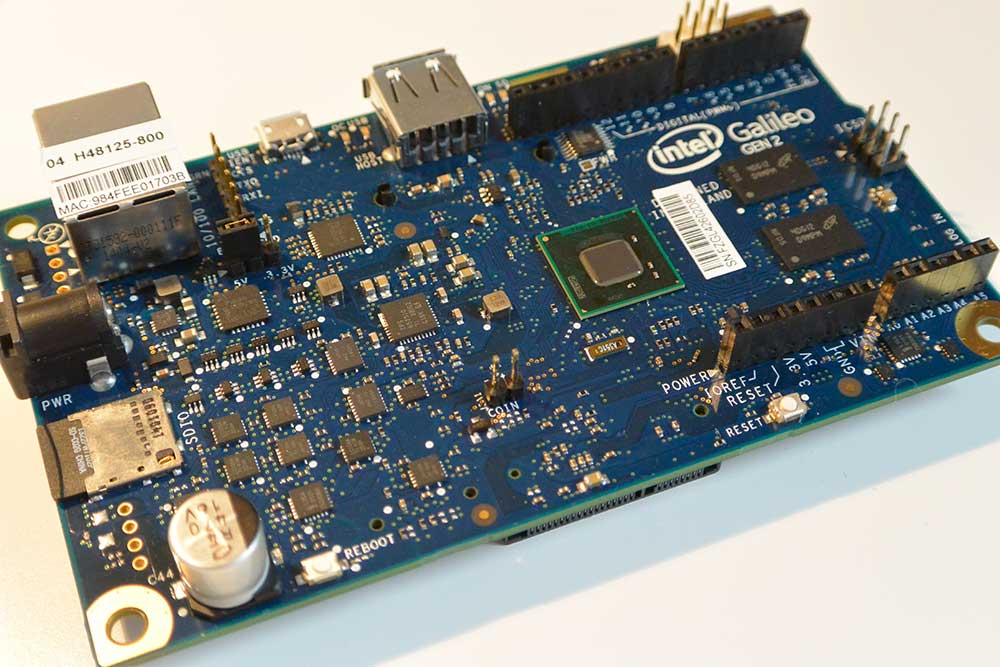


