Since I've decided to migrate over to Eclipse in order to program my Galileo, I've needed a persistent IP address in order to make a target connection. Since I couldn't find much in the way of instructions online, I decided on writing my own tutorial to guide others through the process, step by step.

===

Anyhow, my necessity for using an ethernet cable to make a connection to the Galileo derives from my choice to migrate across to Eclipse, for the sake of the Arduino IDE. In case you didn't know, Intel has a special _flavour_ specific to the Galileo. You can find it [here](https://software.intel.com/en-us/installing-the-eclipse-ide).

What's not 100% clear in the documentation is the need to update your linux image. Previously, when I was trying to make a target connection inside Eclipse, I was getting errors all over the place. Usually something along the lines of a failure to connect SFTP subsystem. 

<!-- 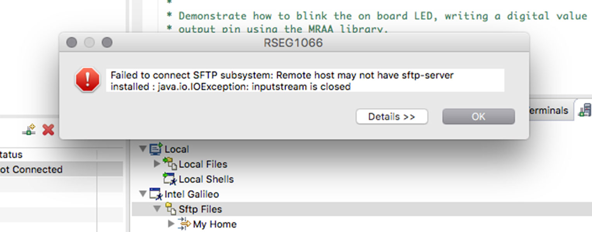 -->

### 1. Updating the Linux Image

If you don't know what version of Yocto you're running, inside the shell you can give the command: 

`uname -a`

If it returns something like what I have below, then you'll need to update.

`Poky 9.0.2 (Yocto Project 1.4 Reference Distro) 1.4.2 clanton`

However, for what we want to do, we need the [iot-devkit image](https://software.intel.com/en-us/creating-bootable-micro-sd-card-for-intel-galileo-board). This version also includes GCC, Python, Node.js, OpenCV and most importantly, support for Eclipse.

You can follow the directions there or read the summary below.

Go ahead and download & extract the image. Insert a blank SD card, erase and format the card as **MS DOS (FAT)**. Rename as Yocto.

Then, inside the terminal, head over to where you downloaded the image. Usually: 

`cd ~/Downloads/`

Now list all mounted drives:

`diskutil list`

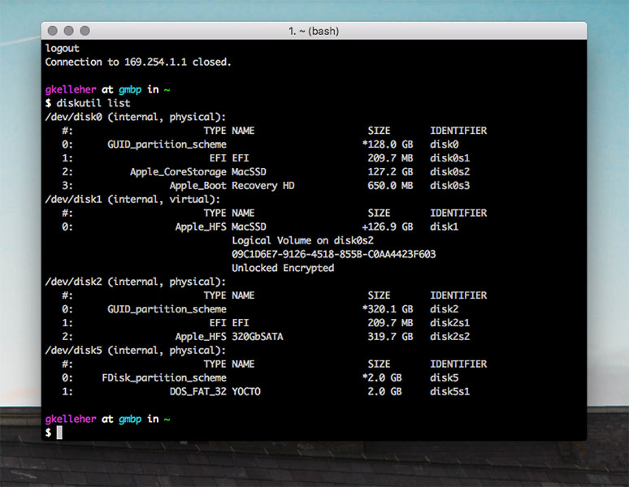

You should see something like what I have above. Notice **YOCTO** is on **disk5**. We want to dismount it:

`diskutil unmountDisk disk5`

!! Of course, you're disk number is likely to be different. Make sure not to confuse it with your computer's disk!

After you (hopefully) get a confirmation message, it's time to write the linux image to the SD card. Take a look at the name of the linux image you downloaded initially. In my case it looked like:

`iot-devkit-latest-mmcblkp0.direct`

Note whether your image has _latest_ or a date in the _YYYYMMDDHHMM_ format. Replace _latest_ and _disk5_ in the command below if yours differs. 

`sudo dd bs=8m if=iot-devkit-latest-mmcblkp0.direct of=/dev/disk5`

You'll likely get a password prompt, enter and let it do its thing. It takes quite a while, upwards of 5 minutes in my case. Just be patient. If you're using a card reader, you'll likely see some flashing indicator lights. 

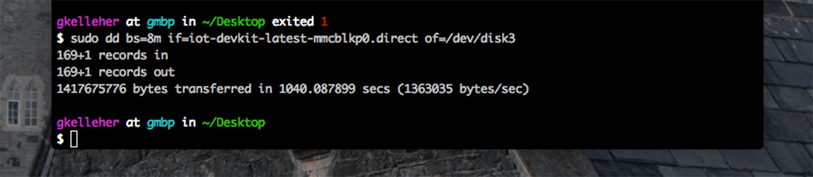

Once it's finished you'll get a message like the one above. Oh, and as a bonus, I also happened to get a pop-up. For whatever reason, my Mac doesn't seem to recognise it. 

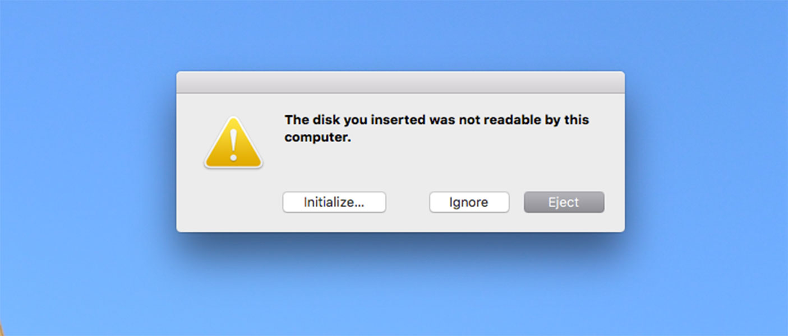

However if you run:

`diskutil list`

again, you'll see that **Yocto** has been replaced by **Linux** - so that's a positive sign!

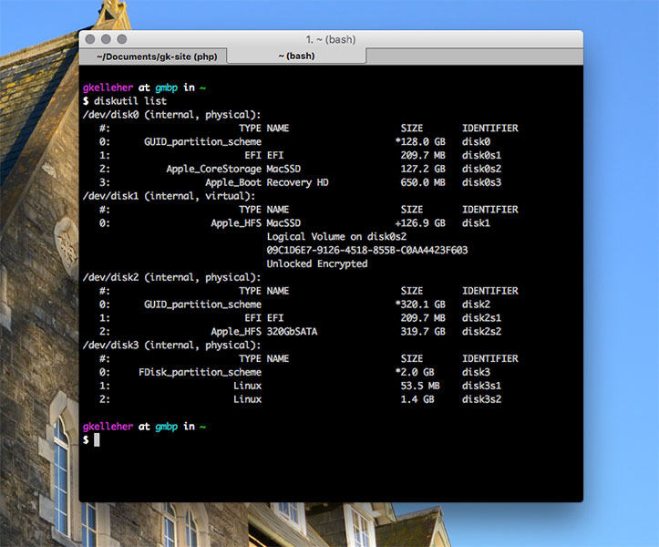

Go ahead and pop it into the Galileo. Plug in power and connect the FTDI cable. Run the following command:

`ls /dev/tty.usb*` 

You should see the connected Galileo device. Now ssh into it, including your own unique Galileo ID:

`screen /dev/tty.usbserial-xxxxxxxx 115200`

The quickest way to know is by running:

`uname -a`

You should get something along the lines of:

`Linux galileo 3.8.7-yocto-standard #1 Tue Jun 9 22:07:14 GMT 2015 i586 GNU/Linux`

If so, congrats! You now have a full-bodied Linux image running off your SD card. 

### 2. Setting up Ethernet 

Ok, sorry to disappoint, but the first bit was easy. At least in my unfortunate circumstances, setting up ethernet was a chore - hence the tutorial. 

In case you're unfamiliar with the difference between _dynamic_ versus _static_ connections, DHCP (dynamic Host Configuration Protocol) is a protocol that assigns free IP addresses to computers that are connected to a network. 

On the other hand, static IP addresses are just that - static. Once a static IP address is assigned a network element, it remains there until a decision is made to change the address for some reason.

The Galileo when its connected to your computer via ethernet cable is assigned an IP address via DHCP. This is the default configuration but it's an issue when we want to talk with it. 

Why? Since we have no idea what IP address has been assigned to it, we can't easily ssh into it & we can't easily address it. It's like trying to mail someone without their address.

However, what if we could assign a static IP address? Then, whenever we power up and connect the Galileo we'd know its exact address. We could ssh into it over the terminal and know the exact target connection for Eclipse. 

!!! Most routers have the 192.168.1.x range for dynamic IPs, where x is a number above 100 (static IPs use numbers below 100).

There are also reserved addresses. For instance, 192.168.1.1 is usually used for the configuration of the web interface and 192.168.1.2 and 192.168.1.15 usually provide the Ethernet connection through USB if your router contains a USB port.

If you're still inside the Galileo terminal, you can easily find out your Galileo's IP by typing:

`ifconfig`

This should list all the network configurations for the board.

! Note that **eth0** which was the previous name for the ethernet connection has been replaced by **enp0s20f6**

Ok, returning to the desktop open up your network preferences. After connecting your ethernet cable from your computer to your board, you should see a new service appear in the left-hand side of the window.

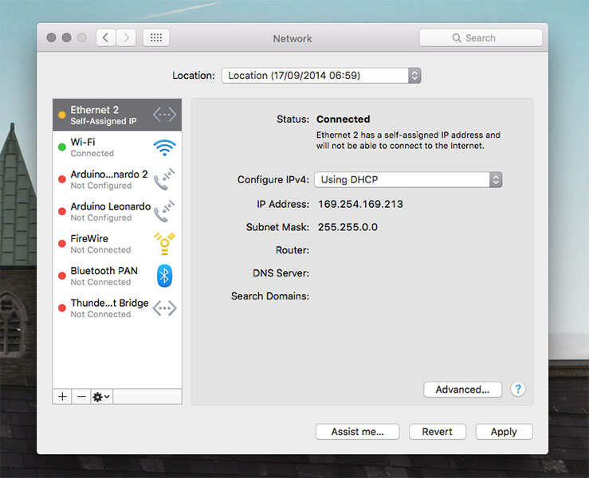

See that? It's assigned a DHCP IP address like we mentioned previously. That's great, now to change that to a static IP address.

Unplug the ethernet cable and a red ball should appear next to the service on the left-hand side. For my Galileo, I changed the IP address to **192.168.1.4**, & the Subnet mask to **255.255.255.0** The Gateway address (Router) should be the address of your router, mine was **192.168.1.1**.

You can run this command on your computer to find out the address of your router if you're unsure:

`netstat -nr | grep default`

Apply your changes and reconnect your ethernet cable and the ball should go green.

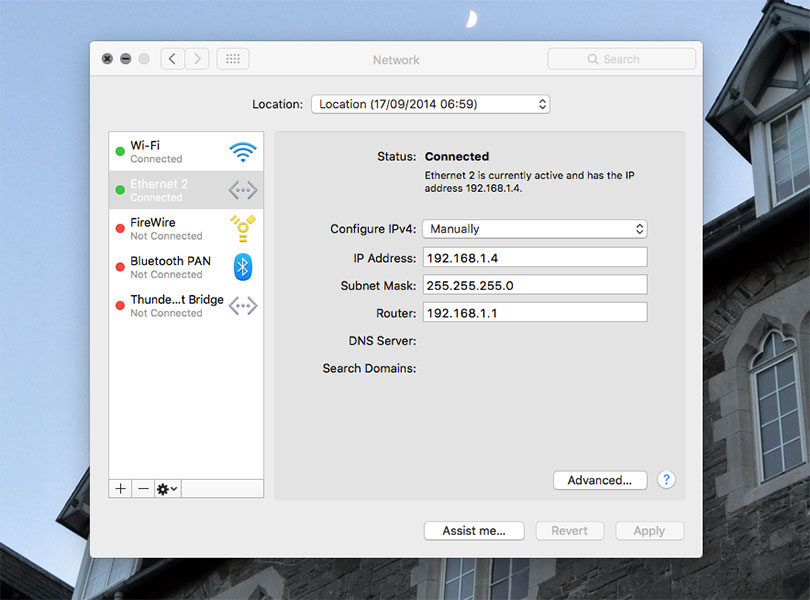

Next is to ssh back into the Galileo using the FTDI cable again and make some more changes in our configurations. Once you're in, type the command:

`ifconfig`

Can you see the default DHCP address assigned to the Galileo? Let's change that:

`ifconfig enp0s20f6 192.168.1.27 netmask 255.255.255.0 up`

Note that the ethernet connection is called **enp0s20f6** and not **eth0** like in the default linux image.

This command sets the IP address to **192.168.1.27**. You can type:

`ifconfig`

Notice the IP address has changed? Great, let's make it static now. Firstly, check your route using the route command:

`route`

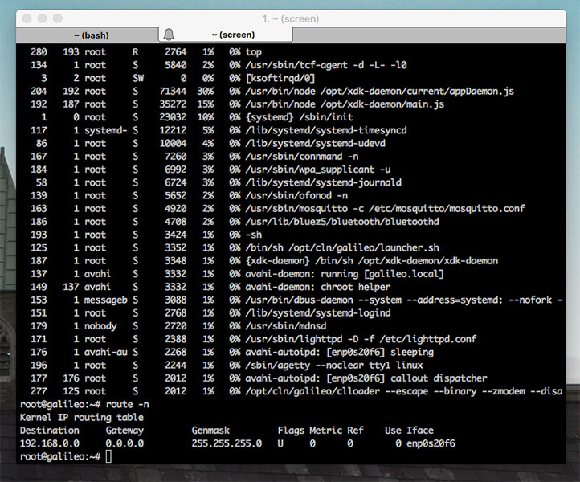

If the gateway is not specified, add a default route to it. Use the route command again:

`route add default gw 192.168.1.1 netmask 255.255.255.0`

Double-check if the route was added correctly:

`route`

In order to set the IP address **192.168.1.27** static we need to use a very useful command line tool called **connmanctl**. To get a list of what it can do, simply type:

`connmanctl help`

Otherwise, type:

`connmanctl`

This enters you into connmanctl mode and you can issue commands from here. 

Firstly, find out the name assigned to your ethernet cable by simply typing:

`services`

It should return something like what I have below.

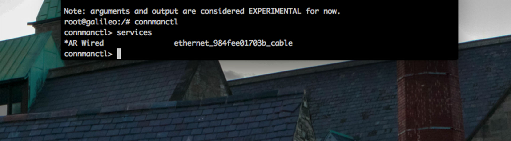

The last command is quite lengthy and you might get a bit of wrap-around text. The solution around this is to type either one of the following, at least one of them should work:

`shopt -s checkwinsize`

`eval $(resize)`

Now for the actual command. I hope you've been keeping notes! The command looks like this:

`config <service> --ipv4 manual <ip address> <netmask> <gateway>`

Where _service_ is your cable, _ip address_ is the one you assigned earlier, _netmask_ is 255.255.255.0 like we had before, and finally _gateway_ is _198.168.1.1_.

Thus, in my case, I substituted in:

`config ethernet_984fee01703b_cable --ipv4 manual 192.168.1.27 255.255.255.0 192.168.1.1`

There's no return message, just `^C` to leave connmanctl.

All working correctly, you should now have a working static IP for your Galileo. Let's test it by shutting down the Galileo and rebooting:

`shutdown -r now`

!!!! If you've your ethernet cable connected and suddenly you're not able to access the internet, it could be that your ethernet connection is taking priority over WiFi. You can change the service order within Network Preferences. This can sometimes throw the Galileo which might require another reboot.

Once the Galileo's back up and running, we need to ping the static IP address (192.168.1.27 in this case), to see if we get anything back. First let's see if the IP address is available by typing:

`arp -a`

Do you see your static IP address? If not, give it another minute or else try rebooting things again. 

If you do, go ahead and ping your address:

`ping 192.168.1.27`

You might get a message back with _request timeout_ or _no route to host_ with 100% packet loss. In that case, you're best bet is to try rebooting or sshing to see if your IP address is indeed, static.

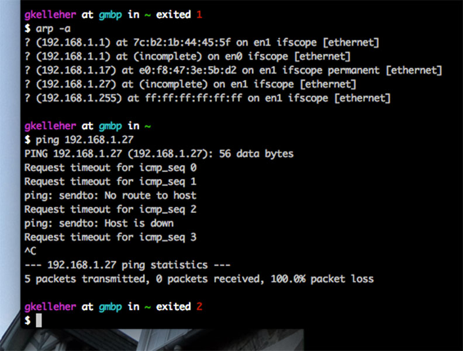

Otherwise you might be lucky enough to have a connection. Fantastic! If you like you can ssh into the Galileo over ethernet using your IP address, by typing:

`root@192.168.1.27`

You can see an example below where the IP address is 169.254.6.22. 

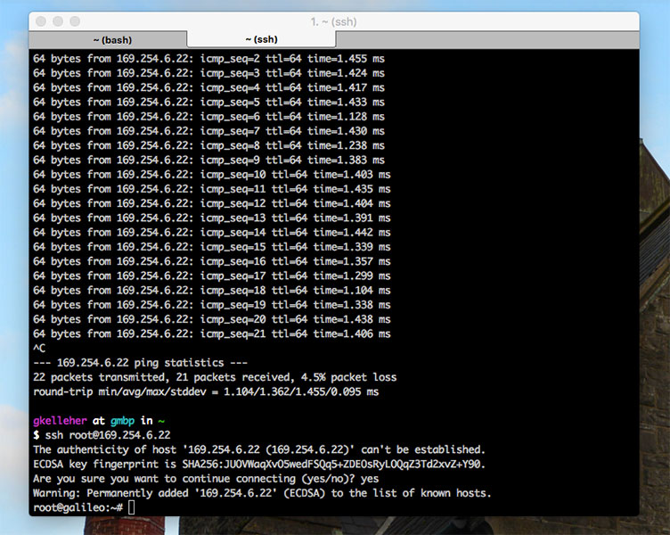

In my case when I tried sshing into my Galileo I got a strongly worded message, warning me of a man-in-the-middle attack. 

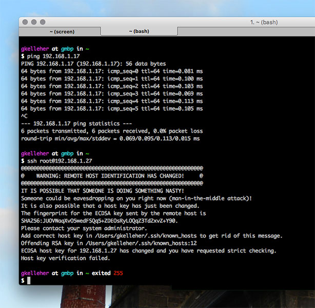

It's not too hard to fix this. Simply following the instructions, you can type:

`cd /Users/<yourname>/.ssh/known_hosts`

This brings you to the known_hosts file where you can type:

`cat known_hosts`

This lists all the hosts known to the computer. You might see the offending hostname it talks about. 

The easiest way to get rid of the unwanted IP addresses is to type in:

`ssh-keygen -R hostname`

If that doesn't work for you and you don't mind losing other hostnames, you can simply delete the known_hosts file and start afresh. Type:

`rm known_hosts`

Then have another go at sshing into the Galileo. It should work for you this time.

Now for the grand finalé - using Eclipse. Open up your pre-installed Eclipse and look to the lower left. Add a connection and click 'ok' on the pop-up without a password. All working, you should make a connection.

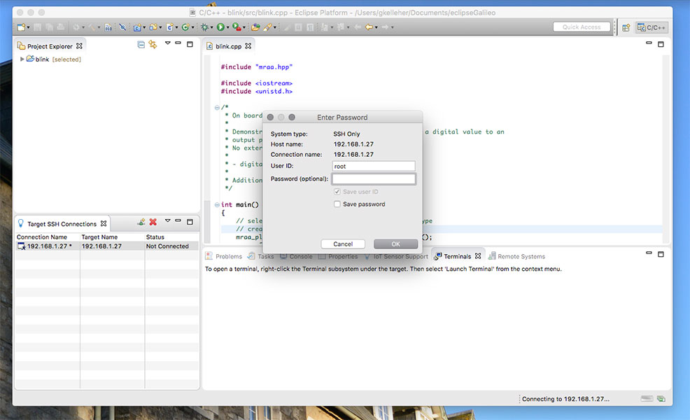

You might need to update and synchronise the libraries. If so, go ahead. It'll only take a minute.

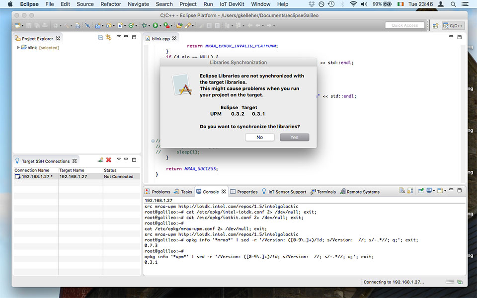

You can even launch the terminal from within Eclipse, which is a useful feature.

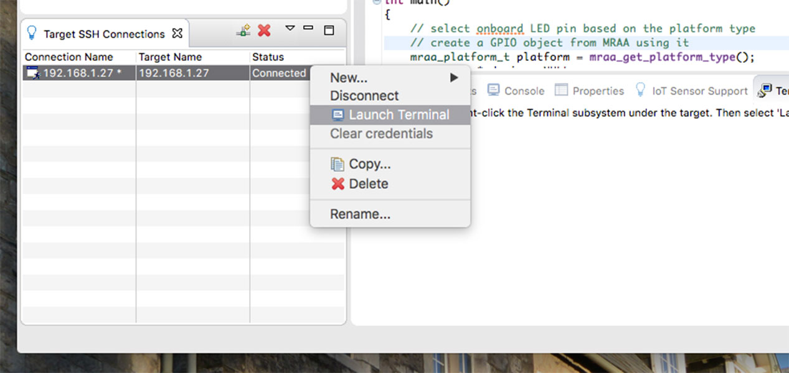

Run the blink test to see if things are in order:

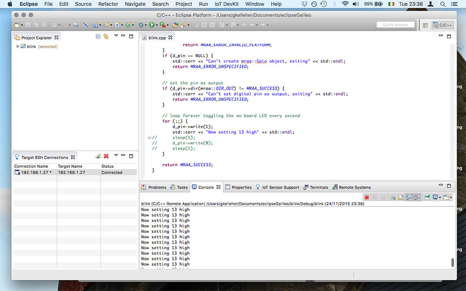

