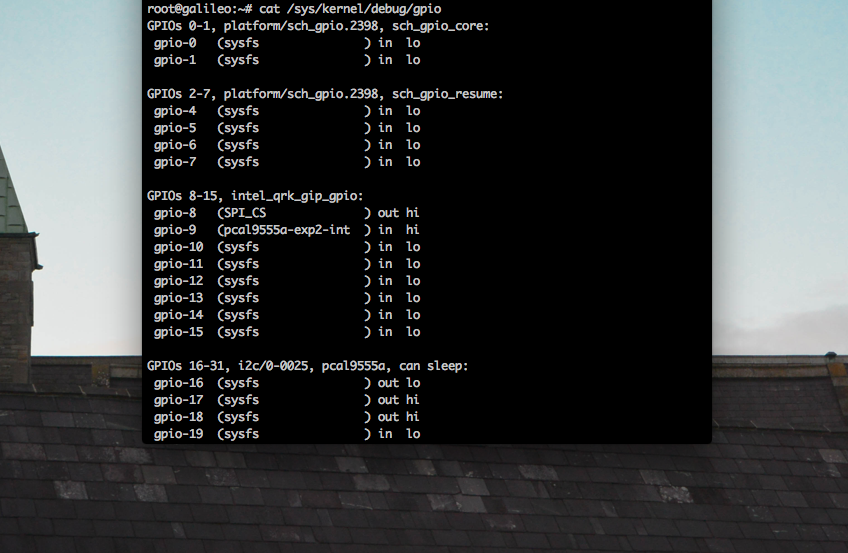
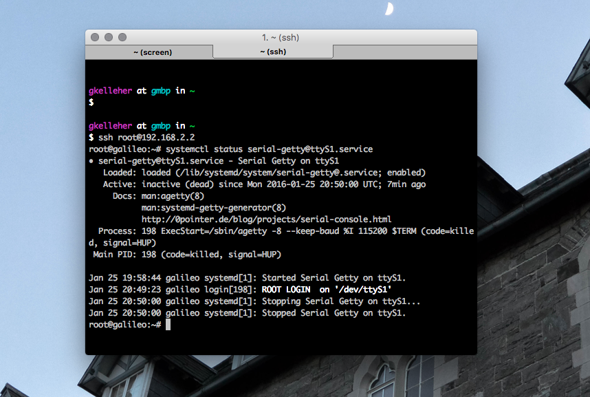
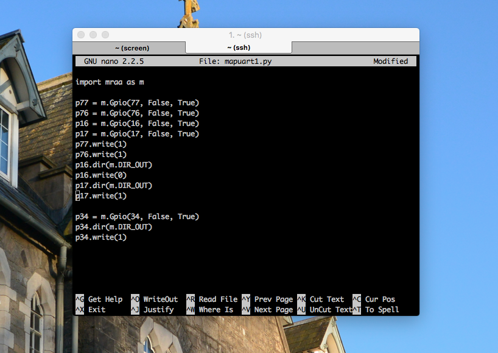
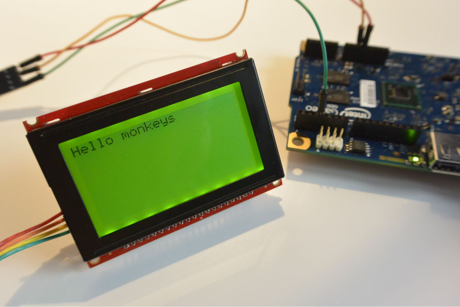

Since I haven't blogged for some time and I'm only getting back to working with the Intel Galileo again, I've decided to write up a quick tutorial to make up for lost time. In this tutorial I'll address a key drawback to the Intel Galileo and a handy solution to remedy. 


===

If you're in anyway familiar with using a micro-controller, you've more than likely made use of a UART serial port. They're commonly used for a variety of purposes such communication between the board and other devices.

Almost all boards only come with at least one; seldomly more. This is a downside to a lot of projects, since you may require the use of a second in some cases. 

Usually if you're working on a larger project, you invest in a better board such as an Arduino Mega or Due which each have three additional serial ports. The Beagle-bone Black even has six! 

Nevertheless, if you ever happen to need another, Arduino has a convenient library called SoftwareSerial which allows you to create a _virtual_ serial port; using software to replicate the functionality (hence the name "SoftwareSerial").

I can't lambaste the Intel Galileo for only having one serial port, since it's not unlike most, however it's not compatible with Arduino's SoftwareSerial library. 

Having said that, Arduino have come out with an update for their IDE that allows you to create a second serial port on pins 2 & 3 by calling **Serial2** in your sketch. Problem solved.

Unfortunately, many people like myself have distanced themselves from the Arduino IDE and have moved onto Eclipse or other environments where things aren't so simple.

For one, I/O interfacing is done through **Libmraa** which makes things a little different. If you're comfortable with MRAA and programming through c++ then the following UART example should be pretty routine:

```c
	#include <unistd.h>
	#include <iostream>
	#include <exception>

	#include "mraa.hpp"

    mraa::Uart* dev;

    try {
        dev = new mraa::Uart("/dev/ttyS0");
    } catch (std::exception& e) {
        std::cout << "Error while setting up raw UART, do you have a uart?" << std::endl;
        std::terminate();
    }
    if (dev->setBaudRate(115200) != MRAA_SUCCESS) {
        std::cout << "Error setting parity on UART" << std::endl;
    }
    if (dev->setMode(8, MRAA_UART_PARITY_NONE, 1) != MRAA_SUCCESS) {
        std::cout << "Error setting parity on UART" << std::endl;
    }
    if (dev->setFlowcontrol(false, false) != MRAA_SUCCESS) {
        std::cout << "Error setting flow control UART" << std::endl;
    }
    dev->writeStr("Hello monkeys");
```
From the above example, we're creating a new MRAA object with the serial port set to **/dev/ttyS0**. This is the UART port on pins 1 & 0 of the Intel Galileo. 

Where does the second UART port **/dev/ttyS1** lie then? It lives on the FTDI header. Ordinarily, it's reserved to provide access to the Linux serial console, which I've demonstrated in the past. However, we want to repurpose it for our own means, and move it to pins 2 & 3. 

This detachment is done automatically inside the Arduino IDE when you use the **Serial2** object. Unfortunately for us, we'll have to do this manually by 'muxing' the right gpio pins on the Galileo. 

Essentially, you're able to change board-level pin configurations through pin multiplexing switch(e)s a.k.a _pin muxing_, especially useful in scenarios when you need to connect a shield pin to the correct interface on the Quark for instance.

You can also change the voltage level-shifter a.k.a _buffer_ direction to input or output. Depending on whether you want the pin signal being driven "out" by the Quark or "in"	by another external circuit. 

Ssh into your Galileo and run the following to check your gpio arrangement:

`cat /sys/kernel/debug/gpio`

!!!! As a heads up, best to ssh in using an Ethernet cable since we'll want to disable the Linux console on the FTDI header to use our new serial port on the Arduino header. 

You should get something back like the following below:



Now we have to carefully switch the right switches in order to enable pins 2 & 3 for our UART port. Fortunately, inside the [MRAA library](http://iotdk.intel.com/docs/master/mraa/galileorevh.html) it tells us which "buttons to press". 

The first step should be to disable the Linux console for a start. Do that by typing:

`systemctl stop serial-getty@ttyS1.service`

If you want, you can confirm it's cancelled by typing:

`systemctl status serial-getty@ttyS1.service`



The easiest method to mux the pins is by making a small python program. Create a new .py file:

`nano mapUart.py`

Enter the following below:

```python
	import mraa as m 

	p77 = m.Gpio(77, False, True) 
	p76 = m.Gpio(76, False, True) 
	p16 = m.Gpio(16, False, True) 
	p17 = m.Gpio(17, False, True) 

	p77.write(1) 
	p76.write(1) 

	p16.dir(m.DIR_OUT) 
	p16.write(0) 

	p17.dir(m.DIR_OUT) 
	p17.write(1)

	p34 = m.Gpio(34, False, True) 
	p34.dir(m.DIR_OUT
	p34.write(1)

```



Great, go ahead and run it:

`python mapUart.py`

Check your gpio arrangement again with:

`cat /sys/kernel/debug/gpio`

Your pinout should now look like the following:


```bash
root@galileo:~# cat /sys/kernel/debug/gpio 
GPIOs 0-1, platform/sch_gpio.2398, sch_gpio_core:

GPIOs 2-7, platform/sch_gpio.2398, sch_gpio_resume:

GPIOs 8-15, intel_qrk_gip_gpio:
 gpio-8   (SPI_CS              ) out hi
 pio-9   (pcal9555a-exp2-int  ) in  hi

GPIOs 16-31, i2c/0-0025, pcal9555a, can sleep:
 gpio-16  (sysfs               ) out lo
 gpio-17  (sysfs               ) out hi

GPIOs 32-47, i2c/0-0026, pcal9555a, can sleep:
 gpio-34  (sysfs               ) out hi
 gpio-47  (sysfs               ) out hi

GPIOs 48-63, i2c/0-0027, pcal9555a, can sleep:
 gpio-63  (sysfs               ) in  hi

GPIOs 64-79, pca9685-gpio, can sleep:
 gpio-76  (sysfs               ) out hi
 gpio-77  (sysfs               ) out hi
 ```

That's all the changes made then. You should now have a new serial port set up on pins 2 & 3. You can use the same code I had at the beginning but change it to **/dev/ttyS1** of course. 

You can also write data straight from where you are inside the console using:

`echo -ne '\033[2J' > /dev/ttyS1`

Or read using:

`cat -v < /dev/ttyS1`

In the photo below you can see I've my serial-enabled display hooked up to pin 3 which is transmitting the text to the display.


