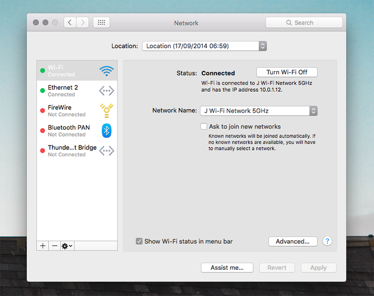
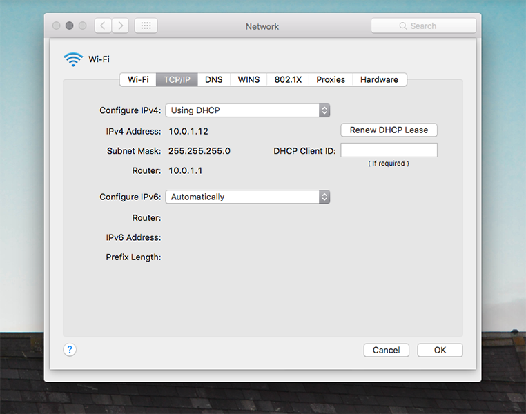
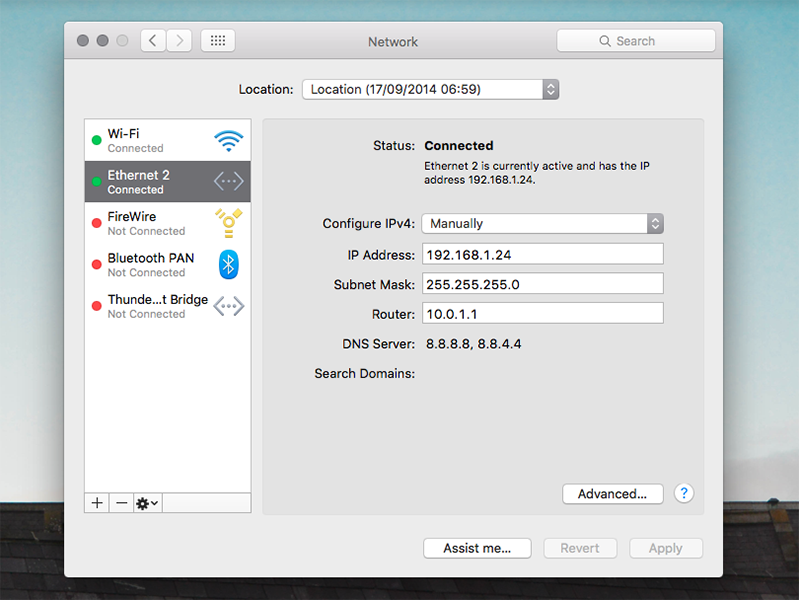
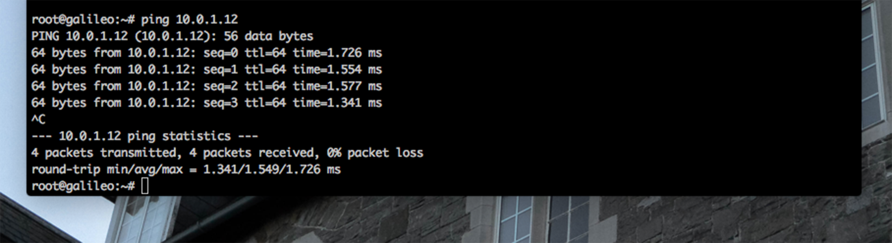
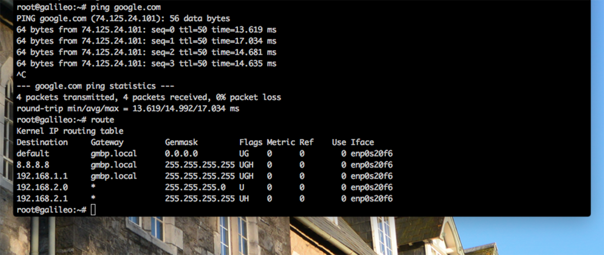
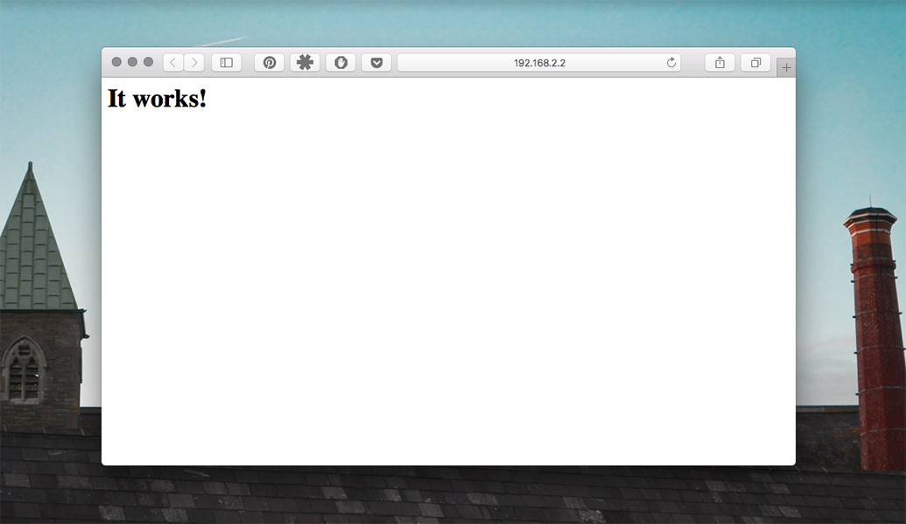
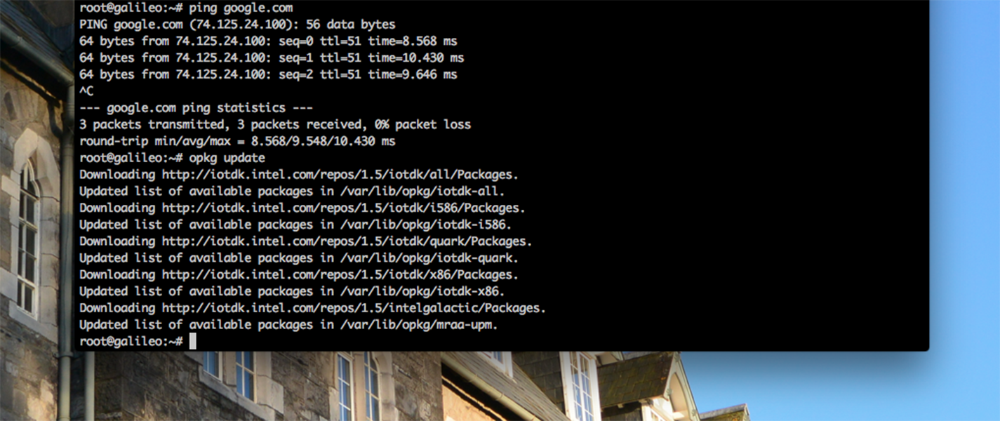
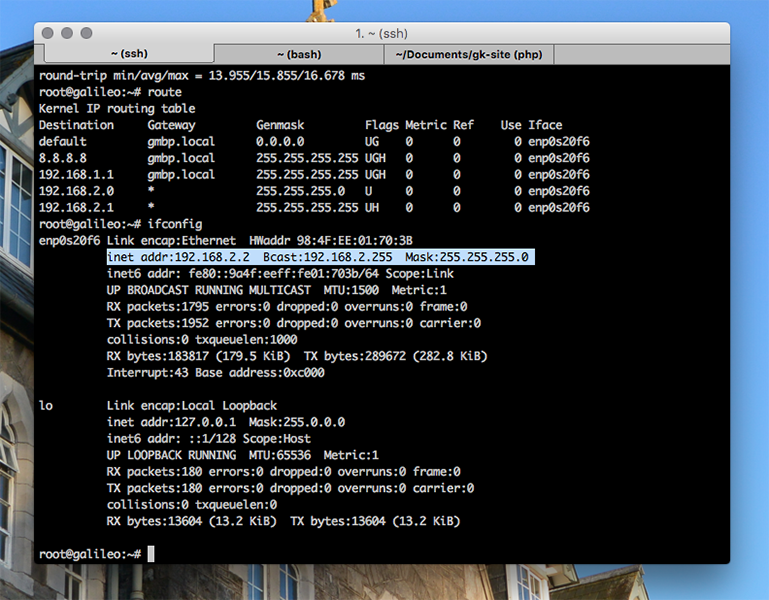
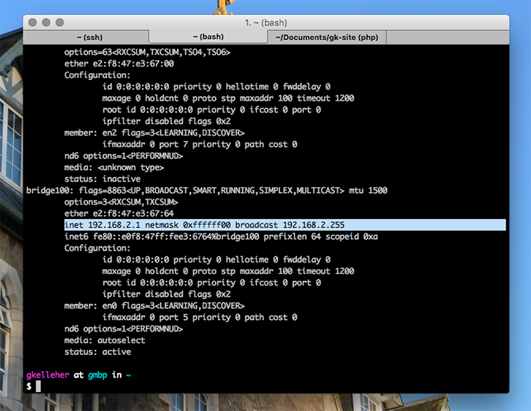

As a continuation on since my last post, I wanted to take things a little further and enable WiFi sharing on my Mac over ethernet. In turn, allowing my Galileo to access the internet. Do it yourself in just five steps.

===

If you haven't set up an ethernet connection to your Galileo yet or haven't the larger Linux image, I recommend you look at my previous [tutorial](http://www.gregorykelleher.com/blog/galileo_ethernet) before you start with this.

### Step 1 - Starting up the Galileo

To start things off, let's get the Galileo up and running. First connect the ethernet cable from your Galileo to your computer before plugging in power. Once it's turned on, attach your FTDI cable and ssh into it with:

`ls /dev/tty.usb*` 

You should see the connected Galileo device appear. Follow by including your own unique Galileo ID:

`screen /dev/tty.usbserial-xxxxxxxx 115200`

For this tutorial, I assume you haven't a static IP address set up yet. It's perhaps best if you haven't since it makes following this tutorial a little bit easier. 

If you haven't a static IP address setup (or don't know what one is!) jump to step 2. 

Else, if you happen to have a static IP set up, you can disable it by using the following command:

`$connmanctl config <service> --ipv4 dhcp`

If you're unfamiliar with this command, _service_ is just the name of your ethernet cable. In my case, it looked like this:

`$connmanctl config ethernet_984fee01703b_cable --ipv4 dhcp`

! If you don't know what your **service** is, you can just type _connmanctl_ which will enter you into connmanctl mode. Then type _services_ to find out.

Double check if you've done that right by typing: 

`ifconfig`

Note whether your previous static IP address has been properly changed. 

### Step 2 - Network Configuration

The next step is always to find out more about your network setup. In the image below, you can see my Mac is connected to WiFi with the IP address **10.0.1.12**. Clicking on _Advanced_ and going to the _TCP/IP_ tab brings up some more info. 

Looks like my router address is **10.0.1.1**, my subnet mask is **255.255.255.0** and my Mac's IP address is **10.0.1.12** of course.

You might have noticed in the first image that I've got an _Ethernet 2_ connection. That's my Galileo connected to my Mac via an ethernet cable. Below are the details of that connection. 

If you're unsure how I've managed to set this up, you can find out more in my previous tutorial [here](http://gregorykelleher.com/blog/galileo). 

You can see I've manually configured the connection - most importantly with the same router address. 

### Step 3 - Internet Sharing

Great, you're half-way there! This next bit is straightforward. Inside System preferences, go to Internet Sharing and share your WiFi connection over Ethernet. Fairly self-explanatory. 

Open up another tab inside your terminal (doing this on your local machine, not the Galileo) and type:

`ifconfig`

Scroll and look for **bridge100**. Note the third line down:

`inet 192.168.2.1 netmask 0xffffff00 broadcast 192.168.2.255`

Bridge100 is the hidden interface that only appears when we enable internet sharing on the Mac. 

If you've already guessed, this is the link Galileo uses to connect to the internet over ethernet.

### Step 4 - Going Online

Now, if you're feeling optimistic you can head back to your first terminal window where you ssh'd into the Galileo and try pinging _google.com_, or any other address. 

More than likely, it doesn't work. Ah, bummer. In this situation, we need to restart the Galileo. 

Don't unplug anything, remember we don't have a static IP address so our Galileo's IP address will be different when it reboots. Therefore, we need to leave the FTDI cable attached.

Type the following to restart the Galileo:

`shutdown -r now`

You should see a scrolling screen of text as the Galileo lists all the processes and starts back up again. Once it's up and running again, type your password into the prompt and log back in.

Cross your fingers and type the following:

`ping 8.8.8.8`

!!! In case you haven't heard of 8.8.8.8 before, it's Google's public DNS server for IPv4. Another one you might see is **8.8.4.4**. Pinging these addresses are a common way of checking your connection. 

Remember your computer or router address? Let's ping those too:

`ping 10.0.1.12`

`ping 10.0.1.1`

Hopefully you should be receiving packets back. If everything's working so far, go ahead and ping Google:

`ping google.com`

Congrats! You now have access to the internet via internet sharing. You can double check this by typing:

`route`

You should see something like the following where **gmbp.local** is the name of your computer. 

If you want, go to your browser and type in your Galileo's IP address, you get something back like this:

Now's a good opportunity to update your package manager - opkg; while you've access to the internet. Type the following to do so:

`opkg update` 

Next type in:

`ifconfig`

You should see the DHCP IP address assigned to the Galileo alongside the Bcast or **Broadcast** address, which is **192.168.2.255**, in my case. 

Note that the Broadcast address is the same as what we saw for bridge100 earlier - **192.168.2.255**.

### Step 5 - Setting up the Static IP address

It's not too hard to set up the static IP address if you've done it before. It's exactly what I did in my previous tutorial. 

Like before, the command is rather lengthy so type in the following to prevent wrap-around text:

`eval $(resize)`

Next type _connmanctl_ to enter connmanctl mode, then type in the following command, substituting your values:

`config <service> --ipv4 manual <ip address> <netmask> <gateway>` 

Where _service_ is your cable, _ip address_ is the new static IP address you want to assign, _netmask_ is 255.255.255.0 like we had before, and finally _gateway_ is the router address.

Thus, in this example, my command looked like this:

`config ethernet_984fee01703b_cable --ipv4 manual 192.168.2.2 255.255.255.0 10.0.1.1`

Now that I've set my static IP address to **192.168.2.2**, you should be able to use it in future for ssh'ing into the Galileo via the ethernet cable rather than pulling out the FTDI cable as before. 

If you try pinging the IP addresses as we did earlier, you'll find the connection has been severed since you changed the IP address.

Simply reboot the Galileo by typing:

`shutdown -r now`

Upon rebooting you should be able to log back in and check if your Galileo's IP address remained static. If so, have another go at pinging an address. You should be back online.

That's it finished then, you now have internet sharing enabled on your Mac with a static IP address assigned to your Galileo. 

