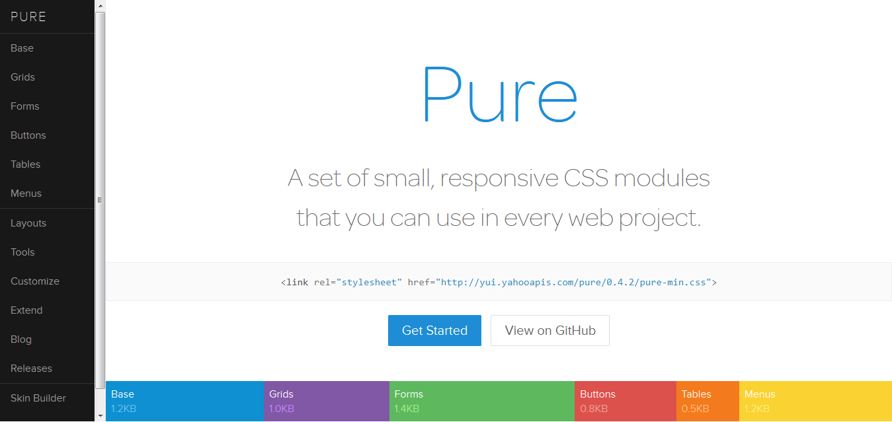
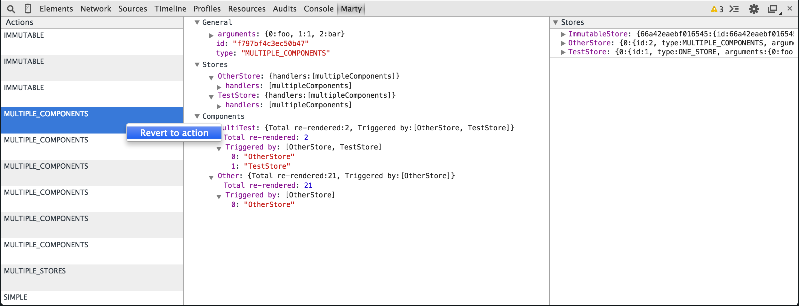
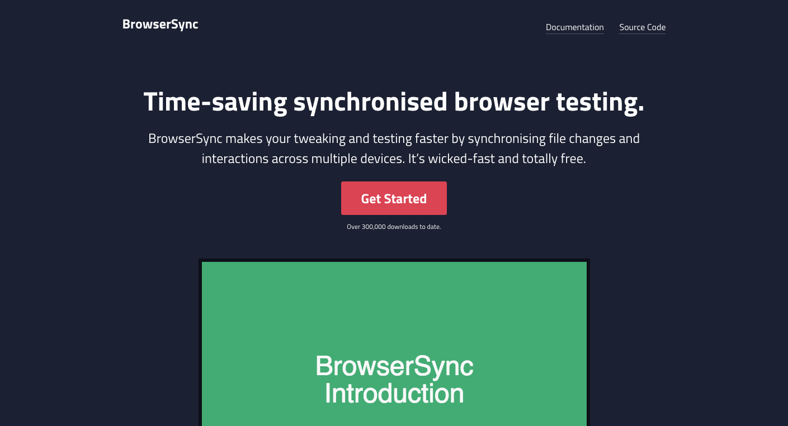
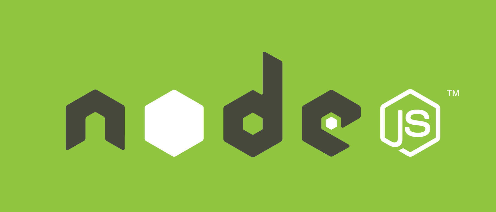
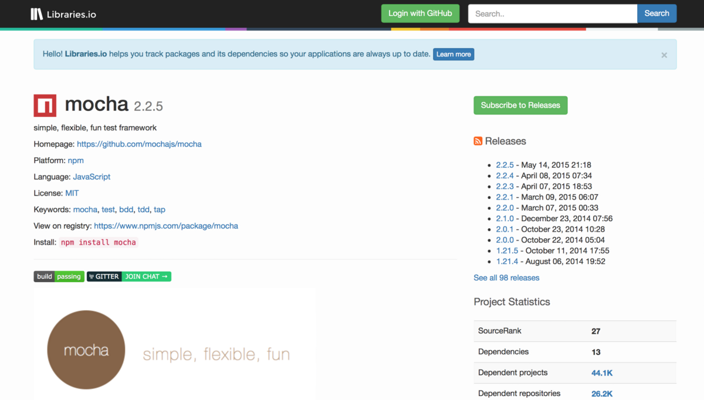
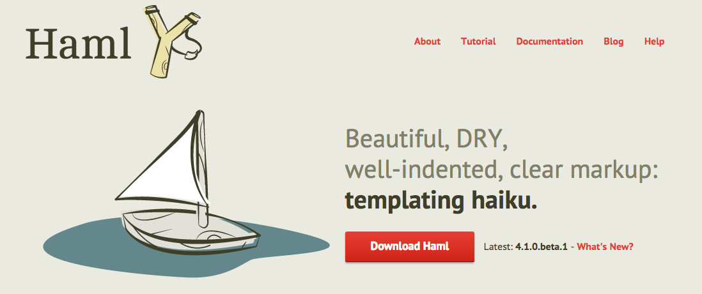
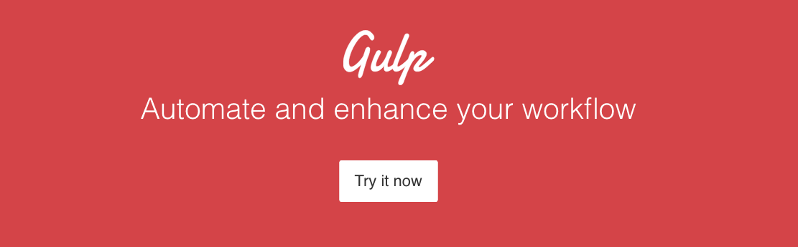
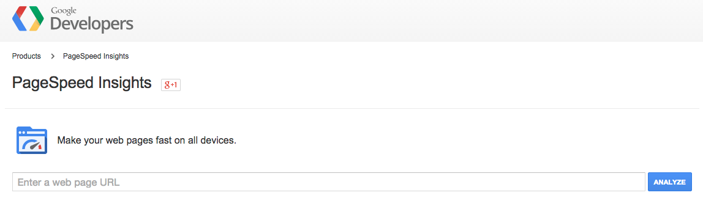
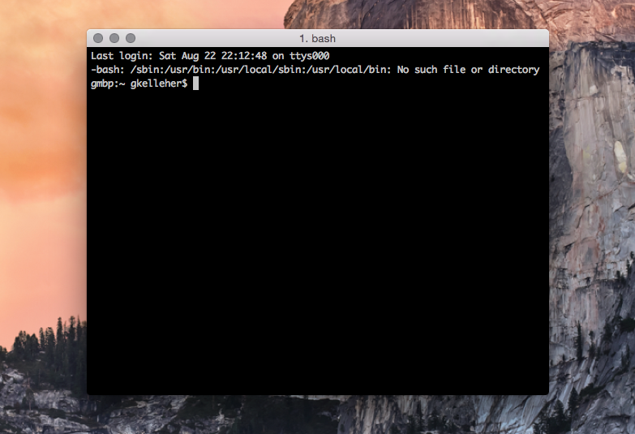

Building a site these days isn't as easy as when I started. Before, I could've been satisfied with just a html page, some basic css & maybe some javascript. These days I seem to be tripping up over a bunch of different technologies, all vying for attention. 

===

This blog post is really for my own sanity - in order to help me track all the shiny new stuff in my web dev toolbox. Some I've used & some I'm itching to try - mind you this list is growing every day!

###CSS Extensions

|  |  |
| ------:| -----------:|
| | CSS Extensions: [sass](http://sass-lang.com/)/[less](http://lesscss.org) and their transpilers (e.g. [libSass](http://sass-lang.com/libsass) and mixins (e.g. [Bourbon](http://bourbon.io/)) | 

Sass is definitely growing on me. If there's any extension for css; this is the one. It works seemlessly and really goes along way in adding features & abilities to regular old css. Sorta like 'pimp my css' in a way. The only downside I've encountered is in finding a good compilier and sticking with it.  

###CSS Frameworks

|  |  |
| ------:| -----------:|
| | front-end css UI frameworks: (e.g. [Bootstrap](http://getbootstrap.com/), [Purecss](www.purecss.io)) | 

These sets of frameworks are lifesavers & make designing pleasurable. Pure is probably the one I use most often in my work. Usually it's in taking advantage of their grid system.

###Debugging

|  |  |
| ------:| -----------:|
| | debugging tools: (e.g. [Chrome DevTools](https://developer.chrome.com/devtools), [Firefox Firebug](http://getfirebug.com/)) | 

Again, there are many more options similar to these, but for me I typically spend most of my time working with Chrome DevTools. It's a great fully-featured debugger that's well-rounded.

###Syncronised Testing

|  |  |
| ------:| -----------:|
| | synchronised testing tool: (e.g. [Browsersync](http://www.browsersync.io/), [LiveReload](http://livereload.com/))
 | 

Really handy tools and an easy install using node.js. These tools simply watch your outgoing css changes in your directory, and then update connected browsers if a change occurs.

###Node.js

|  |  |
| ------:| -----------:|
| | [nodejs](https://nodejs.org/) platform with [npm](https://www.npmjs.com/) and its packages
 | 

A lot of my tools hinge on node.js. It's a fantastic platform for installing a myriad of packages.

###Scaffolding

|  |  |
| ------:| -----------:|
| | scaffolding tools: (e.g. [slush](http://slushjs.github.io/#/), [yeoman.io](yeoman.io))
 | 

Another 'npm' install, Yeoman is the scaffolding to your build. It's a great kickstart to your project and even has some great templates to get you started. Slush is another great alternative.

###Package Manager

|  |  |
| ------:| -----------:|
| | front-end package manager: (e.g. [bower](http://bower.io/), [jam](http://jamjs.org/))
 | 

Likewise, bower is a simple 'npm' install and is bundled with Yeoman. It's a simple package manager that helps handle whatever dependencies you might have. I haven't had much experience with Jam but it's also a package manager, regularly used. 

###Javascript Supersets

|  |  |
| ------:| -----------:|
| | javascript competitors: (e.g. [Typescript](http://www.typescriptlang.org/), [Coffeescript](http://coffeescript.org/))
 | 

Superset Javascript that compiles to plain old javascript. I certainly don't come close to availing of its potential but they're certainly powerful tools.

###Jquery plugins 

|  |  |
| ------:| -----------:|
| | jquery & jquery plugins: (e.g. [Libraries.io](https://libraries.io), [jQuery Plugins Registry](https://plugins.jquery.com/))
 | 

You could really spend days checking out the plethora of plugins available from these two libraries. Bonus is how easy they are to install via node.js.

###Add-ons

|  |  |
| ------:| -----------:|
| | various toolkit addons: (e.g. [Emmet](http://emmet.io/), minification & globbing [GoogleDev](https://developers.google.com/speed/docs/insights/MinifyResources))
 | 

Yet more add-ons to improve your workflow. Emmet for example removes those snippets you know and love & instead uses css (like) expressions to do exactly the same thing. For your minification & globbing then, you can go straight to Google Dev.

###Templating Engines

|  |  |
| ------:| -----------:|
| | templating engines: (e.g. [Handlebars](http://handlebarsjs.com/), [Jade](http://jade-lang.com/), [Haml](www.haml.info))
 | 

Wish I could talk more about these lot but I really haven't had enough experience with them just yet. They're all pretty similar to twig which I've a lot of experience with. Basically they're just handy template engines that interface with your markdown (much like twig). It's like what Sass is to css - enhanced HTML.

###Task Runners

|  |  |
| ------:| -----------:|
| | task runners: (e.g. [grunt](http://gruntjs.com/), [gulp](http://gulpjs.com/), [brunch](http://brunch.io/))
 | 

As grunt puts it: 'automation'. Comes bundled with Yeoman alongside Bower. Deals with the mundane eg. minification, testing, compilation - so you don't have to. Plenty of plugins too, including ones I've mentioned like Handlebar, Jade, Sass & coffeescript .etc 

Gulp & Brunch are noteworthy competitors, but I've yet to try them. 

###Editors

|  |  |
| ------:| -----------:|
| | Editors & IDEs: (e.g. [Sublime Text](http://www.sublimetext.com/), [Atom](https://atom.io/), [WebStorm](https://www.jetbrains.com/webstorm/))
 | 

Frankly, I should be honest about this & admit that I used Sublime 95% of the time but it's worth noting that Atom & WebStorm are tools I've explored in the past. 

Webstorm is certainly powerful & more suited to building fully-fledged web applicatons than just web pages, in my opinion.

Atom I discovered because it came bundled with my GitHub developer pack. In some respects it's so similar to Sublime that I've just never bothered picking it up. 

###Metrics

|  |  |
| ------:| -----------:|
| | performance & mobile-ready (e.g. [PageInsights](https://developers.google.com/speed/pagespeed/insights/), [GTmetrix](https://gtmetrix.com/))
 | 

Last but not least, you've gotta test those specs. Page Insights & GTmetrix do a good job of spotting what you might have missed. It can get addicting trying to max out your website. Never forget Gzip!

###What to think then?

Well, writing that list certainly sent my head spinning. As you can probably tell most of those tools lie clientside where I spend most of my time. In fact, I usually try and avoid server-side tasks or working with php & the like. 

Honestly, most advanced CMSs like Grav (which I predominantly use) are NoDB solutions and let you stick to building your website without having to labour over a database. Neither does Grav prevent or inhibit you from fully accessing the above list of tools in any way.

Other notable CMSs such Wordpress (*cough* *cough*) don't always make things easy & like to mask over much of the tools I've mentioned, unfortunately.

Another point to mention about the tools is how most (if not all) are completely open-source. It's easy to overlook but it's an important factor. Simply because of more capable computers today, there's been a mass migration from the server to the client. Browsers are continously evolving (hello Internet Explorer/Microsoft Edge) and are able to handle fancy new APIs such as WebGL and much much more. 

With this explosion in web development, it somewhat feels like developers are swimming in a primordial soup of sorts, desparately clasping onto whatever new technologies float their way. It's easy to see why web development is such a mess at present! 

But truth be told, larger players such as Microsoft (Visual Studio Code, .NET) or Apple (Xcode, web-inspector) are doing a much poorer job in adapting to this nascent world of web.

### Stepping outside of CodeAcademy

Online learning platforms for coding such as CodeAcademy do an 'alright' job of teaching you the basics, albeit within an acutely limited & restrictive environment. 
To put it simply though, they really only teach you the tools - but not how to use them. 
This is a fundamental flaw, which to my judgement is a major stumbling block for many beginners.

Nothing I do is particulary easy and web development as I've described it is frankly 'uninviting' if even off-putting to any hopeful.

It's just as easy as it was in 2004 for anyone to put together a cute 'one-page' site but things have evidently changed since then. 

No wonder there's been simultaneous rise in the number of website builders and easy CMSs. 

Hopefully by describing my workflow I can help dispel some of the confusion surrounding web development.

!!! Note that this is by no means a definite guide; it's simply an insight into how I usually go about building a site from scratch. It often changes & I'm constantly exploring new ways to accelerate development. 

### Step 1: Fire up your Editor

First things first. Double-click [Sublime Text](http://www.sublimetext.com/). No problem there. Sublime is now an industry standard. Coupled with its wealth of [packages](https://packagecontrol.io/) (accessed via its built-in package manager) you have approximately 3,156 packages (and growing) to play with. 

! There's even a plugin for Arduino which I like to use a lot. Unfortunately it isn't fully enabled for other dev boards such as the Intel Galileo. You can find it [here](https://github.com/Robot-Will/Stino)

Anyhow, some plugins you may want to install include the following: 

| Plugin | Description |
| ------ | ----------- |
| [Package Control](https://packagecontrol.io/installation) | If you want the simplest method to install the following, you'll want this one first |
| [SFTP](http://wbond.net/sublime_packages/sftp)  | Necessary to push changes from local to remote |
| [GIT](https://github.com/kemayo/sublime-text-git) | Commit, pull, push, whatever - all inside Sublime |
| [AutoComplete](https://github.com/alienhard/SublimeAllAutocomplete) | Extends the default autocomplete to find matches in all open files |
| [Emmet](http://emmet.io) | Especially useful for writing HTML/CSS - code with just abbreviations/shortcuts |
| [SideBarEnhancements](https://github.com/titoBouzout/SideBarEnhancements/tree/st3) | Wow, do you need this one. Opens up new capabilities in the sidebar for you |

### Step 2: Build a website

Ok, so I'm not going into huge detail here but people really have different practices when it comes to developing their website. Besides the basic HTML and CSS stylesheets, there's a myriad of ways you can go about building your site. 

At the minute I'm focusing on using Grav & I occasionally begin with one of their skeletons or templates. It's just a matter of downloading what you like from their site and refitting things to fit your purpose. 

! Note that I'm not talking about finding a cookie-cutter theme and rehashing it. It can be as much or as little of your own work. It's down to you.

Finally, another noteworthy point are task runners. Task runners are simply automators that strip out all the boring tasks you need to do and instead, do them for you in the background. Anything like minification, globbing (concatenation), unit testing, linting or any other repetitive task can be handled by a task runner. 

I've already referred to the ones I use in the list above. [Grunt](http://gruntjs.com/), [Gulp](http://gulpjs.com/) & [Brunch](http://brunch.io/) are the mainstay of web development.

I especially use task runners for Sass transpiling, localHost setup, image compression/optimisation, Gzipping, globbing, minification and much more. 

### Step 3: Testing... testing...

Well, here's your option: Chrome Inspector. Oh, and maybe Firebug for Firefox. While I rarely use Chrome anymore since it's fairly sluggish - being completely bloated with extensions and whatnot, I have installed Chrome Canary as an alternative.

DevTools is far superior to anything else available. Check out that device preview - sweet!

Wait, is your site hosted anywhere? Whoops. Better load up [MAMP](https://www.mamp.info/en/) to get started with your localHost. Running Mac? Then you should have php installed as standard. Go ahead and do it instantly straight from the terminal:

`
php -S localhost:8080
`

! Note that Yosemite for reasons unknown dropped support for pngs from the PHP server. Investigation ongoing ;)

There's plenty of other options too. Another easy way is using npm by typing the following:

`
nserver -p 9000
`

#### Step 4: Terminal Tasks

There's no shying away from the terminal. Whilst Sublime does editing, you're going to need something to issue your commands. You'll never get any of those fancy tools I mentioned by avoiding it. Most are invoked directly through shell commands.
Trust me - you'll grow to like it. It's really the best tool for the job & you'll never find a GUI that works as well. There's a reason why it's still around.

Bonus points if you're on a Mac. The default user terminal shell is bash (derivative of the orignal Bourne shell: sh), which is often also the default on GNU/Linux installations too. Both are built upon Unix, so you'll feel right at home on either OS. 
Anecdotally, you'll find more and more people are opting for either Mac or Linux.

I choose to use [iTerm2](https://iterm2.com/shell_integration.html) for Mac but even the built-in Terminal is decent enough.

However, on windows you'll be working off MS-DOS - which I can't really speak for. 

### Step 5: Repository Hosting

[Git](www.git-scm.org) is your go-to choice here. You shouldn't need any encouragement to install it - it's entirely necessary. Don't be put-off if you find it challenging to use - trust me, the investment in time learning Git is worth it alone. 

Frankly, it should be a requirement to know it, since 42.9% of professional software developers use it & over a quarter of permanent software development job openings in the UK call for it. Read more about figures [here](https://en.wikipedia.org/wiki/Git_(software)#Adoption). 

Another point is that Git is primarily accessed through the bash shell. See? There's no avoiding it! 

Both [Github](www.github.com) and [Bitbucket](www.bitbucket.com) (Web-based Git repository hosting services) is where you should be hosting your repositories in the cloud.

!!!! Github allows up to five private repositories if you're a student & have a Student Developer Pack. However, Bitbucket allows unlimited private repositories.

### Step 6: Launch & Conclusion

Phew! That covers most things I do on a day to day basis. Hopefully that helped in clearing some of the bedlam that is web development - or maybe I've just added to it. Whoops. 

Like I've said, the frenzied cesspool of competing technologies that is web development is a difficult one and there's no escaping that. 

However, it is rewarding and once you've adopted an approach to development (much like I've done) things do fall into place & get a little easier. Good luck!

