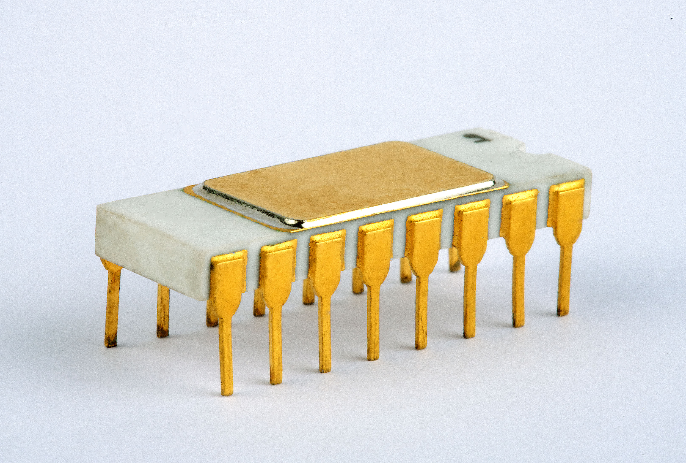
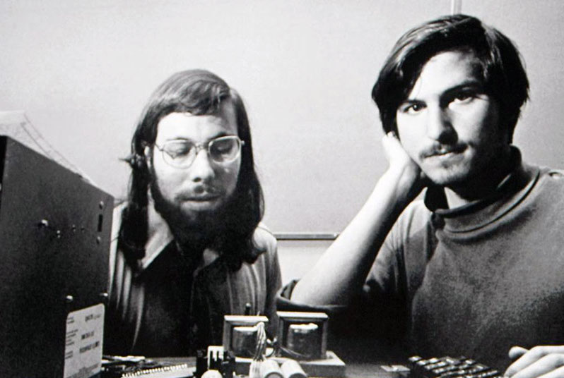
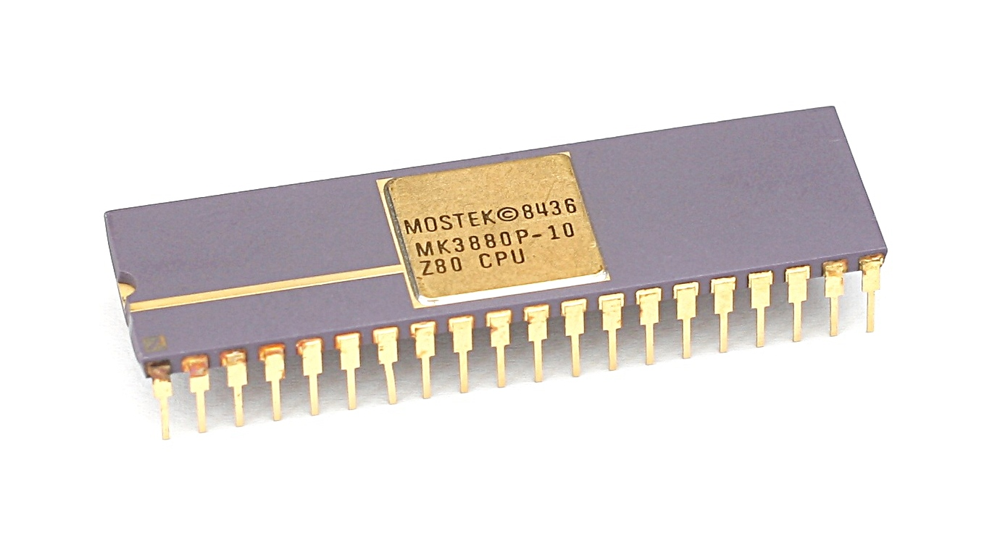
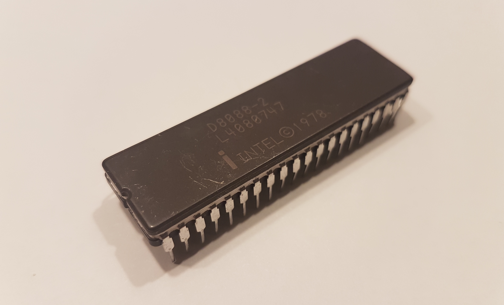

For the longest time I've had a fascination about how computers really work. Despite using them almost everyday it still feels magical how tiny pieces of silicon can come to life and enable the technological world we live in today. As part of this never-ending obsession I've been inspired to pick up a bare-bones processor and get right down to the metal.

===

The recent _nudge_ or rather leap in this thought was sparked by coming across this [post](https://www.reddit.com/r/DIY/comments/6oxcea/i_built_a_computer/) on Reddit. Essentially, the user (going by the alias dekuNukem) designed and constructed an 8-bit Z80-based HomeBrew computer from scratch. And saying that is probably underselling it just a bit. It really is a remarkable feat and I've been slightly inspired.

I don't have any delusions about my capabilities but reading through his excellent documentation, I felt it was something that I could take an interest in. He also regularly references another fantastic HomeBrew project from the equally talented Quinn Dunki who built a similar computer using a MOS 6502 CPU called the [Veronica](http://quinndunki.com/blondihacks/?p=680).

Another HomeBrew enthusiast I encountered was Spencer with his [RC104 computer kit](http://rc2014.co.uk/). It's an excellent little computer that also deserves a mention. I recommend watching this [video](https://www.youtube.com/watch?v=lU2NKHJygD8) from Computerphile that discusses it more. Or even if you felt like it, buy one [here](https://www.tindie.com/products/Semachthemonkey/rc2014-homebrew-z80-computer-kit/)!

With all this newfound inspiration I binged on reading up, even heading down to the university library to pick up books (the physical kind) on the subject of micro-processors.

### What is a Micro-Processor and where did it come from?

At the heart of these HomeBrew computer projects is the processor. The _brains_ of the computer as it's so often toted. This is the black box that casts the magic so to speak, and puts the 'compute' in computer.

For me, this is what it's all about. I'd like to get a hold of a micro-processor and breadboard something so I can put my reading to the test. But what exactly is a microprocessor and how does it differ from a micro-controller? And what micro-processor even to choose?

First, a little bit of history.

Early micro-processors came about soon after the invention of the integrated circuit, a development pioneered by Robert Noyce during his time at Fairchild Semiconductor. In simple terms, it was the concept of having a single-logic module, i.e. a module with all circuit components fabricated entirely from a single semiconductor material. 

This simple realisation spurred the so called, *Third Generation Computers* with ICs soon being produced containing hundreds of components. The IBM 360 computer was
a product of this era.

!!! For those curious, First Generation Computers were the large mainframe computers such as the ENIAC, back in the early days of computing. Second Generation Computers came about soon after the invention of the transistor, replacing the slow unreliable vacuum-based technology of the time.

This golden age of computing, ushered in by the advent of the transistor and the integrated circuit bestowed the invention of the UNIX Operating System and the C programming language, two prodigious innovations that still remain hugely relevant to today.

In 1968, Robert Noyce and Gordon Moore (yes, Moore's Law) started a new company called Intel, to take advantage of the growing semiconductor market. It was there that two engineers, Ted Hoff and Stan Mazor had the intuition of fabricating a 4-bit central processing unit onto a single silicon wafer. It then fell to a process engineer, Fredrico Faggin to realise this idea, and hence the 4004 4-bit processor was born.

The Intel 4004 was the world's first commercial micro-processor and heralded yet another epoch in computing history that continues into the present. The 4004 micro-processor was a success but was soon replaced by the improved 8-bit 8008 in 1972, which was in turn superseded by the Intel 8080 in 1974. 

By this time, other competitors were getting into the market such as Motorola with its MC6800, followed by MOS Technology with their 6502 micro-processor (the chip used in the aforementioned Veronica Computer).

Fredrico Faggin from Intel, even went on to found Zilog and worked on the Z80 micro-processor there. It too was wildly successful and became one of the most commonly used CPUs of all time. Micro-processors from this generation form the basis of most HomeBrew computer projects of today.

Processors from this era typically have an 8-bit data bus and 16-bit address bus, run at 5V and tick off anything from a 1Mhz to a 6Mhz clock. I'm generalising but the point I'm making is that they're relatively easy to interface with, and are within the scope of any hobbyist.

But why choose something so archaic anyways; why not jump for an ATmega328 of Arduino fame instead? There lies the difference. The ATmega328 and most 'chips' today are in fact _micro-controllers_ as opposed to micro-processors. 

Micro-processors as I've described are a central processing unit (CPU) implemented on an integrated circuit. It must interface with other separate peripherals such as RAM and ROM that are external to it. A micro-controller however, integrates everything on a single chip meaning it's essentially a fully-fledged computer in its own little package. 

!!! A SoC or _system on a chip_ takes this idea further and is a big trend in the IoT world of today. It integrates the micro-controller with other advanced peripherals such as a graphics processing unit (GPU), Wi-Fi module or even Bluetooth.

Frankly, there's not much fun or 'sense of history' in wiring up an ATmega328 on a breadboard. Sure, supply a clock, power and ground, but after flashing the Arduino bootloader, you just have another minimal Arduino clone.

In building a HomeBrew computer with a microprocessor, the role is for you to design the architecture of your computer. What pins to buffer, how much memory to map and how to integrate I/O. There's simply more to learn and configure and I find that much more rewarding in the long run.

### What Micro-Processor to choose?

Choosing which micro-processor to use is always going to be a tricky decision, so it helps to narrow the choice down. There's quite a few options that can be immediately discounted. For instance, the 4004 just mentioned is as much a collectible as a rarity, and frankly unaffordable.

Then the **Intel 8080** would be a difficult choice, considering it requires three separate power supplies at +5V, -5V and +12V. Oh, and a slew of supporting interface logic ICs such as the Intel 8222 (DRAM refresh controller), 8224 (clock generator) and 8228 (system controller). Acquiring these parts is equally challenging. Expensive now just as it was then.

Perhaps do what Steve Wozniak did and opt for a much more affordable **MOS 6502** micro-processor. Running at around 1MHz with 3510 transistors on-board, there's endless possibility! When it was first introduced in 1975, it was one of the least expensive micro-processors on the market. It made a lasting impression too, causing rapid price drops from competitors and spurring on the HomeBrew revolution underway at the time.

Still available today, it's a very popular option with plenty of documentation and support. Again to note, the [Veronica](http://quinndunki.com/blondihacks/?p=680) computer previously mentioned is based around this micro-processor.

A contemporary micro-processor was the **Zilog Z80**, perhaps the most successful micro-processor of its time; if not all time. A similar 8-bit micro-processor, designed by the very same Federico Faggin from Intel. The fact that it's still sold today is testament to its longevity.

It was first introduced in 1976, not long after the MOS 6502. Both came to dominate the nascent HomeBrew computer market, with the Z80 becoming the most commonly used CPU of all time by the early 1980s. For good reason too. The Zilog Z80 had a number of key features that put it well ahead of the pack.

For one, it was software compatible with the earlier Intel 8080, including all of its predecessor's 78 instructions within its own 158 instruction count. Unlike the Intel 8080 however, it only required the one power supply. 5V to be exact. Oh, and it also clocks from 2.5MHz up to 8MHz, with a convenient 50% duty cycle.

If these numbers seem inconsequential right now, I can assure you that they make quite a bit of difference when it comes to wiring later on...

In conclusion, either the MOS 6502 or Zilog Z80 would be excellent choices for a HomeBrew computer project. Both are relatively easy to interface with and there's plenty of blogs and tutorials to learn from. In retrospect, I should've chosen one of the two but instead opted for a different processor entirely.

### Intel 8088

Enter the Intel 8088. One of the last, if not _the_ last 8-bit microprocessor produced by Intel(?). Surprisingly, it was released after the introduction of the 16-bit Intel 8086, as a variant.

Despite the smaller bus size, the Intel 8088 found success commercially. It was IBM's number one choice for their first line of personal computers, defeating more powerful competitors such as the brand new Motorola 68000 and or even the Intel 8086. This hugely influential move established Intel's domination of the PC business for decades to come.

!!! When the Intel 8088 was first introduced, it's price was $124.80. I certainly didn't spend that much today!

But how did (an admittedly) inferior 8-bit microprocessor ever make it to the decision table? The Motorola 68000 even came with 32-bit instructions and could access up to 24MB of memory.

The crucial difference was the fact that the only peripheral controller ICs available at the time were 8-bit only, meaning IBM had to compromise on an 8-bit compatible processor instead. This limited their choice to either the Intel 8088 or Motorola's 68008 variant. Internally, these chips are 16 bit processors but have a reduced data bus size.

In the end, the 8088 won out because Intel had the 8-bit peripheral ICs available in quantities that Motorola simply hadn't. Furthermore, IBM was already familiar with using Intel hardware and wanted to stick with something they knew. The Intel 8088 was their answer.

But why did I decide on the Intel 8088? Likely because of its rich history and my Intel bias. And moreover, I wanted to work on something that was a little off the beaten track. The Intel 8088 doesn't share the same community fan-base like the Z80 or 6502 so I thought there might be some room for me to make a little dent in the HomeBrew world.

The 8088-2 model that I own (pictured above) runs at a whopping 8MHz, tucked away inside a weighty 40-pin DIP package. I've been tinkering with it for the past few weeks but in all honesty have made little progress. It's not as user-friendly as say the Z80 and poses some challenges for a hobbyist. I'll do my best to document some of the troubles I've been having below.

One critical issue I've faced is in accurately replicating the 8MHz clock. It's a fussy micro-processor, in that it requires a 33% duty cycle. Achieving this resolution at such a high frequency hasn't proven possible with the Arduino Mega I've chosen to use. Instead I've opted for a separate clock generator IC, the Intersil 82C84A to provide this. Although I've yet to test this on an oscilloscope.

Originally, I had wanted the Arduino Mega to supply the clock, along with the RESET, HOLD and READY lines. The Mega of course, has an abundance of pins which would've suited this purpose wonderfully, but without the clock functioning I can't progress much further.

Another point to mention is that, unlike the Z80 or 6502, the 8088 has some of its address and data bus lines multiplexed. The reason for this choice was in keeping the 8088 within the standard 40-pin package size. The downside to this option means that the lines have to be demultiplexed by another peripheral IC. And this is when a typical fully-buffered system usually has five or six peripheral ICs already.

Anyhow, these are just some of the issues I'm currently handling. I've sent away for a Z80 which I should have soon, but in the meantime I'll continue tinkering on with what I have. If I have something to show for, I'll be sure to post something soon.

