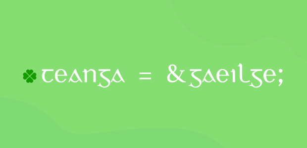

This might appear a little left-field, but it's always surprised me how the morphology of the Irish language lends itself to programming constructs.



===

!!! _Before I continue, I should point out the inspiration for this post originated with Michal Měchura's excellent article [here](http://www.lexiconista.com/awesome-irish/) which touches on the same thoughts_

### The grammatical quirks of Irish

Irish or Gaeilge is an insular Celtic language spoken in, well, Ireland. From a grammatical perspective, it has some unusual traits that set it apart from other modern Indo-European languages.

Specifically its use of inflected prepositions, initial consonant mutations and verb-subject-object word ordering.

While these linguistic aspects can be difficult for language learners, they have certain analogies with programming.

### The Copula - _An Chopail_

Irish in fact, has two verbs that correspond to the English "_to be_". One of which is called, "_the copula_" or **is**.

!!! _A copula is defined as a word that connects a subject and predicate in a relationship of equivalence, i.e. copulates_

The copula is primarily used to describe identity or quality in a _permanence_ sense. Depending on its usage, it's either termed a _classifying_ copula or _identifying_ copula.

#### Classification

The _classifying copula_ construction is used to express a "class membership" relation in Irish.

| Irish | English |
| ------ | ----------- |
| Is dochtúir é | _He is a doctor_ |
| Is múinteoir í | _She is a teacher_ |

```cpp
struct Múinteoir {};

int main()
{
    // classification: "í" (subject) belongs to class "múinteoir" (predicate)
    // i.e. "í" is an instance of the class "múinteoir"
    Múinteoir í;
}
```

#### Identification

The _identifying copula_ construction is used to express a shared _identity_ for the subject and predicate.

| Irish | English |
| ------ | ----------- |
| Is é an dochtúir é | _He is the doctor_ |
| Is í an múinteoir an bhean | _The woman is the teacher_ |

```cpp
struct Identity {};

int main()
{
    // "í" identity object
    Identity í;

    // identification: "an_múinteoir" (predicate) and "an bhean" (subject) refer to same identity
    // i.e. both variables point to the same "í" object
    Identity *an_múinteoir, *an_bhean = &í;
}
```

### Word ordering - _Ord na bhfocal_

Irish follows a verb -> subject -> object word ordering:

| Verb | Subject | Object | English |
| ------ | ----------- | --- | ---  |
| Múineann | sí | Gaeilge | _She teaches Irish_ |

This unique word arrangement can coincidentally be interpreted to a function declaration:

```cpp
struct Múinteoir {};

// verb(subject, object)
void múineann(Múinteoir múinteoir, std::string teanga) {};

int main()
{
    Múinteoir í;

    // "múineann" (verb) "(s)í" (subject) "gaeilge" (object)
    // word order preserved
    múineann(í, "gaeilge");
}
```

So not only does Irish satisfy the _syntax_ of the programming language, it's also _semantically_ and (almost) _grammatically_ correct. Pretty cool.

! To use the correct grammar, it should be _"múineann **sí** gaeilge"_ using the subject form of the pronoun, **sí**, rather than the copula form **í** introduced earlier

! Literally translating _"múineann sí teanga"_ would be _"teaches she Irish"_

### Prepositional Pronouns - _Forainmneacha Réamhfhoclacha_

Prepositions are words such as "with", "for", "at" or "on". Unlike a lot of other languages, these words can be conjugated (sometimes referred to as inflection) in Irish.

So a simple word like "on" can be translated to **ar**. And for **ar** we can make _compound forms_ with _personal pronouns_ like so:

| Pronoun | On |
| --- | --- | 
| me | orm | 
| you | ort | 
| he | air | 
| she | uirthi | 
| us | orainn | 
| ye | oraibh | 
| them | orthu | 

```cpp
enum class ar { orm, ort, air, uirthi, orainn, oraibh, orthu };

void cuir(std::string object, ar pronoun) {};

int main()
{
    // "cuir" (verb) "agallamh" (object) "air" (pronoun)
    cuir("agallamh", ar::air);
}
```

As Michal Měchura pointed out in his article, Irish is strongly _periphrastic_. In other words, Irish places greater emphasis on multi-word constructions to convey meaning, rather than using verbs.

This is apparent in the example above, _"cuir agallamh air"_ which literally translates to _"put interview on him"_. Or in proper English, _"interview him"_ in the imperative sense.

### Conclusion - _An Deireadh_

I'm by no means a linguistic savant, so I hope I got all my terminology correct! But I enjoyed exploring how to translate Irish into a very different context.

It's interesting to see parallels between two unlikely subjects. There's probably even more grammatic forms that have equivalency that I haven't discovered yet.