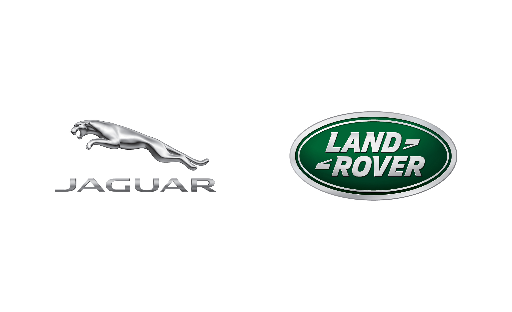

Just a quick post to mention my new start as a graduate software engineer as part of Vehicle Engineering at Jaguar Land Rover Ltd. 

===

It's a great start coming straight out of college and I'm excited to be employed at their new technology and research centre in Shannon, Ireland.

It's already been a few weeks, but time flies so fast. Working in the automotive sector is both new and interesting - with plenty to learn and explore. The annual Graduate Induction Programme occurred only last week, with a trip to Jaguar Land Rover facilities in the UK. It was a great experience to feel part of the wider JLR brand and discover more about the company. The event included a wide range of activities, from Land Rover driving experiences, manufacturing tours and presentations
by senior management.

All in all, it's been a great few weeks already and I look forward to what the future has in store.
