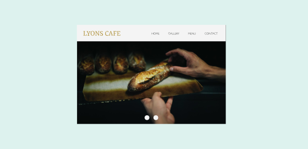
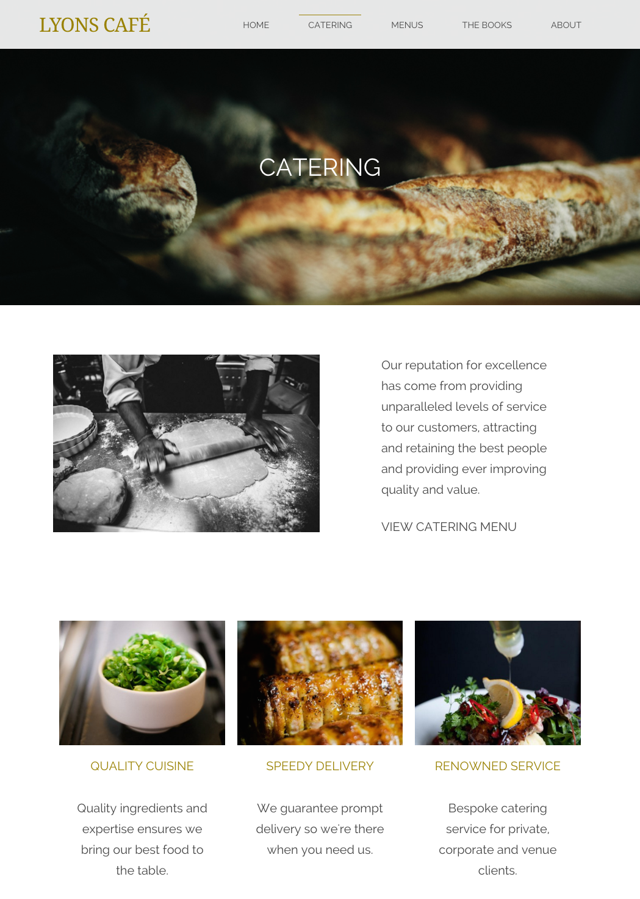
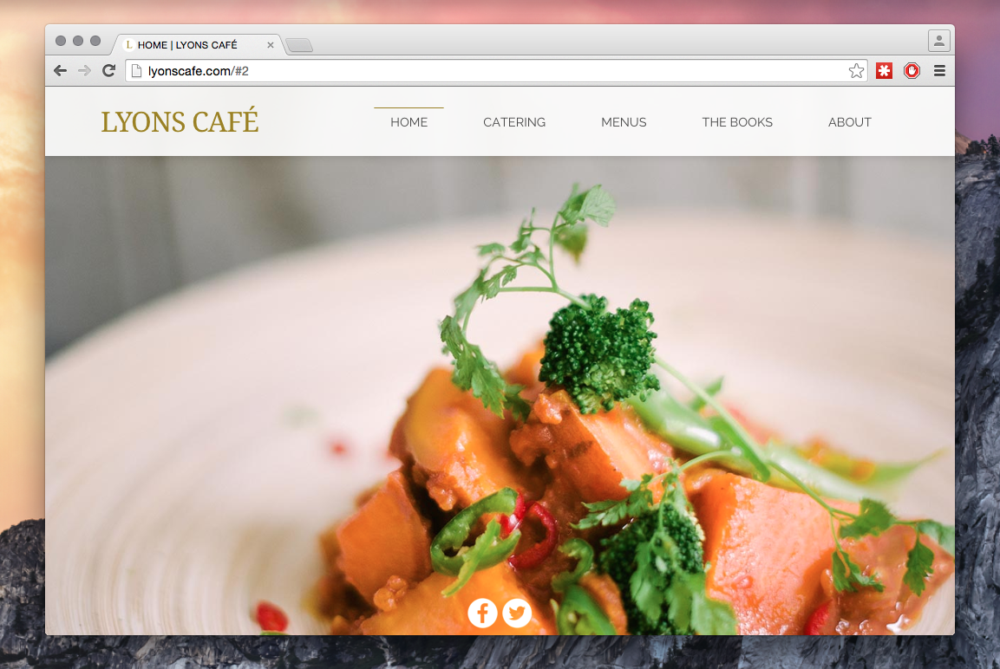
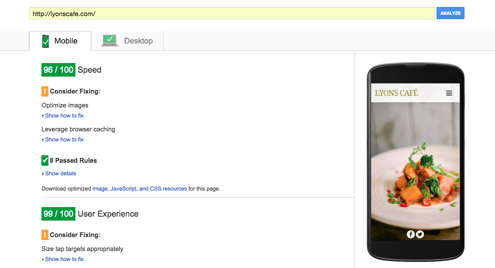
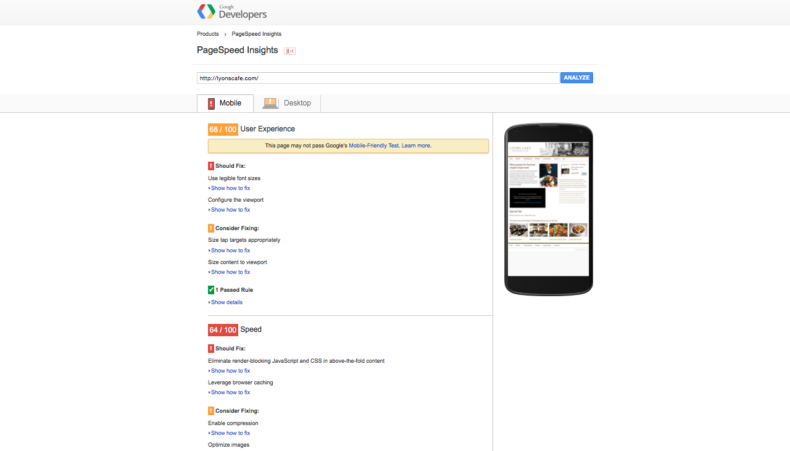
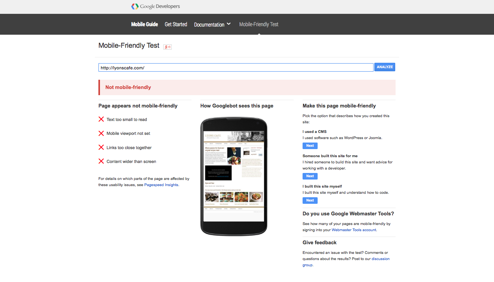

It's a great feeling to say I've finally finished my latest website for [Lyons Café](http://www.lyonscafe.com). To tell the truth, it's possibly the most cutting-edge website I've built so far, and I'm feeling pretty proud about it!

===

Besides my own website, it's the first commercial website I've built using Grav - which was a bit of a gamble. I also set a challenge for myself, integrating paypal, contact forms .etc, all for the first time.

And the outcome isn't half bad. It was a huge asset having some high-res photos to include in the site, and I made the decision early on to place them first & foremost on each page. 

 
 

 
 

Above is a cropped screenshot of the catering page from the site, which is my own personal favourite. It's insightful to see how your skills develop and improve over time, especially in comparision to my earlier work. 

Below is another shot of the homepage. There's seven pages in total, with the two sub-pages included. It stuck me how simple & crisp the site looks while being quite complex underneath. It comprises all the functionality stipulated and performs well across every platform.  

Actually, on that note it's worth mentioning that it's optimised for mobile & tablet, which was a primary concern from the very start. The previous website that was in place represented poorly on mobile platforms, with the implicit downside being for user experience. 

 
 

 
 

It wasn't just how it looked that was a priority either. I spent a considerable amount of time trying to push the limits of performance too.

Thankfully, my efforts paid off & I have the results below to prove it! Not too shabby.

 
 

 
 

And if you're wondering how much of an improvement that was on the previous website, I've also inserted the former results from that site below. 

 
 

 
 
 

