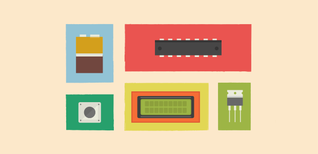
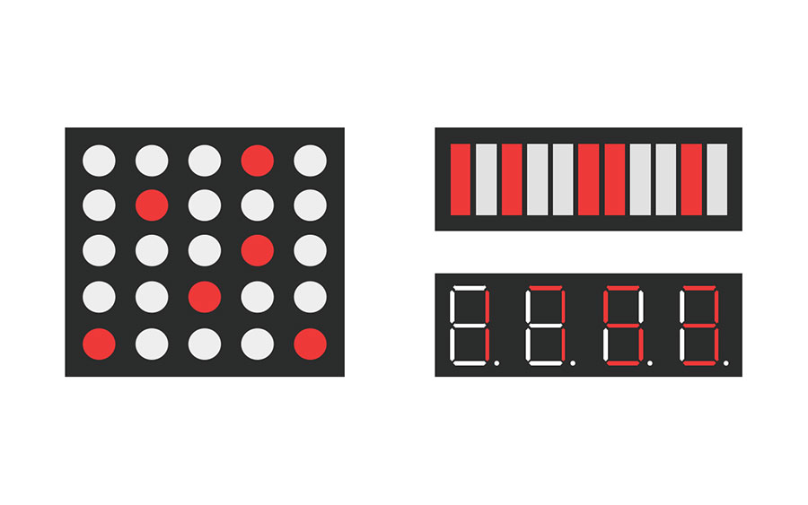
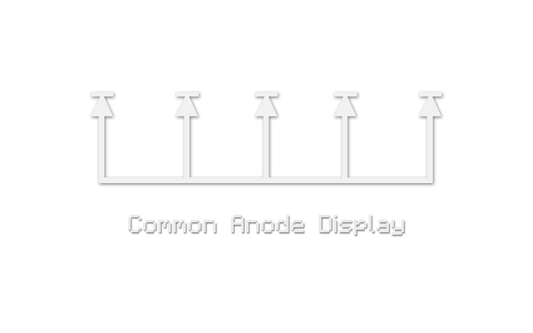
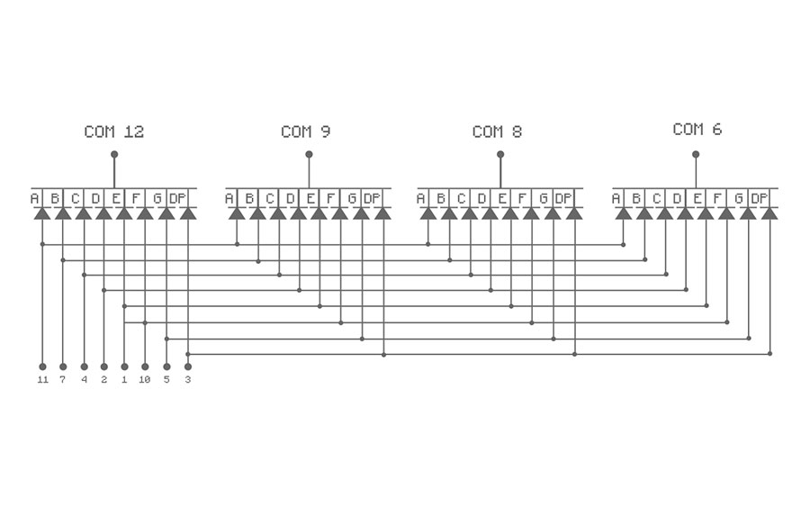
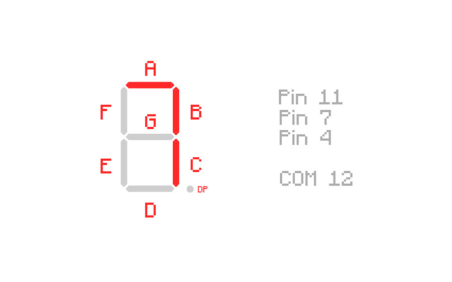
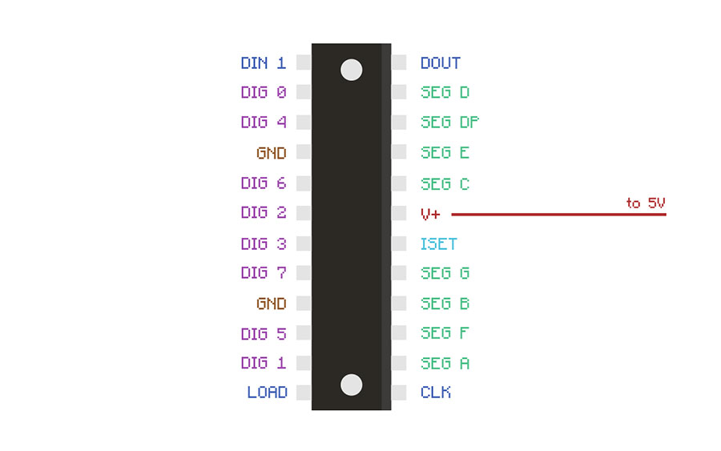

There are many different ways of controlling LEDs using an Arduino and using a MAX7219CNG chip is one such way. You’ll most likely stumble across it much like I did once you’ve exhausted all your options using shift registers & ‘daisy-chaining’ begins sounding monotonous. 



===

If you’ve had prior experience using shift registers you should be right at home with this chip. Consider it like a 74HC595 with 24 pins including the DATA, LATCH & CLOCK pins you’re familiar with. 
What’s more is that Arduino also supplies a convenient [library](http://playground.arduino.cc/Main/LedControl) specifically for use with this chip. 

In technical terms then, the MAX7219CNG is a 4-pin SPI serial interfaced, 8-bit digit, common cathode, LED display driver designed to drive LED displays and save you the bother associated with multiplexing. 

! Another LED display driver similar to the MAX7219CNG is the Austria MicroSystems AS1107. Alternatively you can use this chip instead without any modifications to your code. 



Like I’ve mentioned before, it can be used to control a 8x8 dot-matrix display, up to 64 LEDs, or like in this example, a 7-segment numeric LED display. The LED display I’ll be using is a common cathode display. 

Before I go any further though I should briefly describe the difference between common anode versus common cathode. 

LEDs (or Light Emitting Diodes) like all diodes have two connecting pins, one called the “anode” and the other called the “cathode”. 
A common cathode display simply means that all the cathodes (or negative terminals) of the LEDs in the display are connected directly together to ground (or negative power supply).

Likewise if it were a common anode display, all the anodes (or positive terminals) of the LEDs in the display would be connected directly together to the positive power supply.



My common cathode LED display is a 4 digit 7 segment display which is essentially 4 individual 7 segment displays combined into one package. 

There are twelve pins on the display with four of them being ‘COM’ or common cathode pins for each digit. These are pins 12, 9, 8 and 6. 

Each of those pins are connected to the cathodes of the 8 LEDs belonging to each digit - 4 common pins for 4 digits of 8 LEDs.



The anodes of each of the 8 LEDs in each digit are marked by 8 pins - 11, 7, 4, 2, 1, 10, 5 and 3.
In turn, each of the 8 LEDs in each digit is labeled with letters from “A” through to “G” with the final 8th one labeled “DP” for “decimal place”.

!!! For example then, applying a positive power supply to pins "11, 7 and 4” while applying a negative power supply to COM 12 would light the segments “A, B and C” of the first digit showing the number “7”.



In summary then, there are 4 common cathode pins and 8 anode pins so to speak, giving a total of 12 pins which matches the number of pins coming out of the display.

Returning to the MAX7219CNG, we can start to set it up. Besides the chip itself and the LEDs, all you need are two capacitors and a resistor.

The capacitors are known as “decoupling” capacitors and are used to suppress noise signals introduced by the power-supply lines. It’s recommended to have both a 0.1uf & a 10uf capacitor placed as close to the power and ground pins of the chip as per usual. 



Starting with the easiest things first, both the GND pins of the chip need to be connected to the GND on the Arduino. Same goes for the power pin - connected to the 5V on the Arduino.

The 4 COM pins of the display ( 12, 9, 8 & 6) can be connected to the DIG pins of the chip from 0 up to 3.
The other 8 anode pins are connected to the corresponding SEG pins depending on the letters. For example, pin 11 which matches the letter “A” of the display would be wired to "SEG A” on the chip. 

! The signal pins of the MAX7219CNG are named slightly differently to the common DATA, LATCH and CLOCK. Pin 1 of the chip is “DATA IN” or DATA, Pin 12 is the LOAD(CS) or LATCH and finally Pin 13 is CLOCK.

Like a regular shift register it uses a typical serial interface. The LOAD pin of the chip is pulled LOW to allow the first bit of data in, which in turn is sent to the DIN pin as either HIGH or LOW. The CLOCK pin meanwhile oscillates between HIGH and LOW “inspecting” the DIN pin and saving the data present at the DIN pin into the storage or bit register on the rising edge of the CLOCK.
This sequence repeats until all 16 bits in total are stored in the register. Finally the LATCH pin is set to HIGH and this this moves the 16 bits onto the outputs.

! The DOUT pin is used if you had more than one MAX7219CNG daisy chained together but it’s not needed in this example 

Finally, the last thing to do is choose a resistor value for the ISET Pin. It’s the sole component limiting the current reaching the LEDs. It’s used to prevent damage to the chip and the LEDs from excessive currents.

The two things that must be known before selecting a resistor value are the 'DC forward current' and the 'DC forward voltage' of the LEDs. 
Referring back to the schematics, the display has a forward voltage of 1.9VDC and a max forward current of 20mA.
Therefore the most suitable value would be a 28.0kΩ resistor. 

Now with everything wired up correctly, you should be able to plug it in and run the code for a binary counter I’ve supplied below (you can find it on Github [here](https://gist.github.com/Spokkam/e976aef02883b979208a) if you preferred). 

Just to note that I haven't run this code yet & I can't remember where I found it so results are not guaranteed!


```c
#include "LedControl.h"
LedControl lc=LedControl(12,11,10,1);

void setup(){
  Serial.begin(9600);
  lc.shutdown(0,false);
  lc.setIntensity(0,10);  
  lc.clearDisplay(0);

  for(int x =0; x<=9999; x++){
  outputNumber(x);
  delay(125);
  
  }
}

void outputNumber(int counter)
{
  int nDivider = 10;
  int digCnt = 0;
  boolean allDone = false;
  int queryAns = 0;
  
  
  do {
    queryAns = counter%nDivider; 

    if(counter==queryAns) allDone=true; 
    lc.setDigit(0, digCnt, queryAns/(nDivider/10), false); 
    digCnt = digCnt + 1;
    nDivider*=10;    
  }
  while(!allDone); //false
}

void loop(){
}
```

[plugin:youtube](https://www.youtube.com/watch?v=92z0zRXyw9A) 
