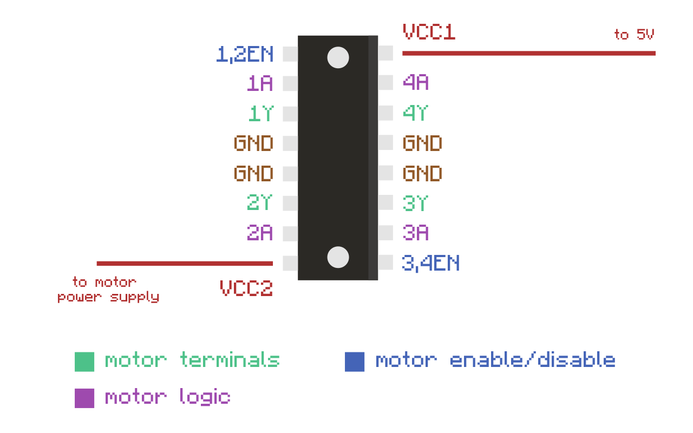
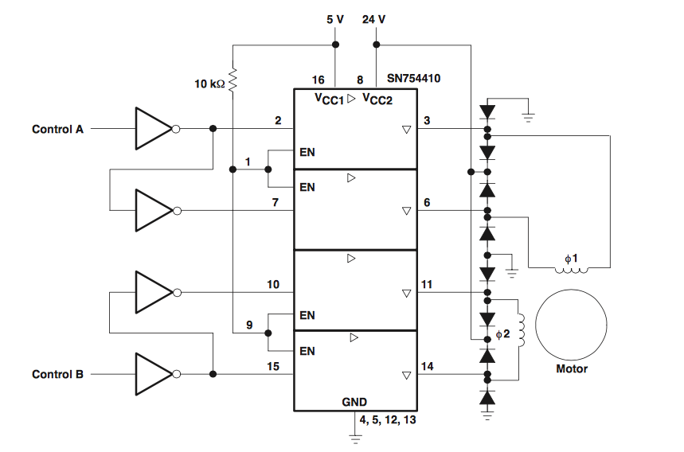
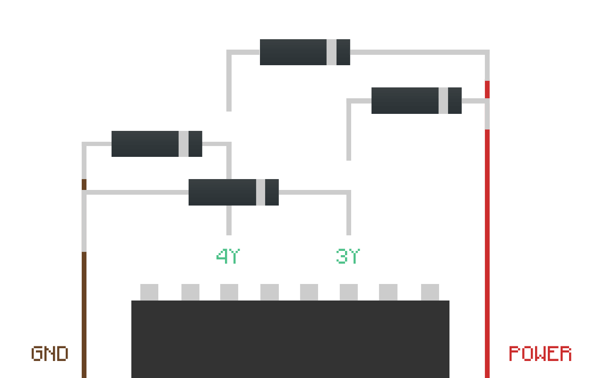

When it comes to controlling motors using an Arduino, there's never a shortage of options. One such way is by using a small but capable integrated circuit like the SN754410. And here's why.


===

Despite it's deceivably small size, this quadruple half H-bridge motor driver has the means to provide bidirectional control to any number of projects at a fraction of a cost.

Costing only a mere few euros it's certainly a keen purchase if you've had the luck I've had with more expensive varieties of motor controllers. 
Besides requiring slightly more know-how & a good supply of jumper wires there's scarcely any real drawbacks.

The chip itself has sixteen pins in total with each motor wired to either side. 
It's a fairly symmetrical layout making it reasonably straightforward to wire-up. 



Each motor has two logic pins, an Enable/Disable pin and two pins for each terminal. 
There are four pins going directly to ground and two pins going to power, one for the external power supply and the other going to the 5V of the microcontroller. 

! The external Power supply (pin 8, VCC2) needs to be the rated voltage supply of the motors. Furthermore, before connecting the microcontroller to the Logic supply (pin 16, VCC1),  make sure to check whether your motors can run at 5V & less than 500mA.

Apart from the chip, the only additional hardware required are eight diodes and a capacitor. 

 #####Lefthand Side

| Pin | Description |
| ------:| -----------:|
| Pin 1 (1,2EN)    | Enables/disables 1st motor whether taken HIGH or LOW |
| Pin 2 (1A) | Logic pin for 1st motor, input either HIGH or LOW |
| Pin 3 (1Y)    | Terminal for 1st motor | 
| Pin 4 & 5 | Ground |
| Pin 6 (2Y) | Terminal for 1st motor |
| Pin 7 (2A) | Logic pin for 1st motor, input either HIGH or LOW |
| Pin 8 (VCC2) | External motor power supply |

<br></br>

#####Righthand Side


| Pin | Description |
| ------:| -----------:|
| Pin 9 (3,4EN) | Enables/disables 2nd motor whether taken HIGH or LOW |
| Pin 10 (3A) | Logic pin for 2nd motor, input either HIGH or LOW |
| Pin 11 (3Y) | Terminal for 2nd motor |
| Pin 12 & 13 | Ground |
| Pin 14 (4Y) | Terminal for 2nd motor |
| Pin 15 (4A) | Logic pin for 2nd motor, input either HIGH or LOW |
| Pin 16 (VCC1) | Connected to 5V of the Arduino |

The motor logic pins of the chip are used for directional control of each motor and I've made a simple truth table illustrating how it works. 
As shown below, simply by pulling the desired pins HIGH and LOW you can change the direction of the motors. 

| EN/DIS | 1A | 2A | 3A | 4A | Function |
| ------| -----------|
| H | L | H | H | L | Turn right |
| H | H | L | H | L | Turn left |
| H | L | L | L | L | Stop |
| H | H | H | H | H | Stop |
| L | X | X | X | X | Stop |


So once everything’s wired up it's almost time to switch things on. Sometimes it’s necessary to add in a capacitor to smooth out any electrical noise or sudden voltage dips. In this context it’s called a decoupling capacitor. It should be placed between power and ground close to the motor. It’s fine to use anything between 10 and 100uf. 

#####Diodes

The diodes are perhaps the most important aspect to this set-up because they’re there to protect against the electrical noise I mentioned in the beginning. Most of the more popular motor controllers should have built-in, internal 'flyback' diodes as they're called. 

Diodes as part of their definition, only allow current to flow in one direction which is ideal for EMF protection. EMF or electromotive force is the electrical noise generated by the motor when it accelerates or decelerates. 

Inertia in the motor keeps it spinning after the power is cut and the motor effectively becomes it's own generator. 
This excess “kickback" current then can easily find it’s way back into the circuit and potentially cause damage.
Therefore a diode placed between the motor and the exposed microcontroller will shield it from any hazardous current coming in the wrong direction. 

!!! Another factor to keep in mind is the breakdown voltage of the diodes. If the voltage rating for the diode was anything less than the full battery voltage then the battery could breakdown the reverse diode and just bypass it. 
The diodes I’m using are IN4001 diode rectifiers and are rated for up to 50V.

Luckily the datasheet comes provided with a very good schematic showing exactly where and what orientation the diodes should be placed in. 



Examining the schematic then, eight diodes are required for two motors. Firstly, four diodes must be placed over the motor terminals of each motor, connected to power in order to protect the driver from over voltage.

These turn on when more voltage is coming from the motors than is coming from the batteries. 
Thus the batteries will absorb the power instead.

And because the diodes are orientated in reverse, power can’t flow from the batteries to the motors. 
If it could then power would be able to flow to the motors, bypassing the chip outputs which could cause it to short circuit. 

Likewise you’re also going to need another four diodes for connecting the motor terminals to ground. They’re there to protect against under voltage when voltage from the motors is below ground. 

!!! Sometimes it can be a little mind-numbing trying to wire the diodes correctly. It helps to just remember that the grey band on the diode indicates the cathode and they all have to face in the same direction.



Once everything's wired up correctly all that's left is to run the code and start getting things moving. I've already written some very basic sample code for controlling two motor in both directions using two pushbuttons. I've made the code available on Github [here](https://gist.github.com/Spokkam/49a6182ea3e1087f861e).

```c

const int motor1A = 9;    // H-bridge (pin 2, 1A)
const int motor2A = 8;    // H-bridge (pin 7, 2A)

const int motor3A = 13;    // H-bridge (pin 14, 3A)
const int motor4A = 12;    // H-bridge (pin 10, 4A)

const int enablePin1 = 10;    // H-bridge enable pin
const int enablePin2 = 11;    // H-bridge enable pin

const int pushButtonUp = 4; //initialise pushbutton pins
const int pushButtonDown = 5;

const int pushButtonLeft = 6;
const int pushButtonRight = 3;


void setup() {
  
    Serial.begin(9600);
    
    pinMode(motor1A, OUTPUT); //set motor logic pins for each motor
    pinMode(motor2A, OUTPUT);
    pinMode(motor3A, OUTPUT);
    pinMode(motor4A, OUTPUT);
    
    pinMode(enablePin1, OUTPUT); //set enable pins for each motor
    pinMode(enablePin2, OUTPUT);
    
    pinMode(pushButtonLeft, INPUT);
    digitalWrite(pushButtonLeft, HIGH);
    
    pinMode(pushButtonRight, INPUT);
    digitalWrite(pushButtonRight, HIGH);
 
}

void loop() {
    
    if (digitalRead(pushButtonLeft) == LOW){
      
      digitalWrite(enablePin1, HIGH);
      digitalWrite(enablePin2, HIGH);
      
      digitalWrite(motor1A, HIGH);  
      digitalWrite(motor2A, LOW);
      digitalWrite(motor3A, LOW);  
      digitalWrite(motor4A, HIGH);
      
      Serial.println("left");
    }
    
    else if (digitalRead(pushButtonRight) == LOW){
      
      digitalWrite(enablePin1, HIGH);
      digitalWrite(enablePin2, HIGH);
      
      digitalWrite(motor1A, LOW);  
      digitalWrite(motor2A, HIGH);
      digitalWrite(motor3A, HIGH);  
      digitalWrite(motor4A, LOW); 
      
      Serial.println("right");
    }
    
    else {
      
      digitalWrite(enablePin1, HIGH);
      digitalWrite(enablePin2, HIGH);
      
      digitalWrite(motor1A, HIGH);  
      digitalWrite(motor2A, HIGH);
      digitalWrite(motor3A, HIGH);  
      digitalWrite(motor4A, HIGH); 
      
      Serial.println("nothing");
    }
}
```


[plugin:youtube](https://www.youtube.com/watch?v=vWXzXqSCBMg) 
