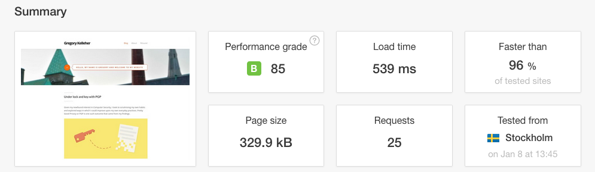
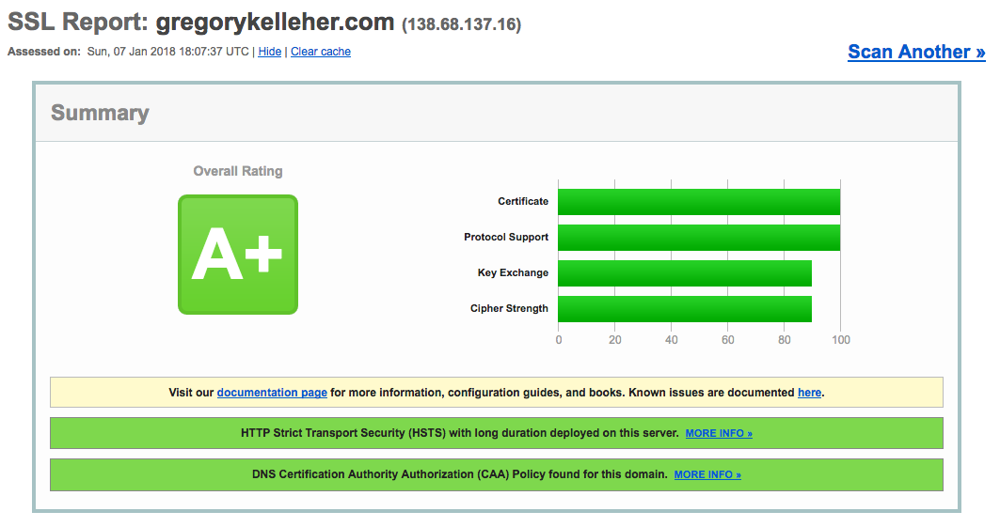
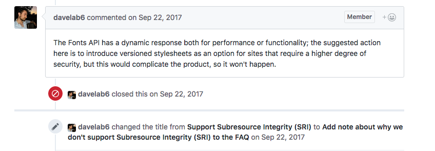
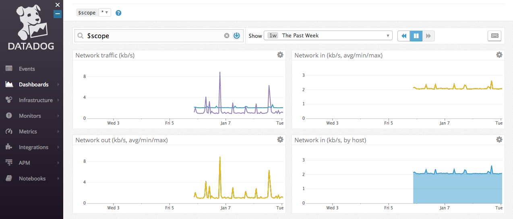

Given it's the start to a new year and I haven't written much in the last few months, I thought I'd post a short update on just a few things I've done in the last while.

===

### Switching to Caddy

This is possibly the biggest change I've made to how I host my website, and really it deserves its own post. Caddy is a web server just like the big two, Apache and NGINX. I've written my fair share on NGINX and highly recommend it, but Caddy is a world apart.

[Caddy](https://caddyserver.com/) comes with the tag-line, _"Every site on HTTPS"_ and they thoroughly live up to that aim. In fact, it's automatic. Caddy is bundled as a single executable (that can be customised as much as you want) and downloaded directly onto your VPS.

So no dependencies or awkward installs, and you're almost finished before you've begun! After downloading, it's just a matter of configuring the `Caddyfile` which couldn't be simpler. The syntax is perfect in its clarity, check out just how simple it can be:

```bash
gregorykelleher.com {
    root /var/www/gregorykelleher
    gzip
    tls gregory@gregorykelleher.com
}
```

At its most basic, it's just a matter of specifying your domain and providing three self-explanatory lines of text. Running the command `caddy` in the terminal will trigger Caddy to generate SSL certificates from [Let's Encrypt](https://letsencrypt.org/) for your site.

```bash
$ caddy
Activating privacy features... done.
http://gregorykelleher.com
https://gregorykelleher.com
```

And hey presto, you have a website configured on HTTPS with an 'A' rating from [SSL Labs](http://ssllabs.com/) without much effort at all. So no more fancy cron jobs either, Caddy will renew your certificates with zero-downtime reloads. Coming from NGINX, this is a breath of fresh air!

!!! Make sure your firewall has port `443` open when enabling HTTPS using Caddy. With UFW, it's as easy as `sudo ufw allow https`

Caddy may appear simplistic, but don't be deceived by its easy syntax. There's plenty of plugins and advanced tweaks that can really make it shine too.

For instance, hook it up with your Github repository and Caddy will update your live site whenever it notices a push:

```bash
git https://github.com/gregorykelleher/gregorykelleher_website.git
```

Ever felt like like customising your HTTP header responses?

```bash
# lolz
header / X-Custom-Header "No one expects the Spanish Inquisition!"
```

As the folks at Caddy put it, _"It's not scripting, and not hard to memorize. Rolls off the fingers. You'll really like it."_ And I'm inclined to agree.

What's more, Caddy is perfect for dynamic and static content alike. Caddy provide a great resource on their [Github](https://github.com/caddyserver/examples) with bespoke Caddyfile configurations for different web applications .etc.

And what about the security of that one-line TLS configuration anyways? It's good to know Caddy uses AES-GCM, ChaCha, and ECC by default. In addition, Caddy has a unique ability in being able to detect "Man-in-the-Middle" interceptions from HTTPS requests. Caddy is also the only web server to rotate its TLS session ticket keys by default too, helping to preserve forward secrecy .etc. And oh yeah, other goodies such as OCSP and HSTS are all there too.

I've noticed I used _"by default"_ more than once, but that's how it really is. Usually the best option is the default. Caddy has excelled in delivering a service that balances convenience with optimum security standards.

In the course of writing this post I also discovered I hadn't been minifying the resources I was serving from my Caddy server. Of course, the Caddyfile syntax for this is as straightforward as the following:

```
#minify
minify
```

A quick scan using [Pingdom](https://tools.pingdom.com/) displays my website's reduced size and improved performance. Not too shabby.



!!! The 'B' grade is down to my lack of browser caching and HTTP expires headers which I haven't yet configured

That about as much as I have to say on Caddy for now. It's been a breeze to setup and has dramatically improved how I manage all my domains.

### Adding CAA Records

I don't know how this eluded me until now, but I've only recently added CAA records to my domain. Certificate Authority Authorisation (CAA) records are a new standard that allow domain owners to restrict which CAs (e.g. Let's Encrypt) are permitted to issue certificates for their domains. This helps to prevent the chance of issuing mishaps, either maliciously or accidentally.



[DigitalOcean](https://www.digitalocean.com/community/tutorials/how-to-create-and-manage-caa-records-using-digitalocean-dns) have a handy tutorial to follow too.

There's three fields (i.e. tags) associated with CAA records:

* `issue` authorises a single CA to issue certificates for specified domain
* `issuewild` authorises a single CA to issue a wildcard certificate for specified domain
* `iodef` defines a URL where CA can report policy violations to provided contact address

!! Note that despite CAA violation reporting, it's not always guaranteed to be notified given that not all CAs support notifications as of writing

Following on from CAA records, I also wanted to configure [DNSSEC](https://en.wikipedia.org/wiki/Domain_Name_System_Security_Extensions) (Domain Name System Security Extensions) for my domain, but it's not supported by DigitalOcean unfortunately. For the record, (excuse the pun) DNSSEC is an extension of the DNS protocol which verifies the authenticity and integrity of responses on the server. It's security against attackers that might manipulate DNS to redirect users to malicious websites .etc.

Similarly, [DANE](https://en.wikipedia.org/wiki/DNS-based_Authentication_of_Named_Entities) (DNS-based Authentication of Named Entities) is another new standard coming for email security. It's a bridge between DNSSEC and TLS. The idea for DANE is in allowing the usual X.509 certificates to bind to DNS names using DNSSEC.

The language might sound a little wooden, but it really has a chance of revolutionising email and making encrypted email delivery the norm. With PGP still the only reliable means of email encryption in 2018, it's understandable why this an exciting development.

! Note that while PGP is _end-to-end_ encryption on the individual level, HTTPS and DANE are _transport_ level encryption on the domain level for content transmission. The two shouldn't be conflated.

I believe [Postfix](www.postfix.org) is one of the few email servers offering support for DANE over SMTP as of yet. It'll be interesting to follow its progress in the coming year. I recommend a website like [Hardenize](https://www.hardenize.com/) to track support of protocols and standards on domains.

### Sub-resource Integrity

I thought I'd mention sub-resource integrity (SRI) given that it's one of the few things I haven't configured on my website yet. For the unfamiliar, SRI is another new standard that enables browsers to verify the integrity of third-party (e.g. CDNs, APIs) embedded resources, such as scripts or style-sheets. With SRI, a hash (base64 encoded cryptographic hash digest) is generated for the particular asset, which can be downloaded by the browser and cross-checked against the one it was expecting.

If the hash of the downloaded asset is a match, then the browser can safely load the script or style. If the hash doesn't match then the downloaded asset cannot be trusted and it must be discarded.

A great website for generating SRI hashes is the [Report URI](https://report-uri.com/home/sri_hash) generator. OpenSSL on the command-line can also be used if you're so inclined.

In my case, my website doesn't load many third-party resources besides typefaces from Google Fonts. I had tried to enable SRI for Google Fonts but it's unfortunately unsupported. When I had tried, the computed hash was different to the computed Chrome resource. 

Providing multiple SHA256, SHA384 hashes didn't solve the issue either. Digging into it more, I discovered that Google Fonts is returning slightly different files optimised for your browser. Hence it hashes differently depending on what browser you're using.



Frankly, it wasn't worth much more effort and I feel the risk of Google maliciously embedding code through a font is a small enough attack surface not to be worried!

### DataDog

Datadog is a monitoring service for larger cloud-based web applications, tying together data from servers, databases and the like to generate a unified overview of the entire web stack. A bit overblown for a simple personal blog but it comes as a feature for Caddy and I thought to try it out. With the [Github Student Pack](https://education.github.com/pack) I also get a Pro account free for two years.



To be frank, I'm sorely underusing it and haven't had the chance to explore its full capabilities. From what I've read and learnt online, it's a very popular service so I suppose it helps to have had some exposure to it.

The image above is displaying the network traffic (incoming and outgoing) being tracked to my server.

### Conclusion

So that pretty much concludes some of the small tweaks I've made to my site in the past few months. I've been quite busy with coursework and job hunting as of late, hence my lack of attention with respect to my blog.

Lastly on a personal note, my cat passed away this week. He was an exotic shorthair cat named Sheerbliss Augustus Fergus Kelleher or 'Gus' for short. He will be sadly missed.


