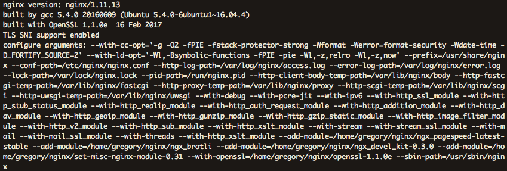
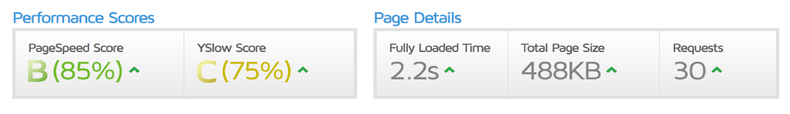
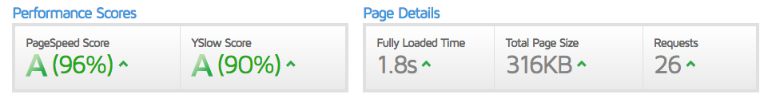
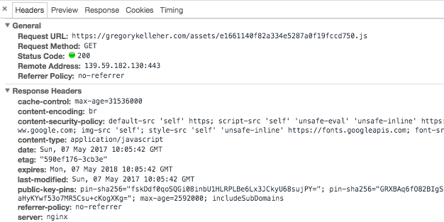
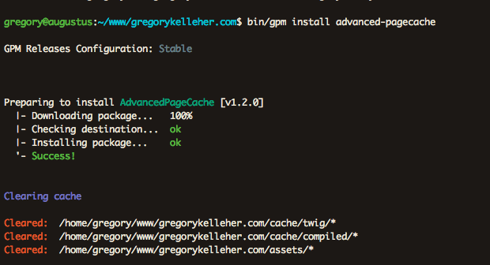

In my third and final post on Nginx, I wanted to take a brief look at improving my website's performance. Take a look at some of the things I've done towards achieving this.


===

First of all, I'd like to say this post will be shorter. My website is already optimised to a high degree, but these are web server improvements that I hadn't had access to before.

In my previous [post](https://gregorykelleher.com/digital_ocean_migration) I described building Nginx from source and including additional modules.

Two of those modules that I installed were `ngx_pagespeed` and `ngx_brotli`. I'll explain what they are now.

### PageSpeed

Prior to migrating to Nginx, I was only familiar with [PageSpeed Insights](https://developers.google.com/speed/pagespeed/insights/) from Google Developers. I wasn't aware they had made an open-source server module called `ngx_pagespeed` for site optimisations.

It's feature rich and is designed to help improve your website's performance without making any drastic changes to your content.

Some of the features taken from the [Github webpage](https://github.com/pagespeed/ngx_pagespeed):

+ stripping meta-data, dynamic resizing, recompression
+ CSS & JavaScript minification, concatenation, inlining, and outlining
+ Small resource inlining
+ Deferring image and JavaScript loading
+ HTML rewriting
+ Cache lifetime extension

So all good stuff. But the first thing is to install it.

```
bash <(curl -f -L -sS https://ngxpagespeed.com/install) --nginx-version latest
```

I found the above command inside the installation guide found [here](https://modpagespeed.com/doc/build_ngx_pagespeed_from_source). That does pretty much all the work.

From there, it's a matter of building Nginx from source as I've described before. So for instance, when you go to run `./configure` for Nginx, add the following argument for PageSpeed, ` --add-module=/home/gregory/nginx/ngx_pagespeed-latest-stable`, substituting where applicable.

You can the see the output from `nginx -v` on my server below.



Thankfully, installing Nginx is the hard part. Enabling PageSpeed is a piece of cake. I've placed my configurations within `sites-available/gregorykelleher`. Remember I've the symbolic link from this directory to `sites-enabled` for Nginx to pick up on.

Right at the very bottom I've exactly three lines for my PageSpeed configuration.

```
 # PageSpeed
     pagespeed on;
     pagespeed FileCachePath /home/nginx/ngx_pagespeed_cache;
     pagespeed RewriteLevel CoreFilters;
```

First line doesn't need an explanation. Second line points to a cache I've created for PageSpeed to use. And finally, the last line is some customisation.

There are only a few modes. `CoreFilters` which is what I've using, plus `OptimiseForBandwidth` and `PassThrough`. You can read up on them, but `CoreFilters` is the typical choice.

Within these modes are different optimisation filters that you can set individually, however it's probably just best choosing a mode and have them all enabled. 

Adding filters is as easy as `EnableFilters` followed by the name of the filter. Even so, I just stuck to the defaults and didn't bother reading up on anything else. 

Still, I saw a marked improvement when I went to test my site. I've a preference for GTmetrix which I find very good. My before and after results are shown below.




So wow. A reduction of about 35% on the page size and a load speed of under two seconds. Pretty good. I've also cut down on the number of requests too. See for yourself [here](https://gtmetrix.com/reports/gregorykelleher.com/IHZhSgjF).

!!!! In practice, load times are much shorter since I'm using strong caching. I usually find pages to load in under a second!

There's much more in the documentation on PageSpeed that I recommend checking out [here](https://modpagespeed.com/doc/). It's well worth the install.

### Brotli


Moving swiftly onto [Brotli](https://github.com/google/brotli), a compression algorithm that I'm choosing to implement on my website. From Github:

> Brotli is a generic-purpose lossless compression algorithm that compresses data using a combination of a modern variant of the LZ77 algorithm, Huffman coding and 2nd order context modeling, with a compression ratio comparable to the best currently available general-purpose compression methods. It is similar in speed with deflate but offers more dense compression.

Uh huh. I suppose if you didn't do much computer science at college that might've sounded like a lot of waffle.

!!! Here's an easier definition, Brötli means ‘small bread’ in Swiss German

It's simply a new compression algorithm that was released by Google in a [blog post](https://opensource.googleblog.com/2015/09/introducing-brotli-new-compression.html) way back in 2015. Prior to Brotili, they had released Zopfli compression. However, according to them, Brotli is able to get a 20-26% higher compression ratio over Zopfli.

Brotli is designed to deliver smaller pages and assets to the client, allowing for better space utilisation and faster load times. It's also targeted for users on mobile, with aims on improving mobile battery performance.

I was able to install it much like I did with PageSpeed, just by including it as `--add-module=/home/gregory/nginx/ngx_brotli` before building Nginx from source. The installation files can be found on the [Github page](https://github.com/google/brotli).

I then went into my `nginx.conf` file and added the following lines:

```
 # turn on brotli compression
     brotli on;
     brotli_static on;
     brotli_types *;
```

After doing a `sudo service nginx reload` I was able to see the change in the response header for a resource loaded on my website. Notice the `br` listed under `content-encoding`? That's Brotli in action.



So that covers the two Nginx modules, PageSpeed and Brotli, but there were a few little tweaks of my own that I made to my website too.

For example, I leveraged browser caching for file extensions by adding the following to my Nginx `common.conf` file:

```
# browser caching
 location ~* \.(jpg|svg|jpeg|png|gif|ico|css|js)$ { expires 365d; }
```

And then, inside Grav, I installed a new plugin called [AdvancedPageCache](https://github.com/getgrav/grav-plugin-advanced-pagecache). It caches the entire page to the Grav cache and reuses the cache when the user requests the same URL again. 

This static caching has dramatically increased the performance of my website, to a noticeable degree. Below, you can see how I installed it using `bin/gpm install advanced-pagecache`.



It installs a config file `user/plugins/advanced-pagecache.yaml` that contains the default settings. I usually find myself having to disable it for when I'm debugging, but otherwise it's incredibly useful.

### Conclusions

Besides the icky way of building Nginx, including PageSpeed and Brotli was relatively painless. Having control over my own web-sever has opened me up to these new 'performance enhancers' that weren't accessible to me before. 

It goes to show that even just tiny tweaks to my site, here and there, go a long way in improving things. 

Thanks for reading.


