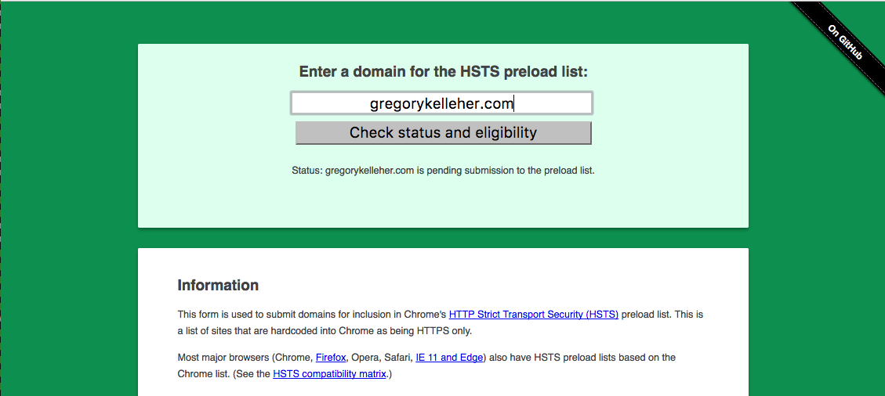
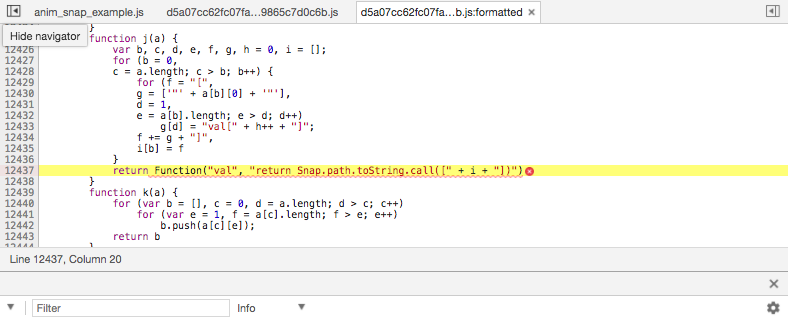
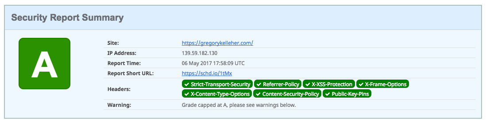
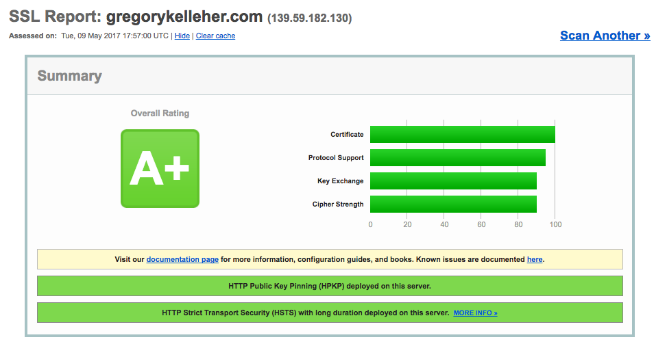

My website mightn't look any different, but I've made some major modifications under the hood. Optimising Nginx and boosting my security has put this website on the cutting edge of today's web.


===

In my last [post](https://gregorykelleher.com/digital_ocean_migration) on Nginx, I discussed how my website looked prior to transitioning to Digital Ocean. Spoiler alert: not good.

Moving my website across to Digital Ocean and spending the time upgrading to the latest version of Nginx means I'm well placed to begin my upgrades to my server's SSL.

Like I described in my last post, I've separated my configurations into individual files for ease. The two most important of which, are `gregorykelleher.com.conf` and `ssl-params.conf`. Let's look at them now. 

### gregorykelleher.com.conf

I have a configuration file just like this one for every website running under Nginx. As a reminder, it's located under `sites-available` with a symbolic link to `sites-enabled`.

```
# Non-SSL configuration - Redirects
server {
listen 80;
root /home/gregory/www/gregorykelleher.com;
server_name gregorykelleher.com www.gregorykelleher.com;
return 301 https://$server_name$request_uri;
}

# Domain - gregorykelleher.com
server {
index index.html index.php;

# Server Info
root /home/gregory/www/gregorykelleher.com;
server_name gregorykelleher.com www.gregorykelleher.com;

# Import common configuration
include /etc/nginx/include.d/common.conf;

# SSL Configuration
listen 443 ssl http2;
include snippets/ssl-gregorykelleher.com.conf;
include snippets/ssl-params.conf;

# HPKP Configuration
add_header Public-Key-Pins 'pin-sha256="fskDdf0qoSQGi08inbU1HLRPLBe6Lx3JCkyU68sujPY="; pin-sha256="GRXBAq6fO82BIgSfurA0VDP2peYUk/EOGekPnqprNlc="; pin-sha256="3oeKWB74UCorXejGwjaHyKYwf53o7MR5Csu+cKogXKg="; max-age=2592000; includeSubDomains';

# PageSpeed
pagespeed on;
pagespeed FileCachePath /home/nginx/ngx_pagespeed_cache;
pagespeed RewriteLevel CoreFilters;
}
```

Inside this configuration, I've requests to port 80 (HTTP) being redirected with a permanent 301 to my HTTPS-enabled website. Essentially forcing a HTTPS connection.

Further down you can see I'm importing other configuration settings by specifying the path; for both the `common.conf` and the SSL `snippet` config files like I mentioned previously. Notice that I'm specifying `http2` for SSL communications on port 443 too.

!!! HTTP/2 is a long overdue update to regular old HTTP. In a nutshell, it's better. It integrates data compression for HTTP headers and multiplexes parallel responses with just a single connection. Although it's only supported on encrypted websites using HTTPS. 
!!!
!!!According to [SSL Labs](https://www.trustworthyinternet.org/ssl-pulse/), only 15% of the top million websites online support HTTP/2.

With the `include snippets/ssl-gregorykelleher.com.conf` I'm importing the paths for my **free** SSL/TLS certificates, courtesy of [Let's Encrypt](https://letsencrypt.org/), which describes itself as a _free, automated, and open Certificate Authority_. 

It's an incredible resource and paired with EFF's [CertBot](https://certbot.eff.org/) tool, makes certificate deployment a trivial affair. Without it, I'd most likely have to purchase valid certificates from another Certificate Authority at cost.

I'll return to HPKP or _HTTP Public Key Pinning_ later, skipping over it for now. PageSpeed is for a later blog post.

### snippets/ssl-params.conf

Okay, so this is the most fundamental file for configuring SSL/TLS on Nginx. Like it says, it sets the parameters for the server. Maintaining and upgrading this file will determine the most part of the SSL Lab grade.

```
ssl_protocols TLSv1 TLSv1.1 TLSv1.2;
ssl_prefer_server_ciphers on;
ssl_ciphers "ECDHE-ECDSA-CHACHA20-POLY1305:ECDHE-RSA-CHACHA20-POLY1305:ECDHE-RSA-AES256-GCM-SHA384:ECDHE-RSA-AES128-GCM-SHA256:ECDHE-RSA-AES256-SHA384:ECDHE-RSA-AES128-SHA256:ECDHE-RSA-AES256-SHA:HIGH:MEDIUM:!MD5:!aNULL:!EDH:!RC4:!DSS";
ssl_ecdh_curve X25519:secp521r1:secp384r1;
ssl_session_cache shared:SSL:5m;
ssl_buffer_size 4k;
ssl_session_timeout 120m;
ssl_session_tickets off;
ssl_stapling on;
ssl_stapling_verify on;
resolver 8.8.8.8 8.8.4.4 valid=300s;
resolver_timeout 5s;
add_header Strict-Transport-Security "max-age=63072000; includeSubdomains; preload";
add_header Referrer-Policy "no-referrer";
add_header X-Xss-Protection "1; mode=block" always;
add_header X-Frame-Options DENY;
add_header X-Content-Type-Options nosniff always;
add_header Content-Security-Policy "upgrade-insecure-requests; block-all-mixed-content; default-src 'self' https; script-src 'self' 'unsafe-eval' 'unsafe-inline' https://www.google-analytics.com https://netdna.bootstrapcdn.com https://code.jquery.com https://www.google-analytics.com https://ajax.googleapis.com https://www.gstatic.com https://www.google.com; frame-src https://www.google.com; img-src 'self' https://www.gravatar.com; style-src 'self' 'unsafe-inline' https://fonts.googleapis.com; font-src 'self' https://fonts.gstatic.com; object-src 'none'" always;
ssl_dhparam /etc/ssl/certs/dhparam.pem;
```
On the first line you can see I'm only using TLS and not any older SSL protocols. It's recommended to phase out support for these insecure protocols. Following that, I've enabled the `ssl_prefer_server_ciphers` option. That's self explanatory. Again, best practice.

For `ssl_ciphers` I've included the ChaCha20-Poly1305 ciphersuite that came from my install of OpenSSL when I built Nginx from source. I'm also removing support for older less secure ciphers like `!MD5:!aNULL:!EDH:!RC4:!DSS`.

I'm also prioritising ciphers with `ECDHE` which stands for _Elliptic Curve Diffie-Hellman Exchange_, in turn allowing for forward secrecy. 

ECC or _Elliptic Curve Cryptography_ is the alternative to RSA that's been gaining a lot of momentum recently. Like I said, I'm using it for my Diffie Hellman Exchange as it's much faster and offers greater strength for a smaller bit count.

Under `ssl_ecdh_curve` I've set support for three ECC curves: X25519, P521 and P384, in that order of preference.

Currently there aren't many elliptic curves to choose from. Curve25519 is my first preference and is one of the fastest. Funnily enough, It's also popular because of suspicions surrounding the use of elliptic curves specified by NIST. 

!!! Renowned cryptographers such as Bruce Schneier hold distrust towards the choice of P curve constants supplied by NIST, believing they could've been manipluated by the NSA. If this sounds like tinfoil hat paranoia, remember that the NSA had planted a back-door in the pseudo random bit generator, DUAL_EC_DRBG, which was widely used in many crytographic algorithms before.

Next notice that I have `ssl_session_tickets` disabled. Session tickets are one way TLS can provide session resumption, which is a great way for TLS to avoid the whole SSL handshake upon reconnection with a client, however it does have its flaws.

Like I described earlier, I've enabled forward secrecy on my server but without a proper configuration this could be easily compromised. Session tickets transmit the secret state of the server to the client, encrypted with a ticket key. It's this ticket key that's valuable. 

If an attacker were to intercept this key, then he/she could break TLS for present and future communications. Therefore it's vital to secure session tickets adequately by rotating the key regularly.

I've set my TLS session cache `ssl_session_cache shared:SSL:5m` to be 5MB in size in my TLS configurations. This is the memory that's provided for session tickets. Of course, if an attacker could read from this cache then he/she could compromise the server.

Hence the need to wipe this cache periodically, which I've done by setting `ssl_session_timeout 60m` which will store the session tickets for 60 minutes.

Then `ssl_buffer_size` is set to 4 kilobytes to minimise _time to first byte_. The default for Nginx is 16k.

Nevertheless, `ssl_session_timeout` will only happen when the client attempts to resume a session at the start of a connection. It will not automatically remove out-of-date entries from the cache, which is an important distinction.

Since 5MB of cache could hold a few thousand session ticket entries, it's a trade off between security and speed. Enabling session resumption would give clients a performance boost but the downside is there's no way of removing session ticket data from the cache that might be timed out.

This left me sort of stuck. I didn't want to compromise on my forward secrecy so I've chosen to disable session tickets for the time being. Many people choose to do the same too.

From reading into things it seems Nginx doesn't have any means of rotating the ticket keys either, so it's definitely a 'no' for me. Although if anyone can enlighten me more on this, I'd appreciate it.

Lastly, before leaving session resumption, Nginx does have support for session IDs which the client can send in the SSL ClientHello message. This can be sent in future connections to the server to quickly resume from the previous saved session. 

Session IDs are stored in the session cache just like the session tickets, so again it shares the same vulnerablity.

Moving on, the next in my configuration is `ssl_stapling` and `ssl_stapling_verify` which enables OCSP stapling for the server. I've added Google's DNS to the Resolver `8.8.8.8 8.8.4.4`.

OCSP or _Online Certificate Status Protocol_ is just a way to check the revocation status of a server certificate. The client makes an OCSP request to the CA to check the status of the certificate and the CA will respond with an OCSP response, indicating whether the certificate is valid or revoked.

OCSP stapling is like the opposite. Instead of the client sending out the OCSP request, the onus is on the server to do the request instead, caching it on the server. Then it will 'staple' this to the certificate and send it to the client. 

Having the server staple the OCSP request takes the burden off the client. This removes the need for the client to do a DNS lookup for the CA as well as the OCSP request itself.

Furthermore, it prevents the CA from discovering the website the client is requesting, since the server is the one sending the handling the OCSP request/response.

And finally we reach the security headers. This is what [securityheaders.io](https://securityheaders.io) will evaluate. 

HSTS or _HTTP Strict Transport Security_ has been enabled, enforcing the use of TLS on web browsers. This will ensure all communications take place over HTTPS on the client-side.

!!! Only 11.8% of the top million websites online use HSTS according to [SSL Labs](https://www.trustworthyinternet.org/ssl-pulse/)

The header `Strict-Transport-Security "max-age=63072000; includeSubdomains"` will specify HSTS for 2 years (63072000 seconds) and include all my sub-domains too. I've added the `preload` bit at the end to enable a browser, such as Chrome, to list my website as a HSTS host by default.



In other words, Chrome will have my website hard-coded in as being accessible over HTTPS only, even in the absence of a HSTS response header. I've added my domain to the Chrome preload list and you can find it [here](https://hstspreload.org/).

The header `Referrer-Policy "no-referrer"` is an easy one. The referrer header lets me know where an inbound visitor to my website orginated from. Useful perhaps but since I've disabled Google Analytics on my website I know longer care to track users.

Hence setting `no-referrer` will indicate to the browser to never send the referrer header with requests that are made to my website.

The `X-Xss-Protection` header if set, will enable XSS protection found on Chrome, IE and Safari. The `mode=block` tells the browser to block any malicious scripts rather than sanitising.

`X-Frame-Options DENY` prevents iframes being used in the browser. Attackers sometimes use this 'feature' in browsers to conduct _clickjacking_ attacks. 

`X-Content-Type-Options "nosniff"` prevents browsers from doing any MIME-type sniffing. Disabling this protects against any MIME-based attacks. With the `nosniff` option, if the server says the content is text/HTML then the browser has no option but to render it as text/HTML.

The last one is decidedly tricky to implement. The CSP or _Content Security Policy_ header is essentially a white-list of approved content sources from either the website itself or from external sources, such as a CDN for example.

Okay, so great idea in theory but it's a finicky thing. It should be a good countermeasure to XSS attacks in practice, but I can't guarantee all the code that runs on my website. For instance, Snap SVG which is an external JavaScript library that I use to animate my SVG illustrations would be prohibited under CSP since it uses `Function()` to dynamically evaluate code in JavaScript.



I like having my animated illustrations so I've enabled `unsafe-eval` for scripts within the CSP header. I've also had to allow `unsafe-inline` since I use inline scripts in some places.

All this leads to a compromise with CSP, undermining any of the XSS protection it could've offered. The only benefit it has for me is preventing any mixed content and upgrading insecure requests; essentially just ensuring all content on the website will be delivered over a secure connection. 

For similar reasons I'm not using SRI _Subresource Integrity_ for CSP either.

If I had CSP setup properly I would score an 'A+' on [securityheaders.io](https://securityheaders.io) but instead my grade is capped at an 'A' because of these compromises.



With all these configurations done, you can view what's being sent by the server in the HTTP Response header based on Nginx's `ssl-params.conf`.


In the middle of the above image you can see the _public key pins_ for my website. This is the HPKP or _HTTP Public Key Pinning_ configuration that I skipped over when I talked about my `gregorykelleher.com.conf` configuration file.

```
# HPKP Configuration
add_header Public-Key-Pins 
'pin-sha256="fskDdf0qoSQGi08inbU1HLRPLBe6Lx3JCkyU68sujPY="; 
pin-sha256="GRXBAq6fO82BIgSfurA0VDP2peYUk/EOGekPnqprNlc="; 
pin-sha256="3oeKWB74UCorXejGwjaHyKYwf53o7MR5Csu+cKogXKg="; 
max-age=2592000; 
includeSubDomains';
```

Again, this is what it looks like. It's a security policy header similar to HSTS or CSP. It provides to the client a cryptographic identity that the client can trust and accept from my website into the future. It's good protection if something happens to my certificate authority, however unlikely that might be.

! I've since disabled HPKP on my website. In truth, I found it inconvenient and more of a hassle to maintain in the long run. I couldn't find a way to automate the renewal on my key pins either. Scott Helme wrote a good article [here](https://scotthelme.co.uk/im-giving-up-on-hpkp/) where he describes the drawbacks I also encountered.

Of course the client has to have an initial connection with the server to receive this cryptographic identity in the first place. Once the client receives this, it will cache it and use it for future connections.

What is this cryptographic identity then? It's simply a fingerprint of the current certificate in use by the server. And because it's always a good idea to have backups, I've taken a fingerprint of a CSR or _certificate signing request_ in case things go wrong.

So for instance, in the case that the private key of my certificate is compromised, I can just use the CSR to request the signing of a new public key instead.

In the header then I've added three fingerprints for my website, setting a max age of 30 days and including all my sub-domains too. 

So I think that covers the SSL configuration for my web server then. So let's switch on over to SSL Labs again and re-run the test to find out how much better it is.



That's a definite improvement and reflects the changes and improvements I've made to Nginx. You can see the results yourself [here](ssllabs.com/ssltest/analyze.html?d=gregorykelleher.com&latest).

It goes to show that upgrading and improving a website's SSL offerings isn't hard and well worth the effort. There's still things to do of course, but I'm satisfied with what I've accomplished so far.

!!! Other great website (still in Alpha) from the creators of SSL Labs is [Hardenize](https://hardenize.com). It can display more information than SSL Labs and has a nice UI, even if it is still unfinished.

### Conclusions

Migrating to Digital Ocean and choosing Nginx were two very good decisions that I should've done sooner. It was a great learning exercise and I'd recommend it to anyone interested in web development. It has taken me a number of weeks to get where I am now, but I'm very happy on the whole.

Coming away from this, there's a few things that I would do differently if I could. For one, while Nginx is an excellent choice and serves my purposes well, it does have its quirks. Most evidently the 'building from source' aspect for installing new modules.

I described this very problem when I was compiling Nginx on my little droplet and had to create a swapfile to get around memory restraints. Nginx just isn't always that great on 'user-friendliness' sometimes.

Secondly, I couldn't figure out more about how to purge the `ssl_session_cache` on Nginx. Like I mentioned, Nginx has `ssl_session_timeout` but that will only trigger if the client resumes a session. It's definitely something that I need to read up on.

And finally, the issue of renewing certificates. I've done the basics and created a cron job to manage this, which works fine for ordinary certificates. However, I've got HPKP enabled and it's become something quite complex to manage. I even gave up on generating ECDSA certificates because it was too much effort.


It was at this time that I discovered [Caddy](https://caddyserver.com), an open-source web-server that looked like everything I wanted. It's just a pity I found it too late, otherwise I would've chosen it over Nginx.

Give me a few months and I might get round to jumping ship to Caddy. It's a great little platform that's ideal for hosting small projects or personal websites. The syntax is incredibly easy coming from Nginx and its configuration is straightforward. It even serves over HTTP/2 right out of the box.

The most useful thing about Caddy for me however, is the ease of renewing certificates automatically with HPKP in use. I'd certainly make use of that handy feature.

On the whole, this website on Nginx is highly secure. In fact, it's over-kill in a lot of respects. However, I've had to make some compromises as I've mentioned. Most noticeably on my implementation of the Content Security Policy header. I can live with this, but I hope this header could be improved in future since it's more than a little awkward to configure.

Another security feature I'm missing is DNS CAA or DNS _Certification Authority Authorisation_. It's currently not supported by Digital Ocean just yet, but having it enabled would allow me to specify which certificate authorities are permitted to issue certificates for my domain.

Anyways, that finishes up my blog post. I hope you found this informative. I'll be sure to write more soon.


