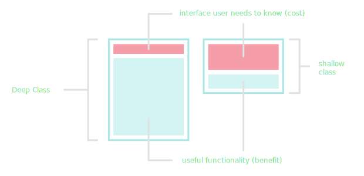

I decided to do a short write-up about my approach to writing a good program. I'd recently finished reading Clean Code by "Uncle Bob" and I felt evangelised to put what I learnt into action.


===

###Introduction

I don't intend on describing the utmost perfect program. Neither am I out to write a great program, nor a bad one. Rather just a good program. 

Usually when we're under the constraints of deadlines at work, it's rare to have the time to deliver an idealised solution anyways.

For that reason, I'm not going to delve into time-complexity or justify early optimisation here. Nevertheless, I do place a strict importance on providing a flexible and readable solution. If indeed the time comes when the program needs to be optimised or extended in the future.

To quote Harold Abelson here,

> “Programs must be written for people to read, and only incidentally for machines to execute”

###Problem Statement

To provide a use case for the program, I thought building a simple CSV reader would fit the bill.

For instance, if we had a sample input file with the following format:

| Time Stamp | Animal 		| Number |
| ---------- | ------------ | -----	 |
| 1597324871 | hippopotamus |	10   |
| 1597324872 | aardvark 	|	20	 |
| 1597324873 | toucan		|	30	 |
| 1597324874 | giraffe		|	40	 |
| 1597324875 | walrus		|	50	 |
| 1597324876 | lemur		|	60	 |
| 1597324877 | yak  		|	70	 |

And then corresponding to how it looks as a `sample_input.csv` file:

```bash
1597324871, hippopotamus, 10	
1597324872, aardvark, 20
1597324873, toucan, 30
1597324874, giraffe, 40
1597324875, walrus, 50
1597324876, lemur, 60
1597324877, yak, 70

...
```

So, what is our program required to do? 

Thankfully, for this simple example, we can come up with a straightforward answer:

> _"Extract the data from the input"_

! In the real world however, it's usually not this simple. Evidenced by the experience of almost every developer that's ever cried about a "lack of requirements"

Note how the program requirement is _just_ vague enough to give some scope of flexibility. Yet still provides a direct aim for the program.

###Defining the Public Interface

For me, it helps to visualise the program as a tool for a potential client. It might be a standalone program right now, but as a project grows, this `csv_reader` program might become reorganised into a component of a much larger piece of software.

A future client won't necessarily care about how `csv_reader` actually works. Their only interest is including a hypothetical `csv_reader.h` file into their program and calling some function that returns the data from the input.

Hence why I like to start from the opposite end. Looking at what the _output_ of `csv_reader` might eventually resemble. Rather than immediately delving into parsing the _input_.

This is contrary to what I frequently find when integrating others' software. Usually there's a span of time where I'm scanning through a header file, struggling to locate _that_ function that I want to use. 

> Oh, and I need to instantiate this object beforehand? Oh right, of course. And I also need to cast before I can pass that as a parameter, gotcha .etc.

To avoid potential internal monologue like above, it's crucial to pay attention to the client interface, right from the outset.

We'd like to make it as easy as possible for the client to use our component, removing any possible signs of ambiguity. Accordingly, I believe our component should only have a _single_ interface function that can be called from a public API.

Taking inspiration from the requirement, here's what this could look like:

```cpp
// main.cpp

auto const messages{ extract_messages(input) };
```

Ground-breaking I know. This may look trivial, but that's the point. It _should_ be trivial. Simplicity is the ultimate sophistication. Writing in this manner could be described as [declarative programming](https://en.wikipedia.org/wiki/Declarative_programming), where the "what" takes precendence over the "how".

I can subscribe to this dogma; I find it easier to read expressions than follow control flow. In fact, Dijkstra has a quote on this, which fits quite nicely:

> "[...] our intellectual powers are rather geared to master static relations and that our powers to visualize processes evolving in time are relatively poorly developed.

> For that reason we should do (as wise programmers aware of our limitations) our utmost to shorten the conceptual gap between the static program and the dynamic process, to make the correspondence between the program (spread out in text space) and the process (spread out in time) as trivial as possible"

Anyhow, now begs the question; what are we returning from `extract_messages()`? What type does `messages` hold?

Looking at the `sample_input.csv` each line could represent a `message` containing the data for each of the three fields:

| Time Stamp | Animal        | Number |
| ---------- | ------------- | ------ |
| 1597324871 | hippopotamus  | 10     |

So `message` would hold the time stamp, the animal and the number. A `struct` sounds ideal:

```cpp
struct Message
{
	std::chrono::system_clock::time_point timestamp{};
	std::string animal;
	std::int32_t number;
}
```

It follows then, that `extract_messages()` would return an `std::vector` of messages. So we can begin to put together a signature for our API:

```cpp
// csv_reader.h

std::vector<Message> extract_messages(input);

```

Finally, what is our input parameter for `extract_messages()`?

The obvious answer is `sample_input.csv` which would correspond to a `std::ifstream` type.

That's correct, but we can also be smarter. The requirement doesn't specify the input is always a file. And we shouldn't place restrictions on the API so soon. It could just as easily be an `std::string` for instance.

Without going overboard and overthinking this too much, I'll choose to just template the function for `std::ifstream` and `std::istringstream` types:

```cpp
// csv_reader.h

template<typename T>
std::vector<Message> extract_messages(T &input_stream);
```

Definitions for the templates follow in `csv_reader.cpp`:

```cpp
// csv_reader.cpp

template std::vector<Message> extract_messages<std::ifstream>(std::ifstream &);
template std::vector<Message> extract_messages<std::istringstream>(std::istringstream &);

```

!!! We'll see later in Unit Testing, how providing an `std::istringstream` template for `extract_messages()` is incredibly useful for writing test cases

That's the public API declaration sorted. It couldn't be simpler now for the client:

```cpp
// main.cpp

#include "csv_reader.h"

int main()
{
	std::ifstream csv_file("sample_input.csv");

	auto const messages{ extract_messages(csv_file) };
}
```

###Implementing the Program Logic

And now for the meat of the matter - the implementation. We have a defined input and a defined output, so we can commence on building out the program's internal logic.

Since this is a simple program, there's little need in taking a class-oriented approach here. I think this is well suited to a procedural rendition. The logical steps taken in parsing lend themselves to this interpretation.

A useful thinking strategy is spelling out in plain English what the program has to accomplish, and listing each step in sequence. From each step, a function declaration can usually be gleamed.

To elaborate on the technique with our program:

1. Extract the messages
2. Check if the message is valid
3. Get the message
4. Extract the fields
5. Check if the fields are valid
6. Get the fields

So six steps and potentially six functions. I find this is a good way of "eye-balling" how the end program could manifest. Listing what the program has to do has also revealed to us the procedure of execution.

This bears a resemblance to what is called _The Stepdown Rule_ in Clean Code. Our program's code should read like a top-down narrative, where every function is followed by those functions at the next level of abstraction descendingly.

Our example `csv_reader` program is convenient for highlighting this rule, but it can oftentimes be difficult to follow with something more complex. On the whole though, it's the most enlightening thing I've learnt from the book.

!!!! Whether a `message` or a `field` within a `message`, there's a common theme of extract, check and get. We should try and hold ourselves to this when building the program.

####Extract Messages

Starting from the top down this time, let's have a go at writing the definition for the public `extract_messages()` function:

```cpp
// csv_reader.cpp

template<typename T>
std::vector<Message> extract_messages(T &input_stream)
{
  Expects(input_stream.fail() != true);

  std::string line;
  std::vector<Message> messages;

  while (std::getline(input_stream, line))
  {
    if (is_message_valid(line))
    {
      messages.emplace_back(get_message(line));
    }
  }
  return messages;
}
```

The first three functions we hypthosised above are evident here:

| Step  	| Purpose 						 	| function 			   |
| --------- | --------------------------------- | -------------------- |
| 1   		| Extract the messages 			 	| `extract_messages()` |
| 2   		| Check if the message is valid     | `is_message_valid()` |
| 3   		| Get the message 				 	| `get_message()` 	   |

That's half the program complete already! Well almost.

From the definition of `extract_messages()` and its name alone, its intent is obvious. 

I could just as easily have declared it as `read_messages()` or `MessageParsedInput()` but neither of those names properly communicate the purpose of the function.

To borrow the book's advice, functions should have a verb or verb phrase. For consistency too, it's best to stick to one word per concept. I prefer `extract` to `read` because it's more descriptive.

One of the most important take-aways from Clean Code is that functions should also be small. Not necessarily as small _as possible_ but rather as small as can be, maintaining context.

I could easily include the `is_message_valid()` logic within `extract_messages()` in the definition above. Yet I choose to wrap this logic in its own function. This also helps to maintain the logic at the right level of abstraction.

!!! Similiar to classes, functions work best if they follow a _single responsibility principle_, i.e. doing one thing and doing it well

####Check Message Validity and Get the Message

```cpp
// csv_reader.cpp

static bool is_message_valid(std::string const &line)
{
  auto const delimiter_count{ std::count(line.begin(), line.end(), ',') };
  return !(line.empty() || delimiter_count != 2);
}

static Message get_message(std::string const &line)
{
  std::istringstream line_stream(line);
  return get_fields(extract_fields(line_stream));
}
```

The next two functions are again, small. They each take a single argument (i.e. they're _unary_). It may sound like a small thing to note, but limiting the number of arguments to a function improves testability.

The more arguments to a function, the greater the difficulty in writing the test cases to ensure all the various combinations of arguments work in tandem.

Furthermore, both can be described as being _pure functions_. A pure function is simply a function that, given the same imput, should always produce the same output. In a word, _deterministic_.

By definition then, pure functions do not cause side effects. Their predictable nature and transparency make them ideal building blocks for our programs, hence why we should favour them whenever possible.

!! Truth be told, I do use GSL precondition assertions within, which in turn will terminate the program given an invalid case (i.e. side-effect). So strictly speaking, these functions aren't entirely kosher. Alas this is unavoidable when interacting with file I/O

For example, in the `get_message()` function, I'm able to "daisy-chain" my pure functions to express a composition. Where the return of `get_fields()` can be _composed_ using the return of `extract_fields()` as its inline argument.

So rather than having a monolithic function taking multiple arguments, this approach works on evaluating a sequence of nesting functions instead, each with a singular argument.

!!! In functional programming, a related technique also exists called [currying](https://en.wikipedia.org/wiki/Currying)

On another note, I've also defined both of these functions as being `static` meaning they're only visible to other functions within the same file (or to be precise, _translation unit_).

This means that they're inaccessible from the public API and aren't declared within the `csv_reader.h` header. This is intentional, since the client doesn't need to know these functions even exist.

This fits quite neatly with John Ousterhout's advocacy for _deep classes_ in his book, _"A Philosophy of Software Design"_.



A class, or indeed, a namespace or module, consist of two parts, an _interface_ and _implementation_.

An interface describing _"what"_ a class has to do, and the implementation describing _"how"_ it does it.

In designing a good class, we want to minimise the complexity of the interface (i.e. the cost to the user) whilst maximising the usefulness of its underlying implementation (i.e. the benefit to the user).

A deep class therefore, is a class that embraces those qualities, with a concise interface abstracting deep internal functionality.

It can be said then, that `csv_reader` matches this description thus far; with a singular `extract_messages()` public interface hiding the actual implementation of extraction.

####Check Field Validity and Get the Field

Now onto the final half of the implementation; getting the data within the fields:

| Step  	| Purpose 						 	| function 			   |
| --------- | --------------------------------- | -------------------- |
| 1   		| Extract the fields 			 	| `extract_fields()`   |
| 2   		| Check if the fields are valid     | `are_fields_valid()` |
| 3   		| Get the fields 				 	| `get_fields()` 	   |

```cpp
static std::vector<std::string> extract_fields(std::istringstream &line_stream)
{
  std::string field;
  std::vector<std::string> fields;

  while (std::getline(line_stream, field, ','))
  {
    fields.emplace_back(field);
  }
  return fields;
}
```

```cpp
static Message get_fields(std::vector<std::string> const &fields)
{
  Message message;

  Expects(are_fields_valid(fields));

  message.timestamp = std::chrono::system_clock::from_time_t(std::stol(fields[0]));
  message.animal = fields[1];
  message.number = std::stoi(fields[2]);

  return message;
}
```

Again, straightforward `static` helper functions that are small and have a single purpose.

For the final function `are_fields_valid()` I define a lambda `is_numeric()` inside to determine whether the string input is numerical for the `timestamp` and `number` field:

```cpp
static bool are_fields_valid(std::vector<std::string> const &fields)
{
  for (auto const &field : fields)
  {
    Expects(!field.empty());
  }

  auto const is_numeric = [](auto &field) {
    long double test_numeral;
    return ((std::istringstream(field) >> test_numeral >> std::ws).eof());
  };

  return (is_numeric(fields[0]) && is_numeric(fields[2]));
}
```

And that's the entirety of the implementation covered. I hope it's provided some clarity to how a program can be written with thought and consideration. It's flexible, open to extension and most importantly provides a succinct interface for the client.

####Unit Testing

Finally, everyone's favourite part - unit testing. Frequently this is where code can become undone. Maybe you uncover dead code or discover branches that could never be hit .etc. Unit testing (done well) tests the behaviour of our functionality.

It needn't be exhaustive but it should be thorough.

I hadn't touched on testability too much in the previous sections, but I was careful to write every function in a deliberate manner, to aid unit testing. Functions are small, focused and pure.

Additionally, I'm solely testing the public interface of the program, i.e. `extract_messages()`. Since it's the only non-static function, I really don't have another choice. This of course is by design. I'm intentionally restricting the unit tests to be purely black-box tests.

In general, I find this approach leads to less brittle tests. There's less jeopardy in the public API changing down the line, whereas the underlying implementation details are more subject to change. Lastly, I'm also avoiding the need for using mocks in any capacity.

Let's jump into it and write the first test case for `extract_messages()`:

```cpp
// csv_reader.h.cpp

#include "csv_reader.h"

TEST(test_extract_messages, handles_valid_file)
{
	std::ifstream valid_file("valid_file.csv");

	auto const messages{ extract_messages(valid_file) };

	EXPECT_EQ(messages.size(), count_lines(valid_file));
}
```

So the above test case runs `extract_messages()` on a valid CSV file, and expects an equality on the comparison of the no. extracted messages to no. lines in the file.

!!! Note how I write my test case in adherence of the [AAA (Arrange - Act - Assert)](http://wiki.c2.com/?ArrangeActAssert) standard

Remember that `extract_messages()` is templated, so I overload `count_lines()` for `std::ifstream` and `std::istringstream` types:

```cpp
namespace
{
	auto count_lines(std::istringstream const& input_stream)
	{
		std::string lines{input_stream.str()};
		return std::count(lines.begin(), lines.end(), '\n');
	}

	auto count_lines(std::ifstream& input_stream)
	{
		input_stream.clear();
		input_stream.seekg(0);
		return std::count(std::istreambuf_iterator<char>(input_stream), std::istreambuf_iterator<char>(), '\n');
	}
}
```

Likewise, we should also test with an `invalid_file.csv` to ensure `EXPECT_NE(messages.size(), count_lines(invalid_file))` too.

What about all our other functions to test then? Remember we're only including whatever's in `csv_reader.h` which only constitutes the single public `extract_messages()` function.

Therefore, we only have a single point of access to the program via `extract_messages()` to test all the statically defined helper functions in the `csv_reader.h` file. Tricky...

We could cheat and include `csv_reader.cpp` in our `csv_reader.h.cpp` unit test file. That way, everything would be part of the same translation unit. Not a great solution and feels a little dirty.

This is why I templated `extract_messages()` in hindsight of this limitation. I understood that a single entry to the program could prove troublesome.

What's more, if `extract_messages()` were defined solely for a `std::ifstream` type parameter, I'd have to create multiple input test files for each test case. This obviously hampers the extensiblity of the unit test, and discourages others to add new test cases.

```cpp
TEST(test_extract_messages, handles_missing_line)
{
	std::istringstream test_data(
		"1597324871, hippopotamus, 10\n"
		"1597324872, aardvark, 20\n"
		"1597324873, toucan, 30\n"
		"\n"
		"1597324875, walrus, 50\n"
		"1597324876, lemur, 60\n"
		"1597324877, yak, 70\n");

	auto const messages{ extract_messages(test_data) };

	EXPECT_NE(messages.size(), count_lines(test_data));
}
```

With `extract_messages()` templated for `std::istringstream` types, we can define the file test data inline, inside the test case. No need to create a file, and much easier to see what's under test.


###Conclusion

I hope this walkthrough provided an insight into how I strategise and implement a solution in code. From reading, I'd say it's apparent my own mantra leans towards building robust and readable code. Likely stemming from my experience working on embedded and safety-critical applications.


