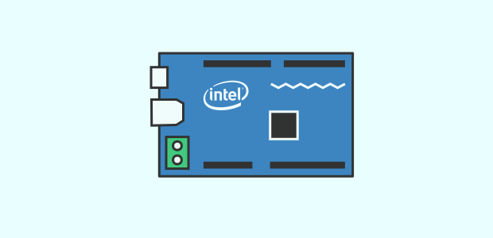
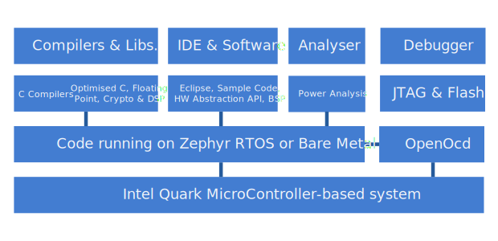
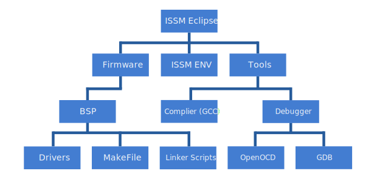

Since starting work with the Quark, I've been meaning to write a tutorial guide intended for getting up and running in the quickest amount of time. 

===

I initially found it almost overwhelming with the amount of information I had to absorb in those first few weeks so it helps me to write about how I got set up and going with writing embedded software. 

!!!! I recommend reading [this](http://embeddedgurus.com/) blog to learn more about everything that goes into embedded software

For the unfamiliar, the Quark is a line of Intel 32-bit x86 SoCs and MCUs specifically targeted for the nascent IoT market. Designed with small size and low power consumption in mind, the Quark is Intel's flagship chip for new markets, such as wearables & the Maker community.

This sweeping aim is reflected in the choice of Quark products available for a variety of consumers and the features Intel has incorporated into the Quark line.

For instance the Intel Curie Module (which includes a Quark SE core) features an accelerometer in addition to Bluetooth - all within the size of a button. It's now even included on the Arduino 101 - the successor to the Arduino Uno. Then on the opposite end of the spectrum, you can find the Quark chip being used by Daikin Applied for the purposes of smart energy monitoring and diagnostics.

###Quark Products

####Quark X1000 - Clanton   

This was the first product released in the line of Quark processors that established Intel in the IoT sphere. It's a feature rich SoC that delivers Intel computing capabilities within a tiny form-factor. Single-core, single-thread with a low cost price, it's ideal for most IoT solutions. It also shares the same instruction set as the older Pentium series and comes at only 20% of the Atom's die size with 10% of it's power. As Intel's first synthesizable core, it paved the way for
future rapid spinoffs that sooned joined the Quark family.

! It's important in making the distinction that the Quark X1000 is unique in being the only Intel Quark _Microprocessor_ product available, whereas all the following products in this list are Intel Quark _Microcontrollers_.

You've most likely come across this Quark chip on the Intel Galileo where you can recognise it by it's BGA packaging. Onboard are two Ethernet interfaces, PCI Express, USB 2.0, SD/SDIO, eMMC, SPI, UART and 12C/GPIO. It also has a clock speed of 400MHz with 16KB cache.    

!!! BGA or _ball grid array_ is a type of permanent surface-mount packaging for ICs like the Quark. Essentially it's a grid of solder balls integrated onto the underside of the IC package which conduct the electrical signals from the PCB, connecting all electronic components present.

It should be obvious that the Quark X1000 offers interfaces for a broad range of connectivity options - including Ethernet as mentioned, but also Bluetooth, cellular and Zigbee capabilities. 

####Quark D1000 - SilverButte

Low-cost, extreme low-power consumption with very high computational performance characterise this MCU. The 32-bit microcontroller is capable of providing flexible & intelligent processing for a wide variety of IoT applications. It integrates more security features including tamper resistance, JTAG lockout capabilities .etc.

It's supported by a complete suite of software tools for ease of development and debugging through the Intel System Studio for MicroControllers (ISSM) alongside the familiar command-line utilities. 

The D1000 features an 8KB cache, 32MHz clock speed with 32 KB instruction flash, 4 KB data flash and 8 KB SRAM. It also has the usual serial interface peripherals i.e. UART, I2C and SPI making it easy to connect to a host of sensors, DSPs, memories .etc. 

####Quark D2000 - Mint Valley

The Quark D2000 is another very similar ultra low-power Quark microcontroller with the same powerful and robust instruction set. It's low-power core runs at the same 32MHz, with 32KB integrated flash and 8KB SRAM. Optimised for power management - it's intended for low battery power operations. It also has the same interface peripherals, for UART, GPIOS, I2C, SPI .etc.

More interestingly it's included in the Intel Quark D2000 Microcontroller Development Kit, which is a small form-factor board that has Arduino headers, a USB interface (with JTAG support), flash storage, 6-axis compass/accelerometer and also a temperature sensor.

!!! This board is actually the subject of the next article in this series so read [part two](http://www.gregorykelleher.com/blog/quark_issm_2) to learn more. 

Again, the platform is supported by ISSM which integrates the GNU toolchain as well as the board support package (BSP) for the Intel Quark microcontroller software interface (Intel QMSI) and sample
applications. 

####Quark SE 

The Quark SE is a little different to the previous Quark processors. For starters, it's much more than a simple microcontroller since it integrates a whole onboard sensor sub-system. This internal sensor hub is able to manage multiple sensors, allowing the Quark SE to support many more peripherals.

!!! The sensor hub also allows the CPU to sleep, until the sensor controller wakes it up through programmable wake cues, resulting in very low energy consumption. 

The Quark SE also features a pattern matching engine, allowing the microcontroller to recognise and differentiate with real-time responses. 

Unlike the two previous microcontrollers it has 384KB of non-volatile memory as well as 80KB SRAM.

Lastly, the Quark SE is the brains inside the Intel Curie module - perhaps the most ground-breaking product Intel has created for the IoT market. Without digressing too much, the Intel Curie includes BLE and an integrated DSP. It also includes an onboard 6-axis combo sensor with an accelerometer & gyroscope. 

###Quark Development Tools

The Quark chip, as I've mentioned previously, is supported by a host of development and debugging tools. Since the details of embedded software development is likely unfamiliar to many people reading, as it was to me, I'll try to express things in the most accessible of terms.  

####Common Acronyms

One of the first things I had to contend with starting out was the sheer ubiquity of acronyms and definitions that I constantly had to remind myself about. Below is a list of the most common acronyms I encountered.    

| Acronym | Definition |
| ------:| -----------:|
| CRB | Customer Reference Board - demonstrative development boards intended for early access developers |
| BSP | Board Support Package - embedded system support code for given board that contains contains the bootloader | 
| QMSI | Quark MicroController Software Interface is the BSP for the D2000 CRB |
| MCU | MicroController Unit or Memory Controller Unit |
| RTOS | Real-Time OS - operating system intended to serve application process data with precise timing and a high degree of reliablity |
| GNU | GNU's Not Unix - an operating system as well as a very good collection of open source software tools |
| GDB | GNU Project Debugger - standard debugger for the GNU OS and used in tangent with OpenOCD |
| JTAG | Joint Action Test Group - interface for on-chip debugging through a dedicated debug port using serial communication |
| TAP | Test Access Port - core of JTAG, accesses set of test registers, providing chip logic levels and device data |
| OpenOCD | Open On-Chip Debugger - provides debugging, in-system programming and boundary-scan testing for embedded target devices |
| SWD | Serial Wire Debug - ARM hardware debugging protocol alternative to JTAG |
| DMA | Direct Memory Addressing - feature enabling hardware components to access main memory independent of CPU
    
Don't worry, picking up all these acronyms is pretty easy. They're rather common and frequently seen. Intel is also notorious for loving acronyms. In fact, there's actually a whole online Intel acronym wiki page on the internal intranet site!

Before going further and explaining the Quark tools, I think it's necessary to step back and learn a bit more about developing for embedded software. The nature of writing and debugging code for an embedded platform isn't as straightforward as hitting a button and watching things run. 

####JTAG 

The Quark D2000 is mounted on the customer reference board making it easier for developers to create applications around the Quark and explore its capabilities. The Intel Quark Microcontroller Development Kit D2000 is the name given to the CRB in this case. The platform also enables programming and debugging using **JTAG** over the USB connection.

Before discussing JTAG and it's important role in debugging, it's necessary to understand why it's there in the first place. 

As you can imagine, accessing the tiny pins and the digital logic inside the SoC with an external tool is near impossible. Hence the requirement for a non-intrusive alternative that's both cheap and easy to use. 

The reason behind JTAG is because of the growing trend towards fine pitch components and likewise the loss of physical chip access, making it much harder to use physical debugging tools. Modern PCB technology enables manufacturers to design circuits with components and traces closer together (SMD) and current packaging technologies such as BGA limit and sometimes eliminate physical access to pins. 

Hence the old-fashioned _bed of nails_ approach to debugging is rapidly becoming obsolete as it necessitates a connection between an external test probe and an electrical pad on the PCB.  

Simply put, PCBs are becoming more complex with higher board densities, miniaturisation and increased layer counts. To add to these issues, high speed signaling has also started becoming more common, which is a headache when using a physical probe since it can cause interference when placed on the circuit.

Enter JTAG, the debugging interface that provides the same access to the processor's debug/emulation functions but without the intrusiveness associated with external test probes.

!!! A nifty consequence in having a JTAG debugging port embedded on a device is the fact that it exists over the device's lifecycle from manufacture through to release, meaning it's equally accessible to engineers as it is to the end user

JTAG stands for **Joint Action Test Group** but has come to adopt a wide variety of meanings and can really mean any of the following:

| | |
|:------|:-----------|
| | In-System Programming (ISP) |
| | Embedded Instrumentation |
| | Boundary-Scan/Structural Board Testing | 
| | JTAG Embedded Testing/Functional Test |

Boundary-Scan Testing and In-System Programming are perhaps the two applications most widely associated with JTAG, although it has much more to offer.

Of course, this blog post is mainly concerned about the embedded & functional testing capabilities belonging to JTAG which is accessed using the **OpenOCD** software belonging to the ISSM toolchain. 

####OpenOCD

OpenOCD is the software providing the debugging tools interfacing with the JTAG interface. It's a command line scripting language which works with a configuration file containing the settings for the target device. 

The general practice is to start an OpenOCD session (with the matching configuration file for the target device), connect to the target, and then open a telnet session on port `4444` to connect to OpenOCD in order to run the commmands. 

!!!! Another alternative option available is to connect OpenOCD to GDB on port `3333` 

OpenOCD is incredibly useful and makes embedded testing & flashing a breeze. I go into more detail on OpenOCD in the [Part 2](http://www.gregorykelleher.com/blog/quark_issm_2) of this tutorial if you want to learn more about it. 

####ISSM

Talking about JTAG and OpenOCD is great but in order to develop you need a full toolchain, which is provided by the _Intel System Studio MicroController_ toolchain.

!!! If you need a definition, a **toolchain** or even toolset is just a collection of programming tools necessary for building code specific to a certain platform. In this case, the D2000 MicroController board.

The ISSM toolchain contains everything required for development. For instance, it contains the cross-complier, drivers, makefiles, linker script, QSMI library and debug tools, i.e. the JTAG & OpenOCD configurations mentioned earlier, which are all necessary in creating code for the platform. 

The ISSM Eclipse Environment is just a pretty interface for using the ISSM toolchain but I sometimes prefer just doing everything on the terminal and using Vim.  

###Conclusion

Developing code for the Quark is much the same as writing any C software but it does require knowledge and consideration about developing for an embedded platform, which is new to many people - including myself.

Hopefully, after reading this tutorial you have a better undertanding about what the Quark processor actually is and what debugging tools are used in development. 

Follow up in [Part 2](http://www.gregorykelleher.com/blog/quark_issm_2) where I delve deeper into explaining the ISSM toolchain, getting started and using OpenOCD over the terminal to flash your first image. 

