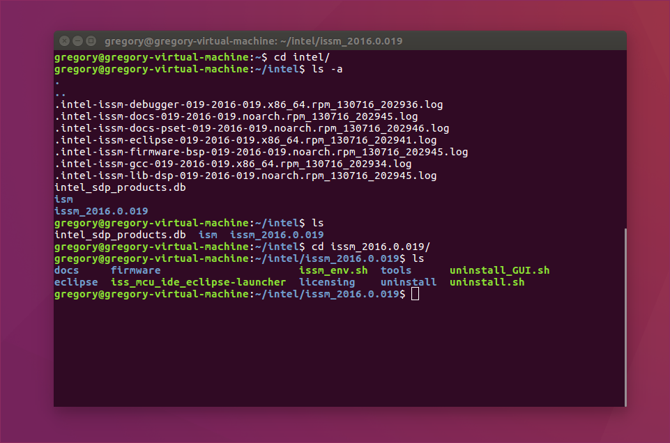
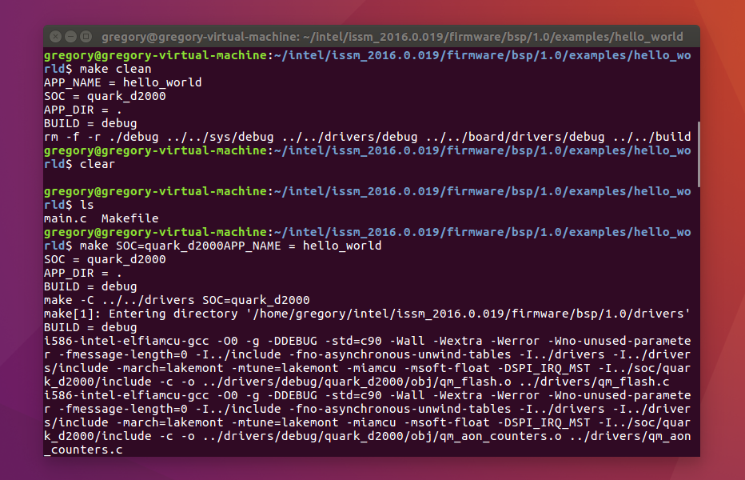
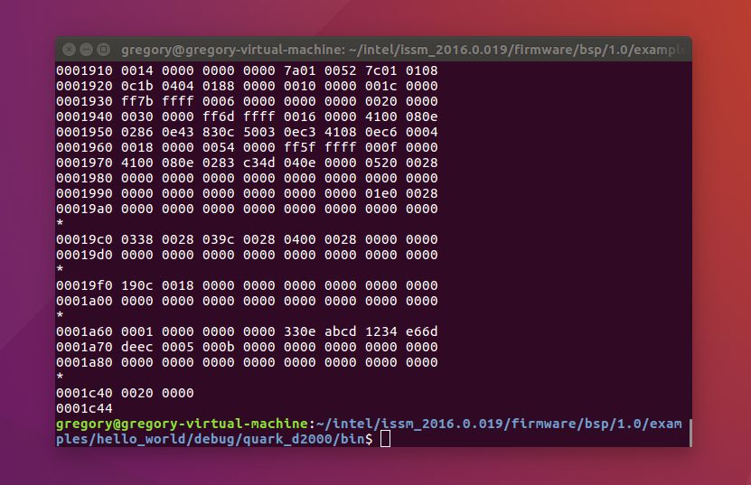
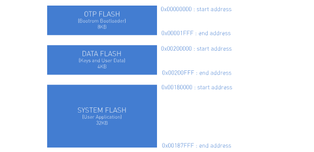
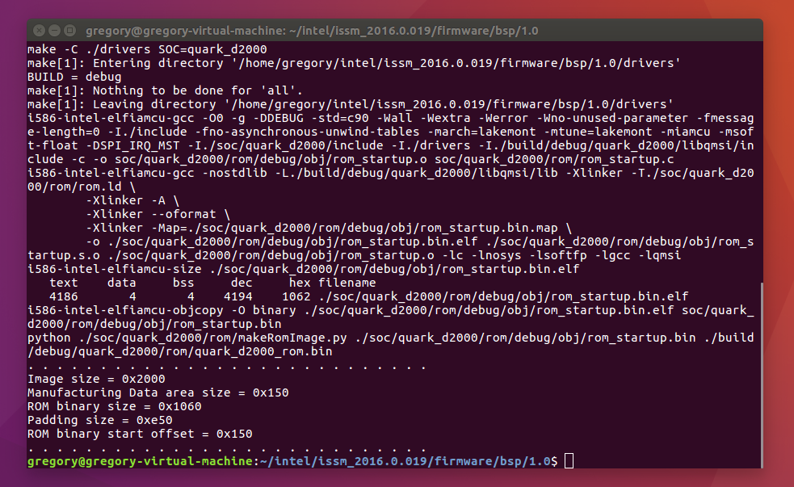
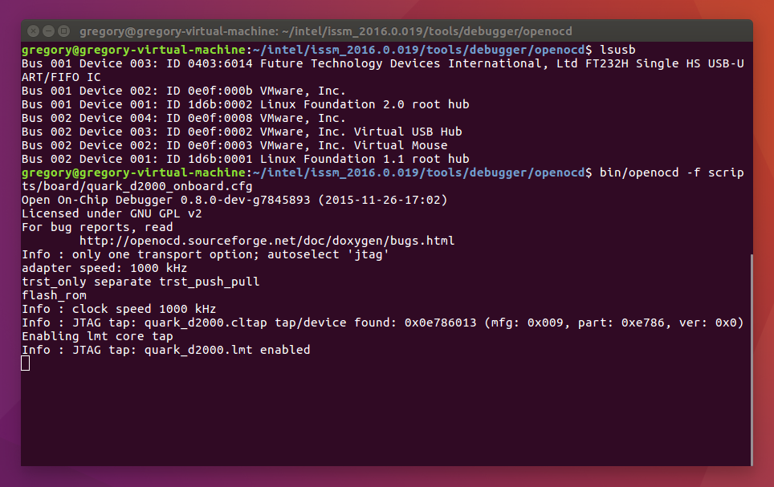
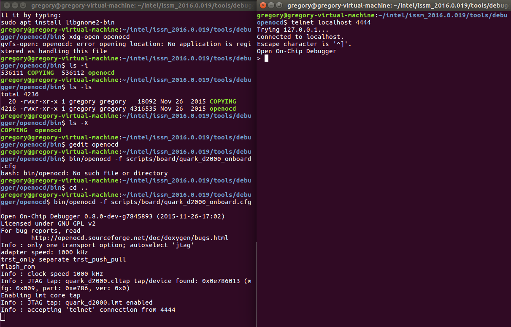
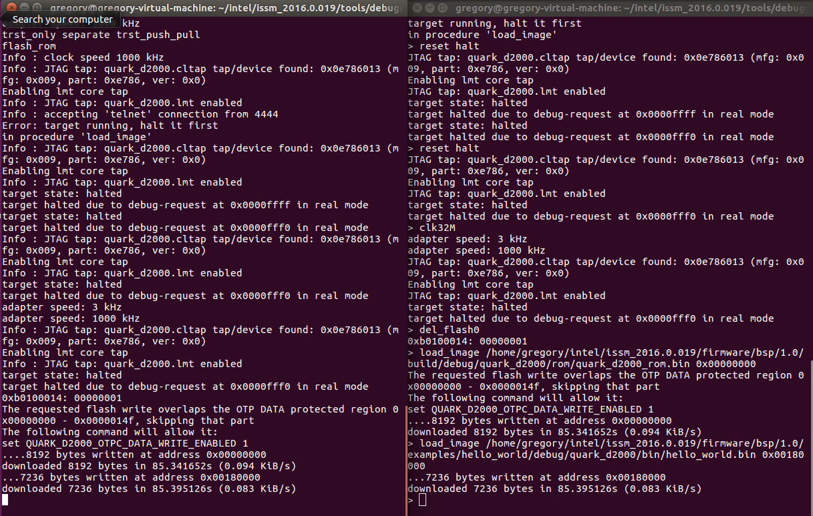
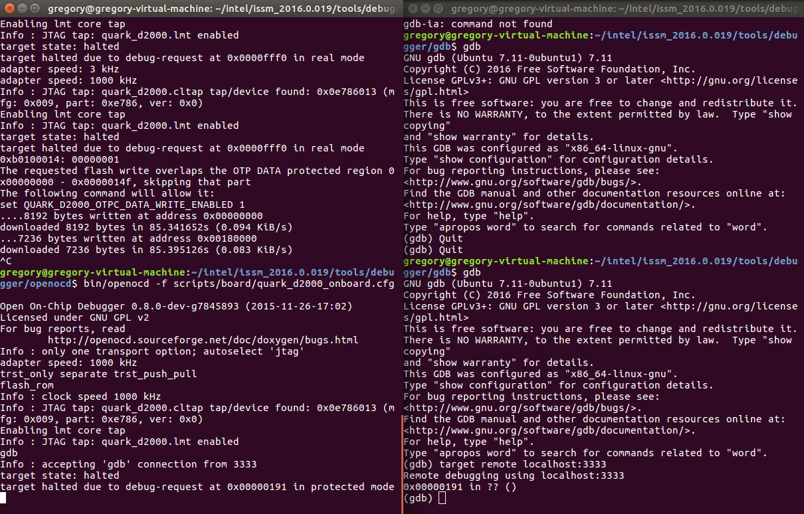

This second tutorial builds on the first by describing how to create and implement an example program on the D2000 platform using the tools introduced previously.


===

In the last tutorial I mainly discussed the Quark family and the development tools involved. This time round, I wanted to better explain everything included in the ISSM toolchain as well as how to use OpenOCD to flash an example program. 

I'll be using the D2000 Intel Quark micro-controller developer kit for this tutorial, which is a development platform built around the Quark D2000 processor. It has flash storage, a 6-axis compass/accelerometer with temperature sensor, an Arduino-Uno compatible shield interface and most importantly a USB connection that enables programmming and debugging over JTAG.

!!! Ordinarily, you're more likely to find JTAG on a 10 pin header but the D2000 has it integrated over USB which is a breeze. 

Before going ahead and getting started, the first thing to do is to install ISSM from Intel's webpage found [here](https://software.intel.com/en-us/intel-system-studio-microcontrollers). Note that ISSM is only available for Windows and Linux platforms with no support for Mac. In my case  I used a VM with Ubuntu 16.04 LTS installed.

It's also a good idea to update your system, install Telnet, Screen and Java if you haven't already.

```bash
sudo apt-get update
sudo apt-get install telnet
sudo apt-get install screen
sudo apt-get install default-jre
```

###ISSM  

I went over the ISSM toolchain briefly in the last tutorial, but I think it's necessary to go into more detail about what's contained in the toolchain and their individual targets. 

After downloading from the Intel webpage and following the wizard, ISSM should install an `intel` directory on your root. Within there, you should find an `issm_2016.0.19` or similar directory which is the ISSM toolchain.   



Inside the `issm_2016.0.19` directory you'll see a number of files. Most are self explanatory and can be ignored. The ones to focus on are the `tools` and `firmware` directories. 

The `issm_env.sh` is a bash script file, the (more powerful) equivalent of a `.bat` file on Windows. You can run it by typing `source issm_env.sh` and open it inside Gedit with `gedit issm_env.sh` to view it's contents.

```bash

#!/bin/bash

# Copyright (c) 2015 Intel Corporation. All rights reserved.
# This script sets environmental variables for building BSP.
# Note that this script must be sourced, not executed.

# Check that script is sourced
if [[ "$0" == "$BASH_SOURCE"  ]];
then
    echo -e "Please re-run this script with source:\n\tsource $0"
        exit 1
        fi

#
# General-purpose variables
#

# Root directory for the installed ISSM
export ISSM_ROOT=$(builtin cd "$(dirname "${BASH_SOURCE[0]}")" && pwd)
# Root directory for the tools
export ISSM_TOOLS_ROOT=$ISSM_ROOT/tools
# Legacy variable
export ISSM_PATH=$ISSM_TOOLS_ROOT
# Root directory for the toolchain
export ISSM_TOOLCHAIN_ROOT=$ISSM_TOOLS_ROOT/compiler
# Binaries directory for the toolchain
export ISSM_TOOLCHAIN_BIN=$ISSM_TOOLCHAIN_ROOT/bin
# Prefix for toolchain binaries, ex. i586-intel-elfiamcu-gcc
export ISSM_TOOLCHAIN_PREFIX=i586-intel-elfiamcu-
export ISSM_TOOLCHAIN_GCC_VERSION=$($ISSM_TOOLCHAIN_BIN/${ISSM_TOOLCHAIN_PREFIX}gcc -dumpversion)
# Debugger
export ISSM_DEBUGGER_ROOT=$ISSM_TOOLS_ROOT/debugger
# Utils
export ISSM_UTILS_ROOT=$ISSM_TOOLS_ROOT/utils

#
# Application specific variables
#

# BSP
export ISSM_BSP_ROOT=$ISSM_ROOT/firmware/bsp/1.0
export IAMCU_TOOLCHAIN_DIR=$ISSM_TOOLCHAIN_BIN

# IPP
export IPPROOT=$ISSM_ROOT/firmware/lib/ipp/1.0.0
export IPP_LIBRARY_PATH=$IPPROOT

#
# Extend PATH with ISSM tools
#

export PATH=$ISSM_UTILS_ROOT:$ISSM_TOOLCHAIN_BIN:$PATH
```

Opening the `issm_env.sh` script up you'll see it's just a bunch of export commands for different variables. What `export` does is add the variables to the environment variables list of the open shell session in which the `export` command was called. And since all the environment variables of a shell are available to any child processes, hence you can use them too. 

!!!! Remember when you finish a shell session, it's environment is destroyed too and therefore you'll have to run the bash script again to reinitialise ISSM. You can run `env` from anywhere to view the shell's list of environment variables.

In other words, running the `issm_env.sh` script tells the shell about the ISSM directories, complier, debugger and tools .etc, whereas it wouldn't have known about them otherwise.

###Firmware

Inside the `firmware` folder then, you'll find two additional folders called `bsp` and `lib` respectively. The `lib` directory isn't important for this tutorial but it contains the _TinyCrypt_ library which provides a set of primitives for cryptography applications.

Within the `bsp` or _board support package_ is the firmware necessary for building applications for the D2000 platform. 

```bash
.
├── board           : Board level drivers
├── bootloader      : QMSI Bootloader
│   ├── boot        : Common Bootstrap code
│   └── dm          : Device Management
├── doc             : Project documentation and Guidelines
│   └── api         : Doxygen documentation
├── drivers         : Intel® SoC drivers
│   └── include     : QMSI driver headers
├── examples        : Examples using the QMSI API
├── include         : Top level headers
├── soc             : Intel® MCUs SoCs support
│   └── quark_d2000 : Intel® Quark™ Microcontroller D2000 support
└─ sys              : Application entry and Newlib syscalls
```

The QSMI `examples` directory can be found here containing a host of sample applications. For this tutorial, I'll be programming the D2000 with the _hello-world_ example. However it isn't as simple as hitting 'run' and watching the program upload to the board. 

###GNU Make

ISSM requires the files to be _built_ using the ISSM build system, which in turn is based on the GNU make tool. 

GNU make is a tool which takes the raw source files from the project and generates executables and non-source files (based on instructions within special _MakeFiles_) that can then be _flashed_ to the device.

It isn't necessary to know anymore about GNU make if you're just interested in building your project, but using the make tool over the terminal you can control the final output of the build process. 

!!! Remember to set up your environment with `source issm_env.sh` before using the `make` command

The Quark D2000 is supported by the make tool. You can select it by setting the `SOC` variable. 

```bash
make SOC=quark_d2000
```

There's also two different build modes available when building called _debug_ and _release_. These are selected with the `BUILD` variable with the default being debug. 

```bash
make BUILD=debug
make BUILD=release
```

There's many more make commands that are useful for development. For instance, you can also do a `make clean` to remove any pre-existing built objects if you believe them to be buggy in any way. A `make all` command will build _all_ of what's needed to make a complete build. Finally, a `make -n` will invoke a `dry run` which will output the steps make is attempting to do in its build process.

Going back to the hello_world example then and within `examples/hello_world`, I'm going to build the example with the following command:

`make SOC=quark_D2000`



On the terminal you should see a load of scrolling text as the make tool does its thing. Finally at the very bottom of the output will be the generated _.elf_ and _.bin_ files. 

```bash
i586-intel-elfiamcu-size ./debug/quark_d2000/obj/hello_world.elf
text   data    bss    dec    hex    filename
6520   712     160    7392   1ce0   ./debug/quark_d2000/obj/hello_world.elf
i586-intel-elfiamcu-objcopy -O binary ./debug/quark_d2000/obj/hello_world.elf debug/quark_d2000/bin/hello_world.bin
```
!!! Notice that since I didn't select a build mode, it's automatically defaulted to debug.

Ok, great. So what's a _.elf_ and _.bin_ then? 

Taking the easiest one first, a _.bin_ file is just a binary file. Simply ones and zeroes. If you want to see for yourself, navigate to the following to find the outputted binary image:

`./firmware/bsp/1.0/examples/hello_world/debug/quark_d2000/bin`

To view the raw binary data you can run the hexdump command to output a listing showing every byte in the file as hexadecimal numbers. Do it with the following command:

`hexdump hello_world.bin`



An ELF file is similar and also contains the binary data, but it has much more information about other things. It might have info on debugging, symbols .etc which is wrapped up in the file.

It's popular on Linux systems and is the standard binary file format for UNIX and UNIX-like systems. Another important point is that it's platform independent and can run on any particular processor or architecture, hence it's popular adoption.

###Flash Memory

Next task is to build the _ROM_ image for the board. This is handled by the top level MakeFile located at `ISSM_ROOT/firmware/bsp/1.0` which contains the two make targets for `rom` and `libqmsi` where the output directory is `ISSM_ROOT/firmware/bsp/1.0/build`.

A ROM image (where ROM stands for _read-only memory_) is a firmware image specific to the Quark that's flashed to a special region in flash memory called the OTP Flash (where OTP stands for _one time programmable_).  

!!! Don't be confused by ROM meaning _read-only memory_. This is somewhat archaic, referring to a time when the firmware flashed really was non-modifiable and couldn't be changed. Still, at runtime, the device has no real ability in modifying the ROM firmware image as it must be assembled and loaded off-device and loaded in one go

You can think of the ROM image as being the 'toolbox' for the device which has its own special slot in flash memory. It's the code that the CPU executes on startup and contains start-up code such as the speed the SOC runs at, GPIO configuration .etc.

Just before finishing the ROM execution, it hands over to the application binary, hence the ROM image is required before the user application binary (i.e. the hello_world.bin example) can be loaded onto the _System Flash_.



Looking at the map above you can see the sections or _regions_ in the Quark D2000's flash memory available for different purposes. The start and end addresses determine where one region ends and another begins. This is important to know when you're going to flash your image - deciding where it belongs in memory.

The OTP Flash region is where execution starts. It can also be locked against modification and erasure if needs be. The Data Flash region is readable by OTP and can also be locked against being read from any device such as an application in System Flash or a DMA controller. Lastly, the biggest hunk of memory is where your application will sit. A whole 32KB can contain any code or data loaded via the bootloader found in the OTP Flash.  

If you ever want to lock the OTP Flash region, bit 0 of flash memory location '0' must be set to 'zero'. This prevents the bootROM memory from being erased, overwritten or read from. In order to make this modification and engage the hardware lock mechanism, write to the flash address by changing the ` rom_startup.c` file located at `ISSM_ROOT/firmware/bsp/1.X/soc/quark_d2000/rom`.

Make sure to include `qm_flash.h` to enable flash access functions:

`#include “qm_flash.h”`

Then within the rom_startup function, add the following line of code:

`qm_flash_word_write(QM_FLASH_0, QM_FLASH_REGION_OTP, 0, 0);`

!! Note that the instructions to lock the OTP Flash are separate to this tutorial and are unnecessary in this instance

Going back to building the required _rom_ target, the following command must be run:

`make rom`



You can find the generated `quark_d2000_rom.bin` within:

`ISSM_ROOT/firmware/bsp/1.0/build/debug/quark_d2000/rom` 

Likewise, to build the _libqmsi_ target, run the similar command:

`make libqmsi`

Libqmsi is a just the library archive of all the QMSI drivers for the SoC. 

###Flashing the Example Image

With both the binary image for the example project and the ROM image for OTP Flash having been built using GNU make, now is the time for flashing to the board.

There's two way of flashing the board. One way is to use **OpenOCD** which I've mentioned before or else using **GDB** - the GNU debugger tool.

Both tools can be found under the `ISSM_ROOT/tools/debugger` directory.

####OpenOCD

The Open On-Chip Debugger or OpenOCD tool provides debugging, in-system programming and boundary-scan testing for embedded target devices such as the D2000 CRB in this case.

Plug in your board and type `lsusb` to check the USB connection. It should come up as an FTDI device.

From within `ISSM_ROOT/tools/debugger/openocd` start OpenOCD by entering the following command:

`bin/openocd -f scripts/board/quark_d2000_onboard.cfg`  

This command gives the instruction to start OpenOCD `bin/openocd` with the configuration file `-f` located at `scripts/board/quark_d2000_onboard.cfg`.



You should see some output from the OpenOCD daemon as it starts. On initiation OpenOCD will first start by processing the configuration file supplied and then verify a valid JTAG connection. 

!!! Note if no `-c` command or `-f example.cfg` options were provided, OpenOCD will instead search for a `openocd.cfg` file as default

Once started, OpenOCD will run silently until it receives a connection from a client such as Telnet or GDB. Once connected, OpenOCD will then process user commands issued from those clients. 

So let's do exactly that. Open a new terminal window and open a new Telnet session with the following command:

`telnet localhost 4444`

Inside the first terminal window, OpenOCD should output that it made a successful connection:

`Info : accepting 'telnet' connection from 4444`



Now's probably a good time to also open up a connection via USB to read the UART console serial output from the device. A UART-A cable is required for this step. 

1. Make sure all JTAG jumpers on the board are in the correct alignment
2. Connect UART cable to host machine 
3. Attach the UART-A pins to the following:
    + Connect GND on the serial cable to the board’s GND pin
    + Connect TXD on the serial cable to the board’s RX pin
    + Connect RXD on the serial cable to the board’s TX pin

Open up a new Screen session with the following:

`sudo screen dev/ttyUSB0/ 115200`

!!!! Sudo rights are required to set up USB rules, ensure they're set with `cat /etc/udev/rules.d/99-openocd.rules`

Back to OpenOCD and time to issue the next few commands in the Telnet window in order to flash the ROM and application binaries. Issue the following commands in order:

```bash
reset halt
clk32M
del_flash0

load_image /.../.../.../ISSM_ROOT/firmware/bsp/1.0/build/debug/quark_d2000/rom/quark_d2000_rom.bin 0x00000000
load_image /.../.../.../ISSM_ROOT/firmware/bsp/1.0/examples/hello_world/debug/quark_d2000/bin/hello_world.bin 0x00180000
```

The `reset halt` command resets the target and the `halt` parameter will immediately halt the target after the reset occurs. The `clk32M` sets the clock speed for the device and the `del_flash0` erases the OTP Flash.

!!!! If you're finding it hard searching for the right file, a handy command to use is `find ./ -type f -name '*.bin'`

A full set of commands can be found by typing `help` or some of the most common ones are shown below.

```bash
reset  - Reset targets
reset halt - Reset targets and halt at reset vector
targets  - Show the status for each target
halt - Halt target
resume - Resume target
mdw 0x00180000 - Read some memory
bp 0x00180000 4 hw - set a hardware breakpoint
step
```



You should see output from Telnet when the image is flashed: 

```bash
....8192 bytes written at address 0x00000000
downloaded 8192 bytes in 85.341652s (0.094 KiB/s)

...7236 bytes written at address 0x00180000
downloaded 7236 bytes in 85.395126s (0.083 KiB/s)
```

Notice that I've specified the start addresses for the OTP ROM `0x00000000` and the System Flash `0x00180000` in the `load_image` command, making sure they're being flashed to the correct locations in memory. 

!!!! You can also verify the image was properly flashed by using the `verify_image` command followed by the path just like the `load_image` command shown.

All going to plan you should see the 'hello world' serial output over the USB connection. 

####GDB

If you're anyway familiar with C development, you're likely to have come across the GNU Project Debugger or GDB. It works exactly the same way as on your local machine but this time it's taking place on a remote target AKA the D2000 device. Flashing using GDB runs atop of OpenOCD. 

!!! GDB belongs to GNU Tools just like GNU Make. It's the GNU Project Debugger.

Start OpenOCD like before with the following:

`bin/openocd -f scripts/board/quark_d2000_onboard.cfg`

In a new terminal window, navigate to `ISSM_ROOT/tools/debugger/gdb` and enter `gdb` to start.

Instead of using Telnet on port `4444` however, GDB runs on `3333` so start your Telnet session with typing:

`target remote localhost:3333`

Enter the follow commands just like with OpenOCD:

```
monitor clk32M 5000

monitor load_image ISSM_ROOT/build/debug/quark_d2000/rom/quark_d2000_rom.bin 0x0
monitor load_image ISSM_ROOT/examples/hello_world/debug/quark_d2000/bin/hello_world.bin 0x00180000
```

That's it - works much like the commands used with OpenOCD. Check the output on the terminal as before. 



###Conclusion

That wraps up my marathon of a tutorial on 'Quark Development'. It certainly was some effort writing this up and I hope it serves some purpose! In actual fact it was harder writing all of this than learning everything in the first place. It's been interesting work and a great exercise. I'd also note that this is still very new to me but I'm enjoying the process. Working on the command line like this removes a lot of the 'fluff' I find, and I feel I become better accustomed with the tools when I work like this. 

Lastly, I think I'll conclude by mentioning that the D2000 Development kit is a great platform to get started on too - especially for those interested in embedded programming, specifically x86. At €15 it's also very cheap so I'd highly recommend it for those interested. There simply isn't a better or easier way to get into developing for the Quark.

