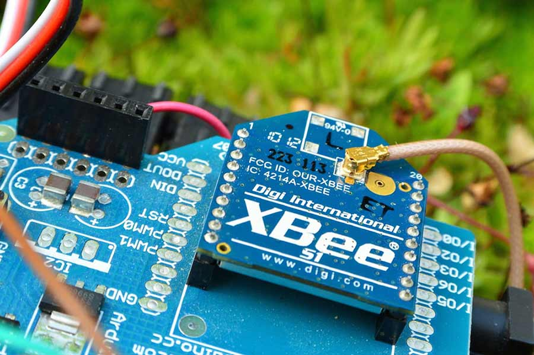
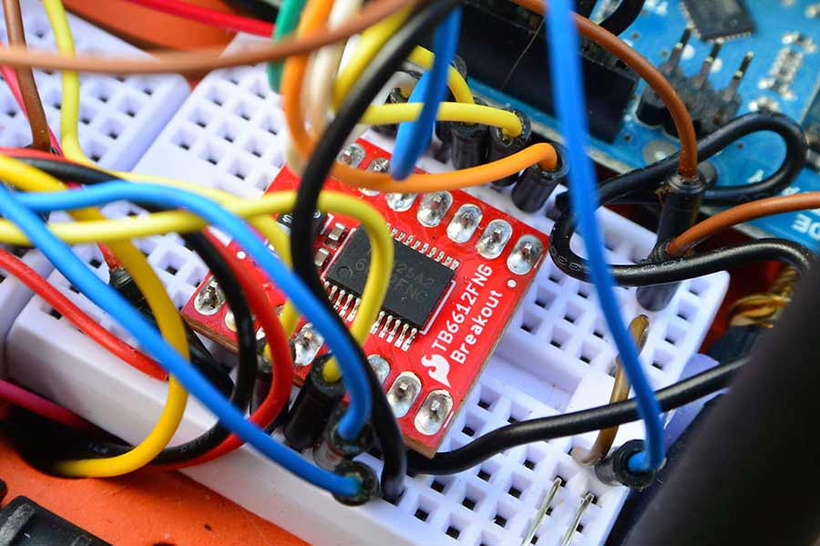
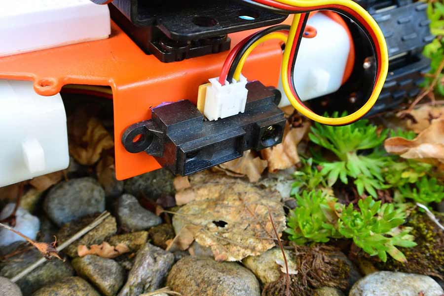
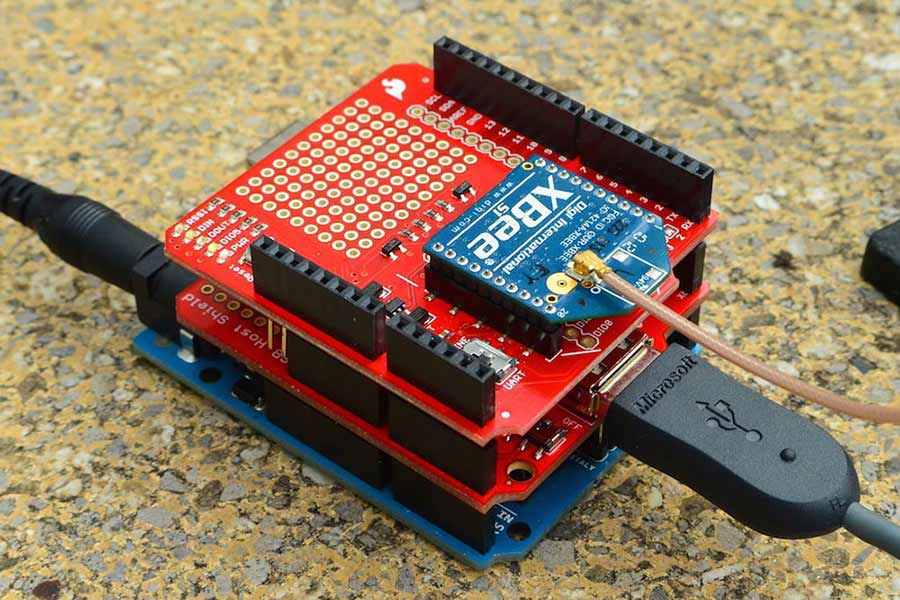
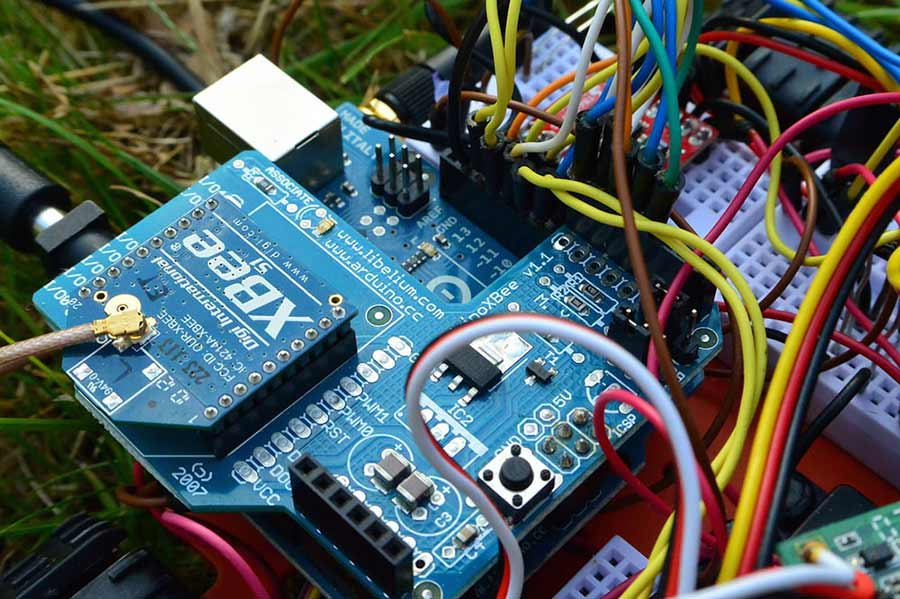

Settle in for a long read; today I wanted to write about how I built my robot - straight from scratch. 

===

The idea for making my first robot came from when I had just begun Arduino. Before long I felt I needed some substantial project that would challenge me. 

That's when I set my sights on creating a semi-autonomous tracked rover that I could control over xbee. Maybe a little too ambitious at the time but I achieved all my initial goals nonetheless. 

What follows is my documentation (partly for myself and mostly for the community) for the robot and an overview of its construction. Enjoy!

###The Parts 

A lot of robots I found built using Arduino were quite simplistic and formulaic. Likely cheaper but I had invisioned something more demanding. 

For the base of my rover I chose the [RobotShop Robot Rover chassis](http://www.robotshop.com/en/robotshop-robot-rover-arduino-tank-kit-rubber-tracks.html) for its all metal frame, servo mount and great looking tracks. 

It was exactly what I wanted and even came with the ideal motors and battery pack. To complete it I bought an additional Arduino Uno, a sharp IR range sensor, two servos and a few LEDs. 
Lastly I bought the necessary motor driver and a camera for the front. 

Below is a more complete table that includes the initial purchases along with other replacement parts bought at a later stage. 

| Component | Description |
| ------:| -----------:|
| [GM9 - Gear Motor 9 (x2)](http://www.robotshop.com/en/solarbotics-gm9-gear-motor-9.html) | Two 90 Degree Shaft 5V DC motors, 66 RPM  |
| [Lynxmotion Pan and Tilt kit](http://www.robotshop.com/en/lynxmotion-pan-and-tilt-kit-aluminium2.html) | Two servos along with two pan & tilt brackets |
| [Pololu Motor Controller](http://www.robotshop.com/en/pololu-low-voltage-serial-controller.html) | Low Voltage Dual Serial Motor Controller 5A 1.5V-6V |
| [Battery Holder - 4xAA Square](https://www.sparkfun.com/products/552) | Housing for 4 AA batteries beneath rover, used to drive motors |
| [Arduino Uno](https://www.sparkfun.com/products/11021) | Additional Arduino Uno to drive the robot |
| [Sharp GP2Y0A21YK](https://www.sparkfun.com/products/242) | Infrared Proximity Sensor for mounting to the front of the rover |
| [Mini Modular breadboards (x3)](https://www.sparkfun.com/products/12043) | For extra prototyping space for other components |
| [FlyCamOne V2](https://www.sparkfun.com/products/retired/11171) | Small stand-alone camera for front servo turret |
| [Libelium Xbee shield](http://shieldlist.org/libelium/xbee) | Xbee shield for Arduino mounted on robot |
| [Sparkfun Xbee shield](https://www.sparkfun.com/products/12847) | Xbee shield for transmitting Arduino |
| [Xbee S1 (x2)](https://www.sparkfun.com/products/8666) | XBee 1mW U.FL Connection - Series 1 (802.15.4) |
| [Duck antenna (x2)](https://www.sparkfun.com/products/145) | 2.4GHz Duck Antenna RP-SMA |
| [Interface Cable (x2)](https://www.sparkfun.com/products/662) | RP-SMA to U.FL |
| [XBee Explorer USB](https://www.sparkfun.com/products/11812) | for Xbee configuration/debugging purposes |
| [TB6612FNG Motor Driver](https://www.sparkfun.com/products/9457) | Dual TB6612FNG (1A) for driving both motors |
| [1N4001 Diode Rectifiers (x8)](https://www.sparkfun.com/products/8589) | 1A 50V 'flyback' diodes used for reverse voltage protection |
| [USB Host Shield](https://www.sparkfun.com/products/9947) | Used to read data from Xbox Receiver |
| [Xbox 360 Controller](https://www.microsoft.com/hardware/en-us/p/xbox-360-wireless-controller-for-windows) | Controller used to drive the robot |
| [Joystick Shield](https://www.sparkfun.com/products/9760) | A joystick shield was my first idea for a controller |
| [SN754410 Motor Driver](https://www.sparkfun.com/products/315) | Half H-bridge Motor Driver 1A |
| [Red & Green LEDs](https://www.sparkfun.com/products/315) | A few indicator LEDs for distance & signal |

Besides the above the only other parts required were jumper wires, batteries and headers for the shields. 

###The Idea

My original vision for the robot was to have be controlled using a joystick shield over Xbee. Thus there would be two Arduinos. One being the receiver mounted on the robot 'receiving' the data and executing the commands eg. driving the motors, changing direction, moving the servos .etc.
The second therefore would be the transmitter which would consist of the joystick shield taking in inputs from the user, an Xbee shield to send that data to the receiver and then the Arduino on the bottom doing the donkey work. 

In addition to that there would also be the camera mounted onto the servos that would record video/take photos, the sharp IR sensor that would measure distance and then the motor driver driving the motors. 

In hindsight it was quite a rudimentary plan but I mostly stuck with it. The only amendment I had to make was a revision of the controller. Instead of sticking with my custom joystick shield I later opted for an Xbox controller (I'll go into more detail on that later). 

###The Initial steps 

Once most of the parts arrived I quickly delved into the project. First spraypainting the chassis a bright orange, and then gluing down the breadboards. 
RobotShop actually had a few videos and a PDF that was a small help in the beginning. In reality though it only got me so far and I quickly exhausted it. 

I took my first baby steps getting the servos set up and running, being controlled using the thumbstick on the joystick shield. Sparkfun actually had a great [quickstart guide](https://www.sparkfun.com/tutorials/171) on configuring the shield along with some sample code. 

I should say none of this early work was over Xbee just yet. It was simply seeing if things worked out of the box. It wasn't too hard plugging in both the servos and having them move according to the analog readings from the thumbstick. 

I've included some of the code [here](https://gist.github.com/Spokkam/460cd8b54c8ad8bb211d). Mind you most of it is pulled from Sparkfun.com so credit goes there. Again it was mostly done it see whether things were feasible and worked.

It wasn't long however before I encountered my first headache. After getting the servos and the joystick shield working together, my next step was to get things happening over Xbee. 

No problem. Plugged both Xbees into the Xbee Explorer dongle and got them configured using the Xctung software. Did my obligatory 'Blink/Hello World' test and soon found out the range was a mere metre at most. 

It didn't take long to realise that I'd accidently chosen the wrong Xbees. I had wanted Xbees with a trace antenna or at least a small wire antenna but unfortunately bought a pair with no antenna whatsoever. Instead I had two XBees with a U.FL Connection.
Thus I would have to send away again for two duck antennas and two matching interface cables. It wasn't what I'd originally planned but I supposed the extra range would be beneficial.

Another issue I had for the controller was a matter of 'aesthetics'. The awkward shape of the Libelium Xbee shield made it difficult to interface with the other shields. 

Since the Libelium shield 'needed' the ICSP pins of the Uno, it had to be placed first. Consequently other shields could only be stacked above it. This made it clumsy trying to add in additional headers to connect the rest of the I/O pins. 

As well as that the Libelium shield obstructed other pins on the Uno so I needed jumper wires to get around that too. 
In short it was a pain using it, and I grew to envy the ease of the Sparkfun Xbee shield. Eventually I gave in and placed an order for a new one.

###Getting things moving

While parts were in the post and work on the servos was halted, I turned my attention to getting the motors running. Both motors were DC motors rated for 5V and required a little soldering.
The funny thing was I couldn't figure out where to solder down the wires. 

In the end though I discovered they needed to be soldered down on the little metal feet poking out the sides. It wasn't completely trouble-free and the surrounding plastic melted easily. 
Judge my soldering for yourself.

To drive the motors then, I had the Pololu Low Voltage Dual Serial Motor Controller. At the onset it seemed like a decent buy. It was the first motor driver I'd ever used so I didn't have much to go by. 

In hindsight, it was a poor choice and an expensive one. For €36 I had bought a motor controller that didn't do much more for me than my later SN754410 chip. When you consider the SN754410 is only €2, it starts to sound a little preposterous. 

Anyway, it gets worse from there. Hooking this thing up was no easy task either. The hook-up instructions from RobotShop didn't match the instructions from Pololu themselves so things soon got confusing. 

Eventually after figuring things out I connected the motors. The rest of the pinout for the motor controller was fairly standard. 
The only issue, well a major one, was that the controller required a serial input line. This needed to be connected to the TX pin on the Arduino Uno. 

The problem is that the Uno only has one serial line for UART communications (D0 & D1) like most Arduino boards and it's difficult sharing. Especially when you want to do more than just drive the motors. 

For instance the Libelium Xbee shield also used the serial line of the Arduino for its DIN & DOUT. Unlike the Sparkfun Xbee shield there was no other option of using the other digital pins instead. 

I realised the implications of this but simply shrugged and carried on, hoping I'd solve this problem down the line. In the meantime I busied myself trying to 'configure' the motor controller. 

What struck me most about using the Pololu motor controller was how pointlessly complicated it was. Between trying to remember to 'disconnect the motor supply prior to configuration' or 'after reset allowing 100ms before sending serial data'; the motor controller wasn't entirely user friendly. 

The worst example of this was the fact that you needed to disconnect the motor controller's serial input line **before** uploading code to the Arduino board. And if you didn't? Well, you caused the motor controller to go kaput. 

Even after installing a switch, it wasn't any easier trying to remember. It wasn't any wonder that I eventually blew it for that simple reason. 

So with €36 down the drain and no motor controller or Xbees I was at a bit of a loss. Queue another order for two new motor controllers. Except this time I was a little wiser or a little more skint depending on how you look at it. 

I felt if there was a chance of blowing another motor controller, it'd better be a cheaper one. That's partly why I decided on buying the SN754410 and the TB6612FNG motor controllers, €2 and €8 respectively. 

Once they arrived I started hooking up the SN754410 for starters. It was the simpler of the two and the cheapest. Unlike the TB6612FNG it didn't have any fancy features like a stand-by mode, built in decoupling capacitors or even a thermal shutdown circuit but it did the job nonetheless. 

And it worked. I was so taken by it I wrote a [blog post](http://gregorykelleher.com/blog/motor_control) on it, as well as creating a [video](https://www.youtube.com/watch?v=vWXzXqSCBMg). Compared to the Pololu motor contoller, it was a far easier and hassle-free solution. I've included some sample code of it working with four pushbuttons [here](https://gist.github.com/Spokkam/49a6182ea3e1087f861e).

However in the end, I migrated over to the TB6612FNG simply for the added features. In practice they were much the same. Unlike the Pololu motor controller neither the TB6612FNG or the SN754410 required a serial input line. 

Instead they required only a handful of PWM pins from the Arduino as well as the common motor supply and logic supply pins. Besides the pins, I added in some flyback diodes (1N4001 diode rectifiers) as an extra precaution from back-EMF.

I found some sample code for the TB6612FNG online that you can find [here](https://gist.github.com/Spokkam/e6a9892ec33f0bd5a2ec). I've also included the pinout I used in the comments. 

###Going the distance

With the motors and motor controller sorted, I shifted my attention to the IR sensor I had mounted on the front of the robot. 
This may have been the easiest part of the project. 

The sensor only had three pins for power, signal and ground. The code I wrote was relatively straightforward and I linked it up to an LED I attached to the back of the robot. 

The frequency at which the LED blinks directly correlates with the distance readings from the sensor. Thus a high frequency blink corresponds with an object in close proximity. The delay between the blinking of the LED is actually the value returned from the sensor. 

You can find out more from the code I wrote [here](https://gist.github.com/Spokkam/707dd256d137452d68e2). 

! Note that I used a different technique for timing instead of the standard delay method. The Arduino actually pauses your sketch when you use the delay method and thus it can interfere with other processes happening at the same time. Instead I'm using a common work-around using the millis() function. You can find out more [here](https://www.arduino.cc/en/Tutorial/BlinkWithoutDelay).

In my final code I force the robot to stop when the IR sensor detects an object within a certain parameter, preventing it from crashing.

###Replacing the Controller

Like I said previously I wasn't entirely happy with my custom setup for the controller. The awkwardness of the 'shield-stack' I had with the Libelium & joystick shield was too much and I began to reconsider my options. 

I came across an old Xbox 360 controller I had lying about the house and decided I could repurpose it for a new controller. The only additional bit of kit would be a USB host shield. 

Once I had my new Sparkfun Xbee shield, duck antennae and the USB host shield I set about hooking things up. I immediately replaced the Libelium shield on the 'Transmitter Stack' as I called it, since it wasn't compatible with the new USB host shield. 

! Note if you're using the USB host shield on an Arduino Uno, it's necessary to supply an external power supply through the board's power jack to get it working. 

I soon downloaded the appropiate library and uploaded the sample code I found online for communicating with the Xbox controller but found it didn't work for me. 

After much researching I discovered that there was an inherent issue with the USB host library running on the Arduino UNO. Apparently there's an error in the RESET pin configuration which no one cared to spot. **To solve this I had to take the '0' active at pin 7 of the Arduino board 'HIGH'** to get things working. 
Luckily this solved my problems and I was able to get things running.

The sample code for the Xbox USB Host Library (including my RESET modification) can be found [here](https://gist.github.com/Spokkam/405da33a23471a2a3b05).

If you want to take a look at the final code I have for the Robot Transmitter, you can find it [here](https://gist.github.com/Spokkam/5185ff3c213fed9e4aeb) instead.

!!! You may notice that when using the USB Host Library, Serial Communications is done on 115200 instead of the more common 9600. It's necessary to reconfigure your Xbees to run at this new Baud rate.

###Getting things talking

So with the new controller sorted and the Transmitter sending out serial data over Xbee, I now needed the robot to receive this data and respond accordingly. 

At this stage I had separate code for the motors and the servos so I decided to amalgamate the two into one 'Robot_RX' program. I then modified this code to listen for serial data over Xbee. 

This is when things went wrong. While I could get the servos and motors running fine over Xbee separately, they didn't cooperate well together. When I ran the code they seemed to glitch and stutter. The motors refusing to move and the servos twitched constantly. 

This proved to be a nightmare. I simply couldn't get to the root of the problem. Perhaps it was bus contention or maybe something else? I spent ages trying to find the solution.  

Eventually what I discovered was that the built-in Servo.h() library included in the Arduino IDE had been updated. Instead of the common PWM method I was familiar with, the Servo.h() library was instead using a more sophiscated method using the interrupt-based technology on the Arduino board.

Since the Arduino 0016 update, the new Servo.h() library made it possible to control a servo from any pin. Not only that but it's now possible to control several servos instead of the limit of two in the old library.

 !!! The old library only made it possible to control two servos using the PWM pins, 9 & 10 on the UNO. You can download it [here](http://arduiniana.org/libraries/pwmservo/).

 The downside to the new library is that it's incompatible with libraries such as NewSoftSerial() and it interferes with serial communication. This was the exact problem I was having with the glitches on my robot. 

 Without further ado I installed the original PWMServo.h() library and adjusted my code. And importantly, it worked! 

 You can find my complete code for the receiving Arduino mounted on the robot (i.e. robot_RX) [here](https://gist.github.com/Spokkam/ac46a4be4e7b5597277c).

 I later included the code I had for the IR sensor and added in a green indicator LED to signal that the Xbee was receiving serial data. 

 !!! Note that Serial communication is happening over 115200 on the receiving Arduino as well, just like on the transmitting Arduino. 

 I modified the code for the servos as well, in order to constrain the range in which they moved. I found they were hitting the diodes on a full sweep so I set the position limit from 50 to 160 degrees for the first servo and 30 to 180 for the second. 

 I'm also constantly sending an 's' (for stop) from the transmitter over Xbee. What I found was that the receiving arduino kept carrying out the previous command unless over-ruled. Thus it will halt everything on 's' unless given different instructions. 

###Final Thoughts

With everything said, I think I've covered 90% of the project. The camera is a separate thing. It's not really that great. More of an eye-catching novelty more than anything else. I have taken some videos/photos (which are saved to a micro SD inserted into the camera module) but it's turned off most of the time. 

In time I'm hoping to replace the TB6612FNG for an Ardumoto shield which would free up two of my mini breadboards for other components. Furthermore, I was hoping on creating a fully autonomous mode which I could switch to by hitting a button on the Xbox controller. 

Perhaps I'll even upgrade the IR sensor LED to a bargraph which could display the distance more accurately but only if I have time. 

Anyhow, thanks for reading and I hope this helped somehow. If you haven't seen the short video I made you can check it out below. 

[plugin:youtube](https://www.youtube.com/watch?v=rv33IRn4F5Q)

