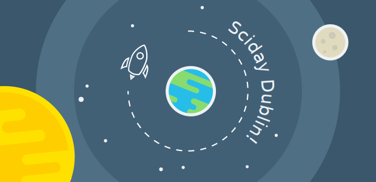
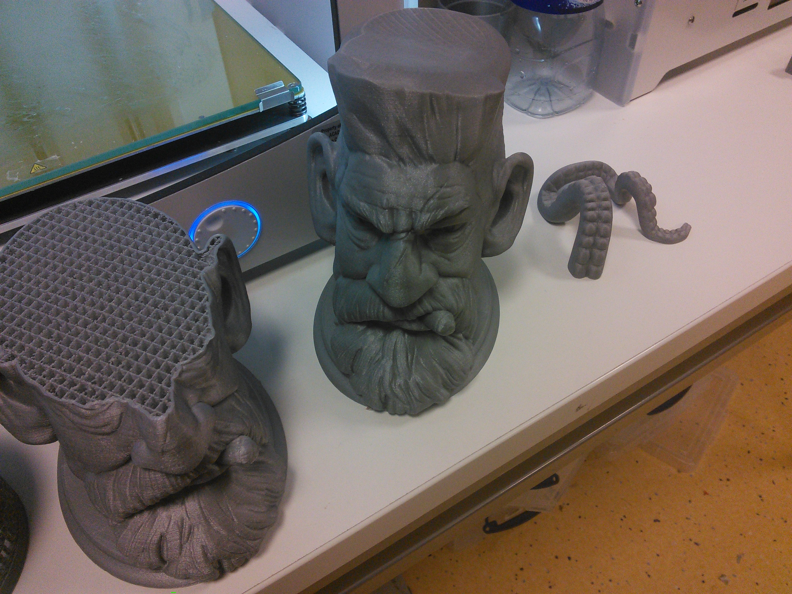
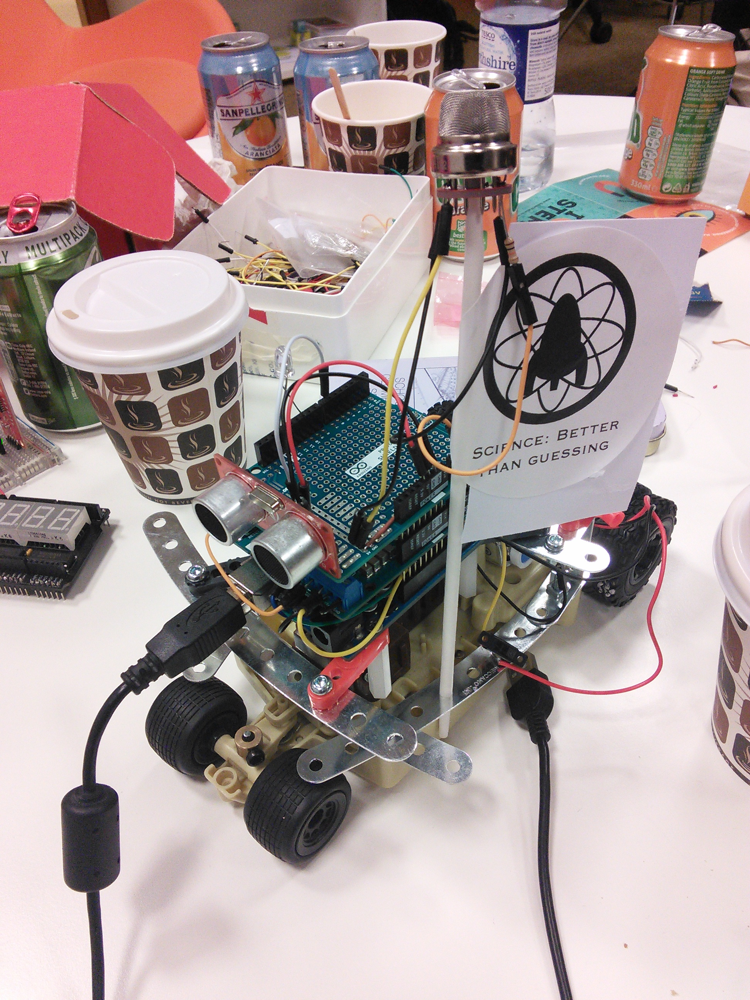

Every year a cohort of makers, tinkerers and like-minded individuals descend upon UCD's campus for Science Hack day Dublin, a 36hr hackathon with creativity and a love of science at its heart. This year, I had the chance to join in on the fun.

===

Things kicked off quite early that Saturday morning, commencing with a brief introduction, soon followed by 'lightening talks' - a quick brainstroming session where individuals pitch on their ideas. 

Each idea has its merit, but ultimately it's down to the interest shared by the audience that brings an idea to life. In this way, teams slowly began to form, and before long, the room had been transformed into a workshop with teams busy on crafting their creations. 

I initially found myself working upon 'SeaBoat' - an autonomous water-craft that would communicate via LED pulses and transmit its location via GPS. While that certainly kept me occupied for much of Saturday afternoon, I soon turned my attention to helping another team on their concept for an autonomous 'SewerBot'. 

  <blockquote class="twitter-tweet" lang="en">
First hack: Sewer Bot by David, Gregory &amp; James <a href="https://twitter.com/hashtag/SHDD?src=hash">#SHDD</a> <a href="https://t.co/rW496Wp4Gp">pic.twitter.com/rW496Wp4Gp</a>
&mdash; Sci Hack Day Dublin (@SciHackDay_Dub) <a href="https://twitter.com/SciHackDay_Dub/status/665903128785588224">November 15, 2015</a></blockquote> 

In the end, it was the SeaBoat which won the 'UCD Innovation Academy Award', and for which I have my medal! Although, I had a great amount of fun working on both concepts. 

In fact, across the whole event I feel my greatest contribution had to have been the 'James Bond' theme song that played on the piezo aboard the SewerBot. It turned out to be a 'buckaroo' of a robot as we strived to include as many features as we could!

Besides the projects I worked on, there was also a 3D pancake printer, a laser maze and a light-up Advent calendar, to name just a few.

