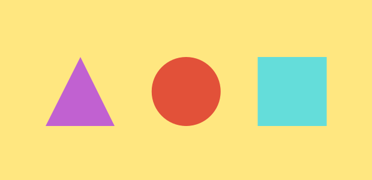
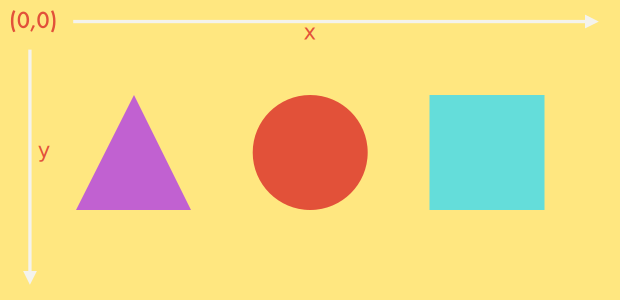
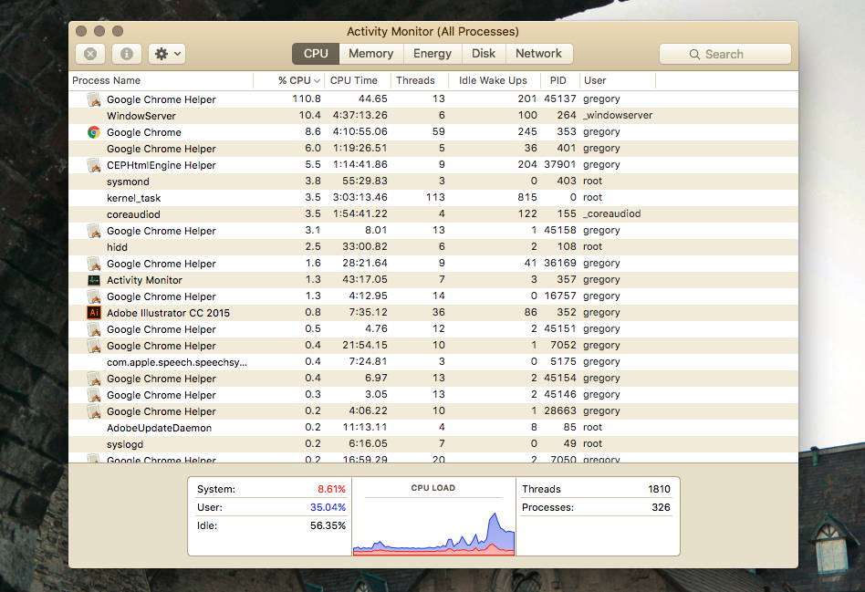
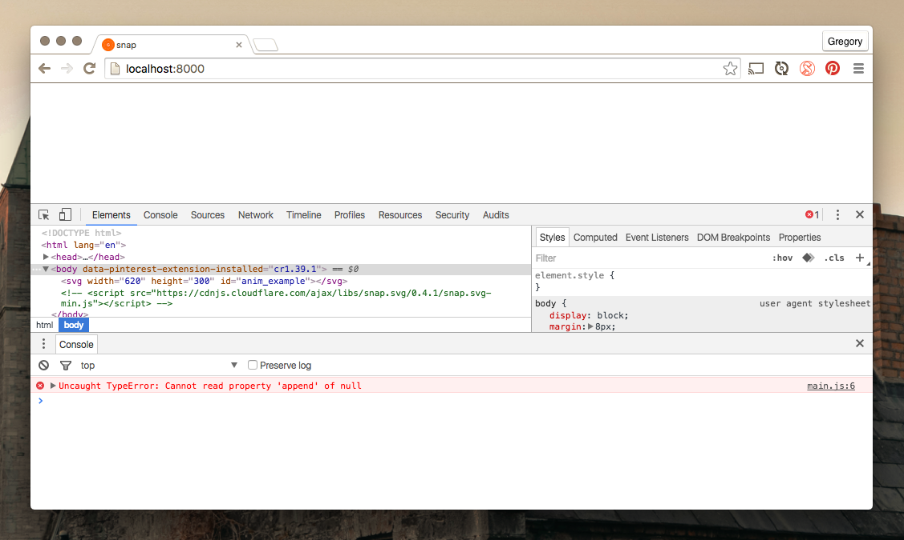

Click the image to animate! And no, that's not a GIF either. It's an SVG drawing being animated and manipulated with Javascript and the Snap SVG library. Read more to learn how I did this. 

<svg preserveAspectRatio="xMinYMin meet" class="svg-content" viewBox="0 0 620 300" id="snap_demo"></svg>
<script type="text/javascript" src="/user/pages/01.blog/snap_demo/snap_demo.js"></script>
<script type="text/javascript" src="/user/pages/01.blog/snap_demo/anim_snap_example.js"></script>
<br>

===

### What is SVG?

If you've been browsing my website of late, you might have noticed that I've chosen to replace all my thumbnails with SVG images. Since most of my illustrations are done inside Illustrator anyway, it only makes sense to export them in their highest quality.

But what is SVG and why is it best for website design? SVGs or _Scalable Vector Graphics_ are first and foremost much more flexible and interactive than regular old PNGs and JPEGs. Any web developer understands the downsides to having high quality images on their site and the issues with compression and image serving based on device resolutions. 

!!!! On a related note, any images inside a `` tag require a browser HTTP request of course. And any such request necessitates precious bandwidth and download time. SVGs on the other hand, simply being a set of DOM nodes require no such thing. 

But what if you could have sharp, crisp and pixel perfect images that look identical across platforms as well as being responsive out of the box? Sounds like a dream but SVGs are the answer. What's more is that SVGs are an XML-based file format meaning your images are rendered as code, and any code is able to be manipulated. In this case with Javascript. 

!!!! Since SVGs is text-based XML you can do regular GZIP compression as you normally would. Actually _SVGZ_ is the term for a gzipped SVG. An SVGZ file is often 20 to 50 percent of the original size. You can also do this dynamically inside your _.htaccess_ file of your website.

In fact, you can do a lot with Javascript and SVGs. Since the SVG DOM (node-based) API is so much easier to get into than the client-side only Canvas API, there are distinct advantages. 

One of the most important points being the ability to manipulate SVG styles, shapes, positions .etc with Javascript as well as the ability for SVG client-side generation. On top of all this, you can you also use typical Javascript event handlers such as click or hover, just as you would with any other HTML element.

### Taking a closer look

I've rambled long enough about SVG being an _XML-based file format_ but what exactly does it look like? SVGs for a start have their own tag: `<svg></svg>` which contains the contents of your SVG, be it shapes, paths or whatever else. 

Below, I've created an illustration in Adobe Illustrator and exported it as an SVG. Besides some clean-up it's exactly how it's exported. It's fairly intuitive and isn't far off vanilla HTML. 

```HTML
<svg id="back" xmlns="http://www.w3.org/2000/svg" viewBox="0 0 620 300">
	<defs>
		<style>
			.cls-1{fill:#ffe780;}
			.cls-2{fill:#e25139;}
			.cls-3{fill:#c161d1;}
			.cls-4{fill:#64ddda;}
		</style>
	</defs>
	<title>first_example</title>
	<rect class="cls-1" width="620" height="300"/>
	<circle class="cls-2" cx="310.25" cy="152.5" r="57.5"/>
	<polygon class="cls-3" points="76,210 191,210 134,95"/>
	<rect class="cls-4" x="429.5" y="95" width="115" height="115"/>
</svg>
```



You can see I've given my SVG an `id="back"`. This is important later when we want to reference an external SVG file with JQuery. 

Also note the `viewBox="0 0 620 300"`. While this might look relatively straightforward it's a fundamental in understanding the SVG coordinate system. Trust me, knowing how positioning and transformations work makes working with SVGs that much easier. 

Without digressing too much, I'm just going to run through the two most important aspects: `viewPort` and `viewBox`.

### The ViewPort

The viewPort as the name suggests is the _portal_ or viewing area where the SVG is visible. The size of the viewPort is the `width` & `height` of the outermost `<svg>` element.

```
<!-- viewPort is 300px by 300px -->
<svg width="300" height="300">
    <!-- SVG content -->
</svg>
``` 

Not too hard then. Remember that values in SVG don't necessarily require given unit identifiers. This mightn't be new to you, but just realise I didn't specify values using units in the above example but they're interpreted as pixels. 

Now, how to position things inside the viewPort then? Well for starters, it doesn't look like I set an **initial viewPort coordinate system**.

Luckily, SVG did. The initial viewPort coordinate system is established when the viewPort is declared. It's probably a little different to the regular cartesian coordinates you learnt in school but not too alien. 

The origin is in the upper left of the viewPort at (0,0) with the positive x-axis pointing to the right and the y-axis pointing straight down. One unit on the x/y axes represents one pixel in the viewPort.



So if the viewPort coordinate system is the coordinate system established by the viewPort then it stands to reason that as users we should also be able to declare our own, right? 

### The ViewBox

Enter the `viewBox` attribute! This allows us to set our own **user coordinate system** based on our own custom coordinates. Intially the user coordinate system is set to the initial viewPort coordinate system as default. 

!!! The viewBox is the coordinate system that you'll really be using 90% of the time. Just remember that the viewPort coordinate system can still be there and the viewBox can also be bigger or smaller than the viewPort if you intend. 

Now, let's understand the syntax. The viewBox attribute requires four parameters: 

```
viewBox = <min-x> <min-y> <width> <height>
```

The `<min-x>` and `<min-y>` values determine the origin of the viewBox, and the width and height determine the width and height of that viewBox. 

!!! Note that if the viewBox has a different aspect ratio (ratio of height to width) to the viewPort, then you can use the `preserveAspectRatio` to choose whether or not to apply uniform scaling. 

In our first example you can see I haven't set the viewPort but I have specified the viewBox as `viewBox="0 0 620 300"`.

That's as much as I'll go into coordinate systems. If you want to understand it a bit better then I highly recommend reading this [article](https://sarasoueidan.com/blog/svg-coordinate-systems/) I found.

### Drawing shapes

Returning to the first example, I've deliberately drawn three different shapes to highlight the various ways you can create SVG elements. 

```HTML
	<rect class="cls-1" width="620" height="300"/>
	<circle class="cls-2" cx="310.25" cy="152.5" r="57.5"/>
	<polygon class="cls-3" points="76,210 191,210 134,95"/>
	<rect class="cls-4" x="429.5" y="95" width="115" height="115"/>
```

Firstly, note they all have different classes which are predefined inside `<style>` tag of the `<defs>` tag. The `<defs>` tag is used to embed definitions that can later be reused within the image, such as the colour classes used in this example.

```HTML
<defs>
	<style>
		.cls-1{fill:#ffe780;}
		.cls-2{fill:#e25139;}
		.cls-3{fill:#c161d1;}
		.cls-4{fill:#64ddda;}
	</style>
</defs>
```

Anyways, drawing elements is straightforward. I'll pass over the _easily understood_ `<rect/>` tag and look at the `<circle/>`. The `cx` and `cy` define the centre x and y coordinates of the circle, with `r` standing for the radius. 

The `<polygon/>` tag is used to create elements with at least three sides, which of course makes it perfect for three sided shapes such as... um, triangles! Polygons are made of straight lines, and the shape must always be closed.

```HTML
<polygon class="cls-3" points="76,210 191,210 134,95"/>
```

Our triangle has three points: `76,210` for the bottom left corner, `191,210` for the bottom right corner and `134,95` for the apex. Notice how the points correspond to the viewBox described earlier.

### Animation

Finally, the time has come! Before I dive in though I should introduce the Javascript library I intend on demonstrating - [Snap Svg](http://snapsvg.io/).


Snap SVG is a free open-source library (supported by Adobe, yes the people that made Flash) that's quick becoming the de facto standard for serious SVG animation. Designed specifically for modern browsers, it supports all the cutting edge features available like masking, clipping, patterns, full gradients, groups, and more.

With it's simple API, it's a great place to get started with SVG animation.

By hovering below you can see that I've animated the example using the Snap SVG library. 

<svg preserveAspectRatio="xMinYMin meet" class="svg-content" viewBox="0 0 620 300" id="anim_example"></svg>

<br>

Snap SVG as I've learnt is best suited to this kind of brief animation. Typically you'll see animation like this employed on icons or buttons for user interaction purposes. 

I misunderstood this fundamental property when I began animating my SVG image. I was intending for a running animation being played on a continuous loop but Snap SVG isn't exactly performant for those kinds of applications. 

Looking at the CPU usage below, you can see that Chrome Helper is hogging things at over 100%. It's a little better on Safari but neither is good. 

Besides CPU usage, complex graphics and animations are just going to lag and misbehave, especially on smaller devices. Hence why I've disabled my animated SVG at the top of this article simply because it's so taxing on the browser.



Anyways, how do you go about animating with Snap SVG? Firstly, setup is always where you should start. Since SVG is just XML you can slot it inside your HTML no bother, but it isn't very pretty and get quite clumbersome when files get bigger. 

```Bash
snap_example/
├── first_example.svg
├── index.html
├── js/
│   ├── main.js
│   └── snap.svg-min.js
```

That's why I like to create my directory as you see above. Have my SVGs external to the my `index.html` and load in my Javascript animations as well as the Snap SVG library.

!!!! You can download the Snap SVG library from [here](http://snapsvg.io) or choose to use this [CDN](https://cdnjs.com/libraries/snap.svg/) instead.

Below I've set up a simple HTML page with the necessary `<script>` tags and an `<SVG>` placed in the body. I've also give an `id="anim_example"` to the `<SVG>`.

```HTML
<!doctype html>
<html lang="en">
<head>
	<meta charset="UTF-8">
	<title>Snap Example</title>
	<script src="https://ajax.googleapis.com/ajax/libs/jquery/2.2.2/jquery.min.js"></script>
	<script src="/js/snap.svg-min.js"></script>
	<script src="/js/main.js"></script>
</head>
<body>
	<svg width=620 height=300 id="anim_example"></svg> // Note that user coordinate system will default to viewPort
</body>
<!-- Alternative CDN -->
<!-- <script src="https://cdnjs.cloudflare.com/ajax/libs/snap.svg/0.4.1/snap.svg-min.js"></script> -->
</html>
```
Inside my main.js file I've added a common load function to insert the external SVG. The `Snap.load()` takes in the URL of the SVG file as its parameter and then calls a function to append said file to the page.

```js
'use strict'

var s = Snap("#anim_example");
var main = Snap.load("/first_example.svg", function (loadedFragment) {
	s.append(loadedFragment);
});
```

Although, that didn't seem to work... Opening the Chrome Inspector, you can see there's an error: _uncaught TypeError cannot read property 'append' of null_. 



The way to get round this is to enclose the code with JQuery's **$(document).ready()**.

 This simply says that the code inside will only run once the DOM is ready for Javascript code to execute. It's one of those common errors that you come across quite regularly - so remember it! 

```js
'use strict'

$(document).ready(function() {
	var s = Snap("#anim_example");
	var main = Snap.load("/first_example.svg", function (loadedFragment) {
		s.append(loadedFragment);
	});
});
```

Now, since we've 'linked' up our SVG image, we should be able to reference it in a simple manner. Remembering that SVG is just XML we can find the shapes by just referencing their classes. You can do so by using `Snap.select()` just as you would with JQuery using the CSS selector syntax.

```JS
'use strict'

$(document).ready(function() {
	var s = Snap("#anim_example");
	var main = Snap.load("/first_example.svg", function (loadedFragment) {
		s.append(loadedFragment);

		var circle = Snap.select('.cls-2');	
		var triangle = Snap.select('.cls-3');	
		var square = Snap.select('.cls-4');	

		var sqr_bbox = square.getBBox();
		var tri_bbox = triangle.getBBox();
	});
});
```

For our square and triangle animations, we'd like to be able to get the centre coordinates. Hence why I'm using `.getBBox`, which stands for _Bounding Box_. This returns the bounding box descriptor for the given element which provides the `cx` and `cy` coordinates. 

```
function circ_jump () {
	circle.stop().animate({transform: 't0,-50'}, 500, mina.backout, function () {
		circle.animate({transform: 't0,0'}, 500, mina.backin);
	});
}
```

For animating the circle, I've created a `circ_jump` function which moves the circle element up 50 pixels with a `mina.backout` ease and then moves back down to its original position with another `mina.backin` ease.

Breaking this down a little further and taking it line by line...

```
circle.stop().animate({transform: 't0,-50'}, 500, mina.backout, function () { ... });}
```

The above line takes the circle we defined earlier, stops any previous animation with `.stop()` and then moves to `.animate` where we specify the animatons we want to carry out. 

The `.animate` method syntax looks something like this:

```
Snap.animate(attrs,duration,[easing],[callback])
```

So in this instance our `attrs` is to translate or move `'t0,-50'` or in other words, move `0` on the x-axis and move `-50` (up 50) on the y-axis: `{transform: 't0,-50'}`. 

Duration is for `500` or half a second, followed by an easing function `mina.backout` and then a callback function which is called once the animation is finished.

The callback function is similar again:

```
circle.animate({transform: 't0,0'}, 500, mina.backin);
```

Again, animate the circle by returning it to `'t0,0'` in `500` milliseconds followed by another `mina.backin` easing function.

So that's the circle animated then. Let's animate the square next and get a better look at the `getBBox` method.

```
function sqr_rotate(){
	square.transform('');
	square.animate({ transform: "r180," + sqr_bbox.cx + ',' + sqr_bbox.cy}, 1500, mina.bounce);
}
```

The first line `square.transform('');` is a simple line that tells the element to return to its starting position. Nothing tricky but very useful.

```
square.animate({ transform: "r180," + sqr_bbox.cx + ',' + sqr_bbox.cy}, 1500, mina.bounce);
```

Inside the next line, we have another `.animate` but this time we're doing a rotation of 180 degrees `r180` around the centre of the square which is being determined by `sqr_bbox.cx` and `sqr_bbox.cy`. This is being done for `1500` seconds with a `mina.bounce` ease. 

!!! Notice that there's no callback within this function. Callbacks are optional and not always necessary.

Finally, we can move onto the triangle which introduces scaling.

```
function tri_scale () {
	triangle.transform('');
	triangle.stop().animate({transform: 's.5,.5'}, 300, mina.easeout, function() {
		triangle.stop().animate({transform: 's1,1'}, 700, mina.elastic);
	});
}
```

Notice that inside the `.animate`, there's `{transform: 's.5,.5'}` which scales the element down to half before the callback scales the element back up: `{transform: 's1,1'}`. 

Lastly, down at the very bottom of our file, we can call our Javascript methods by creating JQuery `.mouseover` events for each.

```
circle.mouseover(circ_jump);
square.mouseover(sqr_rotate);
triangle.mouseover(tri_scale);
```

Our final Javascript animation file looks like this then:

```
'use strict'

$(document).ready(function() {
	var s = Snap("#anim_example");
	var main = Snap.load("/first_example.svg", function (loadedFragment) {
		s.append(loadedFragment);

		var circle = Snap.select('.cls-2');	
		var triangle = Snap.select('.cls-3');	
		var square = Snap.select('.cls-4');	

		var sqr_bbox = square.getBBox();
		var tri_bbox = triangle.getBBox();

		function circ_jump () {
			circle.stop().animate({transform: 't0,-50'}, 500, mina.backout, function () {
				circle.animate({transform: 't0,0'}, 500, mina.backin);
			});
		}

		function sqr_rotate(){
			square.transform('');
			square.animate({ transform: "r180," + sqr_bbox.cx + ',' + sqr_bbox.cy}, 1500, mina.bounce);
		}

		function tri_scale () {
			triangle.transform('');
			triangle.stop().animate({transform: 's.5,.5'}, 300, mina.easeout, function() {
				triangle.stop().animate({transform: 's1,1'}, 700, mina.elastic);
			});
		}

		circle.mouseover(circ_jump);
		square.mouseover(sqr_rotate);
		triangle.mouseover(tri_scale);

	});
});
```

That brief demo covers the basics of Snap SVG animation. Rest assured it can be more or less complicated depending on how ambitious you are. I haven't even covered features such as clipping, masking, patterns or gradients. Just some of the things that make Snap SVG so great.

To conclude, I'd like to mention that I'll most likely expand on this article in due time, detailing a bit more on how I created the header SVG image, since that incorporates masking which is especially useful to learn about. Until then, thanks for reading!

P.S. You can find the repository for the header SVG image [here](https://github.com/gregorykelleher/computer_snap_svg) on my Github Profile.
