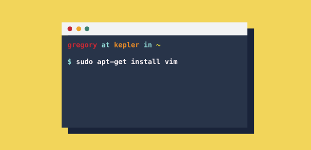
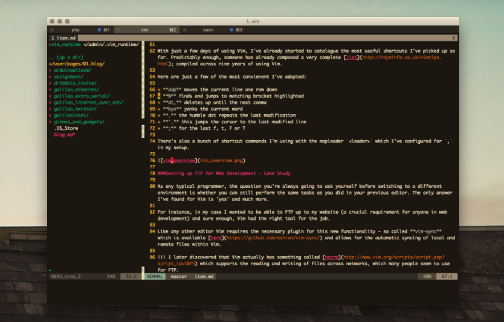
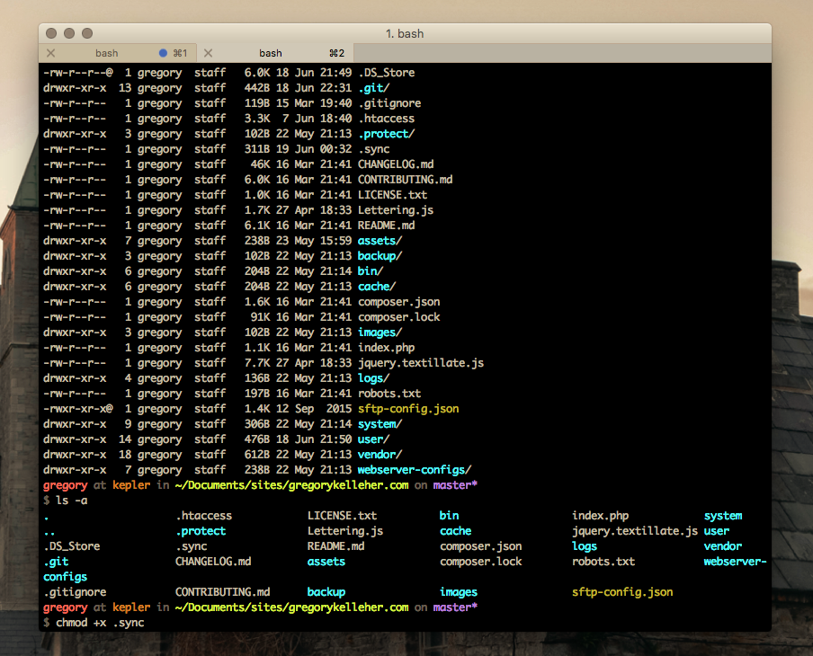
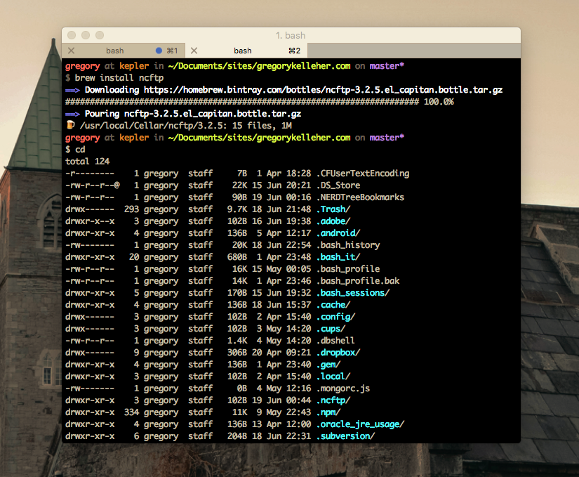

Since starting in my new job, I've been hearing more and more about 'Vim' around the office and have been curious in trying it out. I've only recently made the 'switch' but I wanted to write about what I've learnt so far and how I've adapted it for my own purposes.




===

###What is Vim and why?

Vim ('vi' IMproved) for the unacquainted, is a text editor based on the command-line interface, and hence probably looks more akin to a terminal view than any GUI text-editor you've seen before. Don't let that put you off though because you're just a step away from one of the coolest and most versatile editors out there!

So why Vim and why now? For myself like most things, I was simply curious. Lately I've been keen on boosting my prowess inside the shell and creating shortcuts in my workflow. Discovering Vim was like finding something I'd been searching for all along. 

! Please note that this is not another Vim tutorial - there's enough of those out there. Rather this is just someone else's first-hand experience of using Vim for the first time which may include something useful. 

An editor inside the terminal is just the greatest thing and honestly I spend most of my time within iTerm nowadays since discovering Vim.

!!!! Actually, on that point you can use the `:.! [command]` to execute an external bash command and dump the output into Vim. For example `:.! date` would insert the current date into your open buffer within Vim.

###Where do I start & how do things work?

Firstly, I found this quick [video](https://www.youtube.com/watch?v=_NUO4JEtkDw) super useful and it's well worth the watch. It's even the first link when you search for 'Vim' on YouTube.

There's two critical points to take away from the video that vastly improve your Vim experience.

####Remap Caps Lock to ESC

You would not believe how vital this really is. When I started, the first thing I took to disliking was the use of the ESC key. It's simply too far out of the way and awkward to reach. So change that by remapping your needless Caps Lock with [this](https://pqrs.org/osx/karabiner/seil.html.en) handy tool. 

####Speed up your Key Repeat

This is really handy, even if you're not interested in using Vim. Honestly, before changing my key repeats I had no idea how slow the default settings were. You can install [Karabiner](https://pqrs.org/osx/karabiner/) to modify the key repeats. The settings I've used and as recommended in the video are as follows:

+ Delay until Repeat: 400ms
+ Key Repeat: 25ms  

####Steal a dotfile

This is a maybe. If you feel you'd learn more from doing things yourself then I recommend just going ahead and creating your own unique `~/.vimrc` and configuring things as you learn. Since I'm lazy and overconfident I went ahead and downloaded this really nice [vimrc](https://github.com/amix/vimrc) which has most things you'd probably want. However this really throws you in the deep-end and you have to spend time figuring out how things sit together. Not impossible though. 

####Disable the arrow keys

You're not helping yourself by cheating. Keeping your hands firmly on the home-row is the one rule you must abide. I recommend disabling the arrow keys entirely by including the following in your `vimrc`:

`noremap <Up> <NOP>`
`noremap <Down> <NOP>`
`noremap <Left> <NOP>`
`noremap <Right> <NOP>`

###Some useful Vim commands

With just a few days of using Vim, I've already started to catalogue the most useful shortcuts I've picked up so far. Predictably enough, someone has already composed a very complete [list](http://rayninfo.co.uk/vimtips.html); compiled across nine years of using Vim.  

Here are just a few of the most convienent I've adopted:

+ **ddp** moves the current line one row down
+ **%** finds and jumps to matching bracket highlighted
+ **dt,** deletes up until the next comma
+ **bye** yanks the current word
+ **.** the humble dot repeats the last modification
+ **'.** this jumps the cursor to the last modified line
+ **;** for the last f, t, F or T

There's also a bunch of shortcut commands I'm using with the mapleader `<leader>` which I've configured for `,` in my setup. 



###Setting up FTP for Web Development - Case Study

As any typical programmer, the question you're always going to ask yourself before switching to a different environment is whether you can still perform the same tasks as you did in your previous editor. The only answer I've found for Vim is 'yes' and much more. 

For instance, in my case I wanted to be able to FTP up to my website (a crucial requirement for anyone in web development) and sure enough, Vim had the right tool for the job.

Like any other editor Vim requires the necessary plugin for this new functionality - so called **vim-sync** which is available [here](https://github.com/eshion/vim-sync/) and allows for the automatic syncing of local and remote files within Vim.

!!! I later discovered that Vim actually has something called [netrw](http://www.vim.org/scripts/script.php?script_id=1075) which supports the reading and writing of files across networks, which many people seem to use for FTP. 

With the previous download of Amix's vimrc, I already had [pathogen](https://github.com/tpope/vim-pathogen) installed and hence it was just a simple matter of booting up the terminal and running the following:

`
cd ~/.vim_runtime
`
`
git clone https://github.com/eshion/vim-sync/ sources_non_forked/vim-sync
`
!!! This command just clones the repo into a new folder name `vim-sync` inside the `sources_non_forked` directory.

The next step after install, according to the directions on the vim-sync Github page is to create a new executable `.sync` file in your project directory.

```bash
#!/bin/sh
if [ "upload" == $1 ];then
ncftpput -m -u login_name -p login_password -P 21 remote_host remote_path/$2 `dirname $0`/$2/$3
elif [ 'download' == $1 ];then
ncftpget -u login_name -p login_password -P 21 remote_host `dirname $0`/$2 remote_path/$2/$3 
fi
```

Inside the new `.sync` file is where you write the **execute config** for your remote host - whether for rsync, FTP, SFTP .etc. Examples are provided inside the `.README`. 

In the case of FTP, replace the following with your own details: 

* login_name
* login_password
* remote_host
* remote_path

!!! Ignore the '$' numbers - they're variables necessary for the script, you'll see see them in the output when the file is executed

However, before you try running this script there's two more steps that are required - which are unfortunately absent from the `.README`. 

Firstly, you're going to want to change the privileges for `.sync` before you can even try executing the file. Switch over to your terminal window and type the following to make it executable:

` 
chmod +x .sync
`



Another semi-obvious thing (if you've even glanced at the script) is to install [ncftpget](http://www.ncftp.com/ncftp/doc/ncftpput.html) which is the internet file transfer program used by the script.

You can do this by installing it with HomeBrew: 

`
brew install ncftp
`





After that quick setup, you should have a handy way of FTP'ing your files on the go. 

If you prefer like me, you can remap the keys so `CTRL` + `u` uploads the open buffer and `CTRL` + `d` does the download. 

The way to do this is to open up the `sources_non_forked` directory again and navigate to `sync.vim` for vim-sync. 

Open the file and insert the following at the very bottom:

`
nnoremap <C-U> <ESC>:call SyncUploadFile()<CR>
`
`
nnoremap <C-D> <ESC>:call SyncDownloadFile()<CR>
`


 
