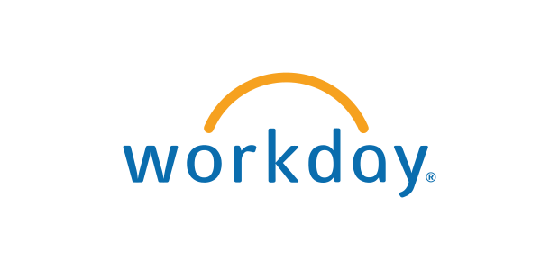
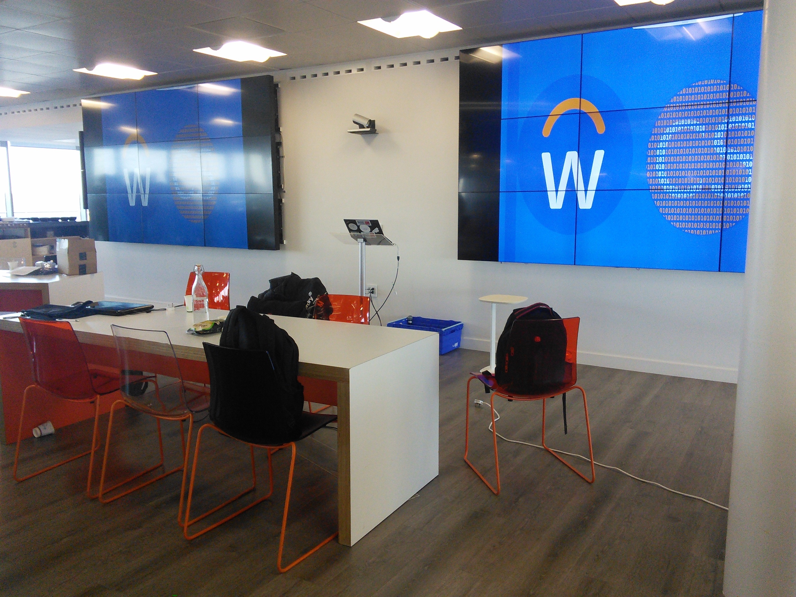

Phew! That was fun. Yesterday I was at the DIT Comp SOC hackathon held at the Workday offices in Dublin. It was an all round great experience that I wanted to share.

===

Myself and three friends joined to create our team, _The Executables_ for the day. 
It was the first hackathon for most of us and a great learning experience. We're all on placement for our 3rd year of university and we're keen to prove our chops for the day. Unfortunately, our erm... overall strategy left something to be desired.

Anyhow, the event commenced at 10:00am inside the Workday offices. Well, commenced with breakfast that is. Looking back, we lost a lot of valuable coding time to refreshments.

A short introductory presentation followed with the unveiling of the hackathon's theme: *ChatBot*. Yes, the aim of 8hrs was to design and build any kind of ChatBot and demo it at the end. Well frankly, it was more like 5hrs of solid programming - right down to the wire.

With my head still deep in x86 opcodes and C after 3 months at work, I quickly had to re-orient myself and dust off my web development environment setup.

In honesty though, I had done some light revision prior and looked over some TypeScript and Angular2 before I came. It wasn't a whole lot of good but at least I wasn't too out of sorts.

The consensus of the group was to create an RPG chatBot for Slack. How? Well, the person that shouted the loudest decided on [HuBot](https://github.com/slackapi/hubot-slack). It isn't a bad choice in fairness and you could interface with the API in either plain JavaScript or CoffeeScript. However, we overlooked a fundamental concern that compromised the team. None of us knew how to program in CoffeeScript.

This is what really let us down in the end and something we'll know for next time. Always program in a language that you've at least some experience with! I was hopelessly lost and CoffeeScript is something you just don't pick up over the space of a few hours.

!! No wonder CoffeeScript is the _third most dreaded language_ on StackOverFlow's Developer Survey 2017

With the Hackathon winding down, and with us trying to cobble together something functional in vain, we began to regret our ill-informed decisions.

Besides this, we made our presentation and survived the approximate three minutes of slight embarrassment. In the end, it was fantastic fun and we're incredibly keen to go on another hackathon despite our poor showing.

Lastly, thanks to Workday for being such great hosts and equal thanks to DIT Comp Soc for organising the event.
