A few days back I had my first look at the Intel Galileo. Since then, I've had time to cast my eye over another remarkable IoT board - the Arduino Yún.


===

On account of reviewing the Intel Galileo only a short time ago, the experience is still fresh in my mind. Whilst it's a solid board, I did encounter a few setbacks & points of contention. To name one critical defect - it's lack of built-in wifi. 
From exploring the Galileo, it urged me to conclude that any IoT board should include wifi as default to meet the minimum criteria. Otherwise, with special regard to the Intel Galileo, you end up feeling just a little bit short-changed. 

Anyhow, this post isn't about reviewing the Intel Galileo again. Yet it does pay to heed where other IoT boards fell short, on my estimates at least. Thankfully, the Arduino Yún doesn't share the same shortcomings. 

###Specifications

Measuring the same footprint as a classic Arduino Leonardo, the Yún is an IoT board packed with features. Onboard, it has an USB-A host port, micro-SD card slot, micro USB (power/prog), ethernet port (as well as a built-in wifi), alongside 20 digital input/output pins (7 of which can be used as PWM outputs and 12 being analog inputs). Another (often overlooked feature) is it's UF.L connector for an antenna.

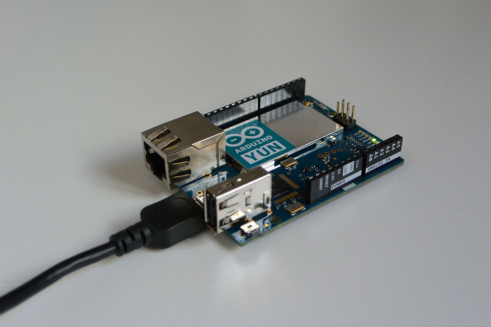

! Unlike other Arduino boards though, it doesn't come with a DC barrel jack. Neither does it come with a 5V regulator, so take care when powering it via the 5V or VIN pin.

On the topic of processors, the Yún is very similar to the leonardo, sharing the same Atmel ATmega32U4 (running at 16MHz) microprocessor. The ATmega32U4 has built-in USB communication, eliminating the need for a secondary processor. Thus, allowing the Yún to appear to a connected computer as a mouse and keyboard, as well as to a *virtual* serial / COM port. 

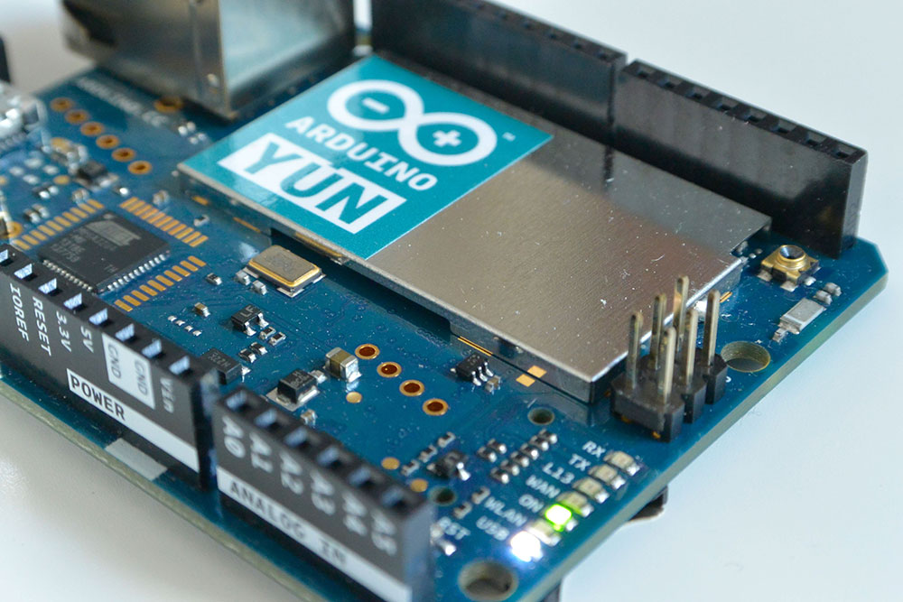

The Yún doesn't have a dedicated chip to handle serial communication, meaning that the serial port is in fact virtual - done through software. One key point to having a virtual port is that everytime you reset the 32U4 processor, the USB serial connection will be broken and re-established. 

This causes any open serial connections will drop and the board will disappear from list of serial ports. This sometimes has consequences for anything to do with driver installations, uploads, and communication.

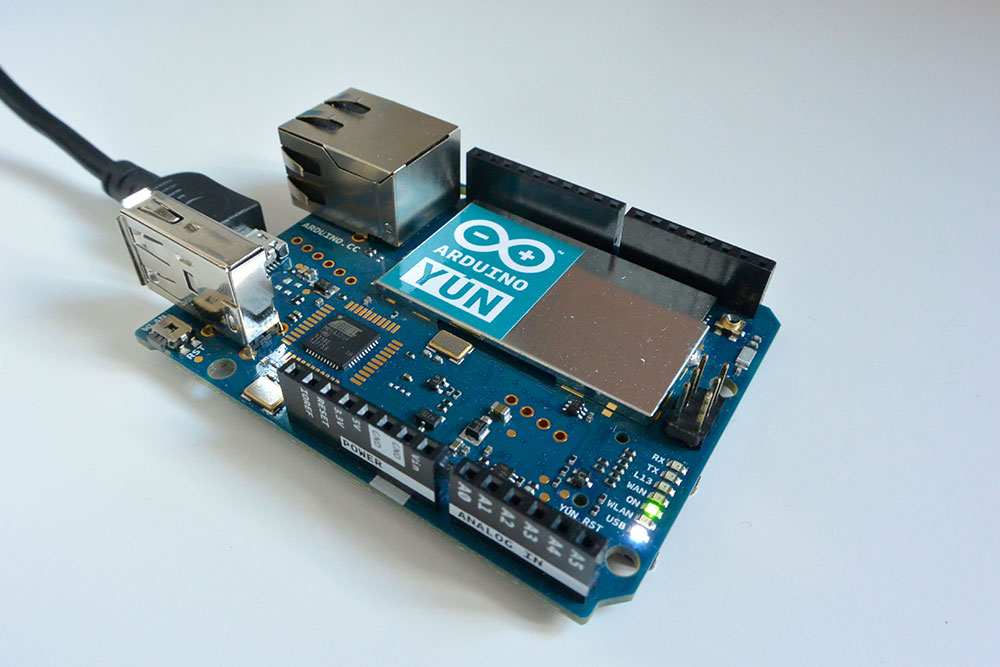

What sets the Yún apart however, is that it also comes with the Atheros AR9331 which runs OpenWrt-Yun, the embedded Linux distribution. Thus it's really two computers in one. 

!!! Note that the OpenWrt-Yun installation takes up around 9 MB of the 16 MB available on the internal flash memory. Disk space can be expanded by having an SD card inserted.

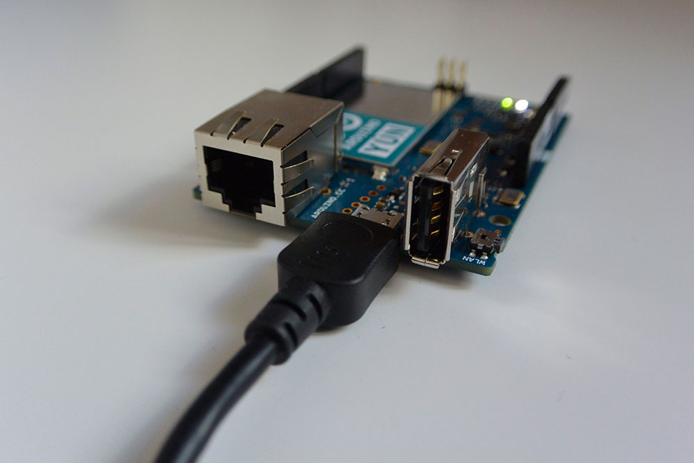

The 32-bit CPU operates at 400MHz, and is a MIPS - a RISC (reduced instruction set) architecture processor, unlike the CISC (complex instruction set) architecture of the Quark, found on the Intel Galileo. 
Onboard then, it has 64MB DDR2 (RAM) along with 16 MB of flash memory. It's also capable of doing full flavored TCP/IP networking over Ethernet & Wifi.

Lastly, it's connected to the ATmega32U4 MCU via a serial interface.

!!! Note that you're apparently dissuaded from using the Yún's built-in non-volatile memory since it only has a limited number of writes. I'll explain later how to use the µSD card instead.

One important thing to note is that the USB host, network interfaces (wifi & ethernet) and the SD card are connected to the AR9331 - not to the ATmega32U4. Instead, the bridge library enables the Arduino to interface with these peripherals.

Conveniently, the 32u4, WiFi, and AR9331 processors all have their own reset buttons. There's also plenty of onboard LED indicators - for WLAN (wifi), power, usb, RX/TX, pin 13, & WAN (ethernet).

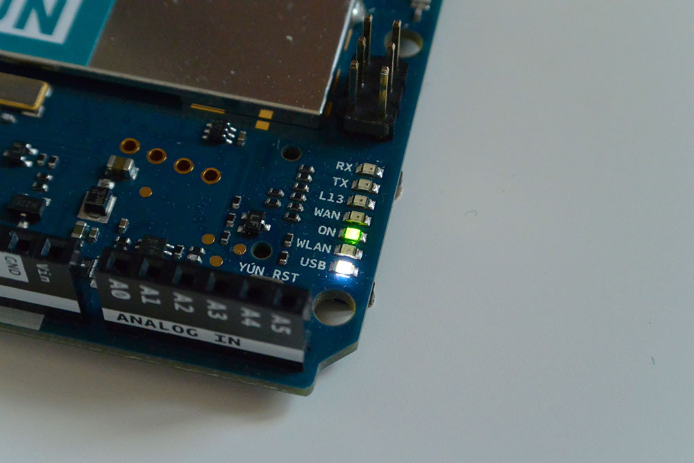

There's been quite a bit of discussion surrounding the PoE (power over ethernet) compatibility. In short, it *is* compatible with PoE power supply but it's necessary to have a PoE module mounted. The catch 22 is that there isn't a PoE module available just yet. 

!! Earlier models of the Yún with the PoE adapter were incorrectly providing the board with 12V. This has since been corrected & is in the process of being updated.

###Linux Onboard

Arguably, The Yún's greatest asset is its embedded linux distribution which sets it apart from other Arduino boards. It brings a whole new world of connectivity, offering a powerful networked computer with the ease of Arduino.

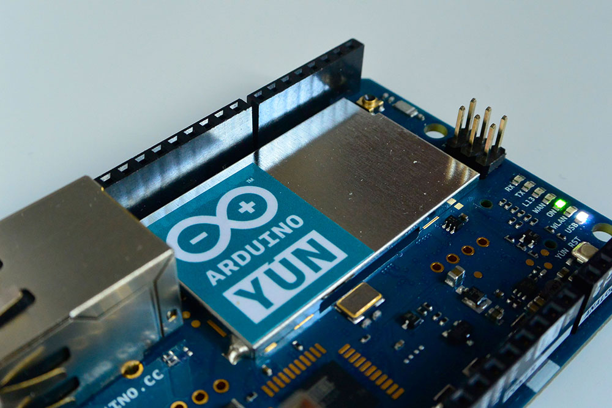

The onboard linux distribution is called OpenWrt-Yun and interfaces with the ATmega32U4 through the Bridge library, making it astonishingly easy to integrate the functionality of both processors, all within your sketch. Bridge commands from the 32U4 are interpreted by python on the Open-wrt.

This enables you to do anything from running shell scripts, communicating over wifi/ethernet, to doing Linux commands such as cURL and using python. 

Of course, much of the configuration happens through the console using SSH but there's also a web page that allows you to configure many of the different options available - at least to get started. 
You can also access configurations using the Bridge library inside a sketch.

Finally, the package manager for installing any additional software is called *opkg*.

###Getting Started 

Setting up the Yún is remarkably easy and Arduino did the right thing in making it configurable within the browser. Especially for those coming from the Uno or beginner boards and haven't had the same experience with the console. 

First step to setting up the Yún then is to supply power to the board. Simply connect using a micro-USB cable for this. You should see some of the onboard LEDs light up. 

Out of the box, the Yún doesn't know anything about your network and is setup as its own access point. You should soon the Yún appear as a wifi network called something like **ArduinoYun-XXXXXXXXXXXX**.

Go ahead then and connect to this network. Open a browser next and type: ``http://arduino.local`` or the IP address: ``192.168.240.1``.

!!! Note that the Yún is able to connect to unencrypted networks as well, including networks that support WEP, WPA, and WPA2 encryption.

Hopefully, all going well, you should come to a page asking for a password. The default password is: ``arduino`` all lowercase.

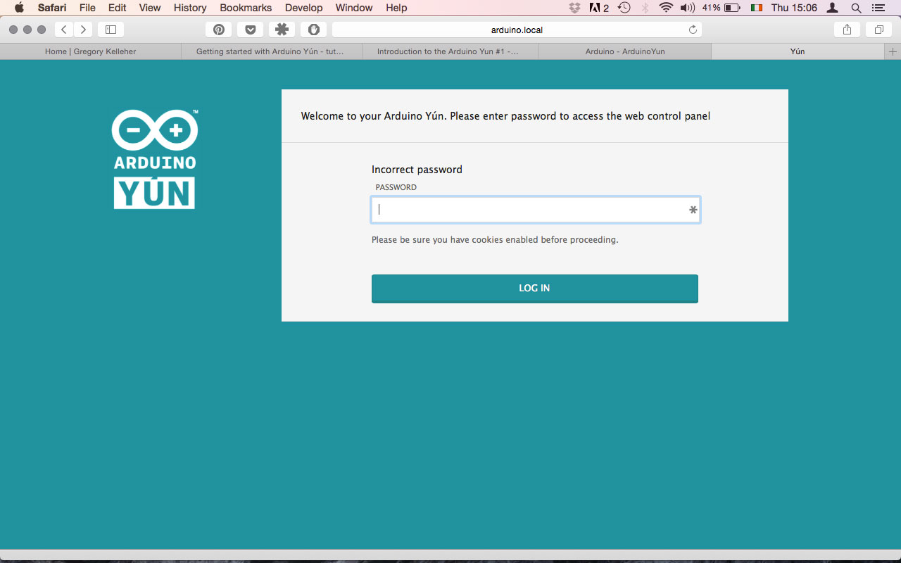

After you're in, you should reach a page showing the default configuration. This is where you'll be able to connect your Yún to your own wireless network. 

The settings are fairly straightfoward. Give your Yún a name and enter in all the necessary details to allow it connect to your network. Go ahead and save/restart once you're done. It's really just that easy. 

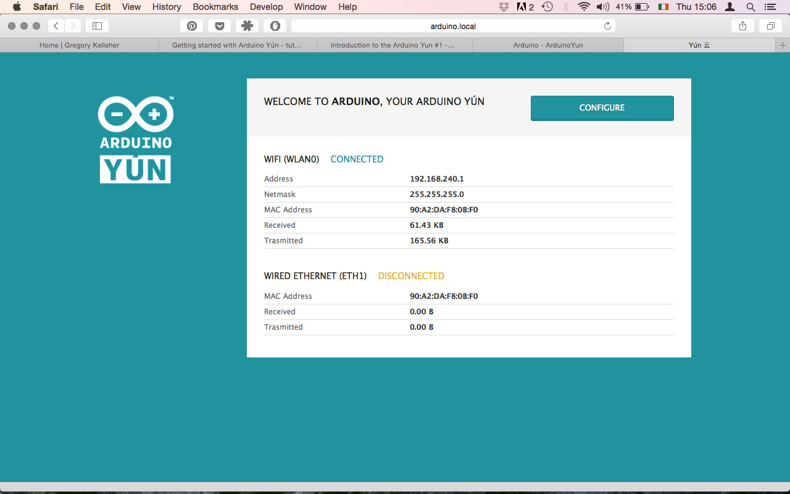

If you felt like it instead, you could always access the board through the console. The console creates a secure connection between the Yún and your computer via SSH. 

Simply go to the menu inside Arduino and look to the Bridge example folder. Load up the YunSerialTerminal sketch via serial (not WiFi), then open the serial monitor at 115200. You can also use the serial monitor as a basic command line interface for Linux using this sketch.

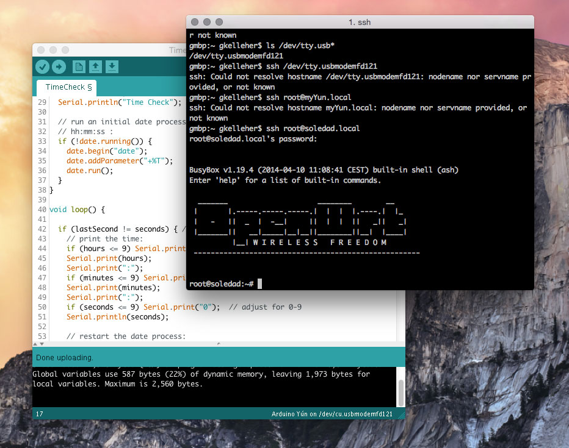

Another way is by using the terminal and typing ``ssh root@youryúnsname.local``. You should be prompted for a password before you're allowed access the linux computer. 

###Upgrading Open-Wrt

Inside the OpenWrt linux distribution you can try upgrading the linux image. First go to the download page [here](https://www.arduino.cc/en/Main/Software#toc8) and download the .zip file. Unzip the binary image file once you have it downloaded and move it onto the root directory of your SD card.

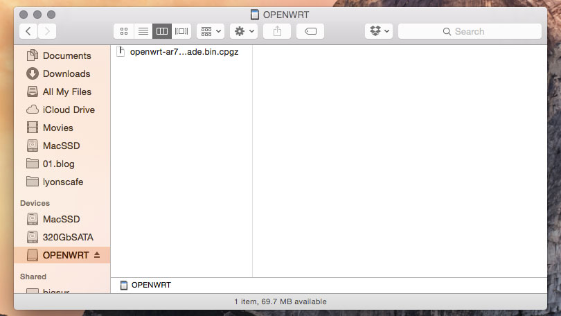

!! Note that updating the linux image will cause you to lose all of your existing files and configurations you previously had on the flash memory of the Yún.

Eject the card and slot it into your Yún. From here you can take two possible routes. One way is to do it by the web panel and the other is through the console. 

But before you upgrade, I suggest you load the YunSerialTerminal sketch I mentioned before, since other existing sketches can interfere with things and cause the Yún to freeze and not reboot during the upgrade. This in fact happened to me the first time round. 

Firstly the web panel approach is the simplest and just requires you to navigate to ``http://arduino.local`` as you did before. Log in again and scroll to the bottom. You should see some notifcation, alerting you that an upgrade image has been found. Follow the directions and reset the board. 

! This does take some time so hang tight - you should see the WLAN LED flicker a bit during the process. 

The second method is by connecting to the Yún via SSH (the approach I took) and upgrading it through the console. 

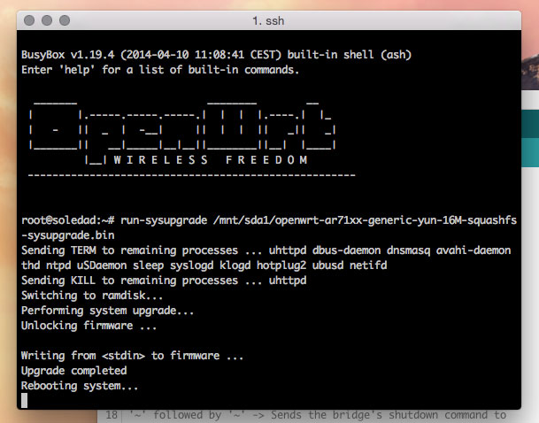

Again, do as you did before and type ``ssh root@youryúnsname.local``. Once you're in, type in: 

```bash
run-sysupgrade /mnt/sda1/openwrt-ar71xx-generic-yun-16M-squashfs-sysupgrade.bin
```
 to upgrade the linux image. You should see some feedback coming through and once it's done it should reboot itself. 

###Having some fun

Congrats! Now that all the configuration is finished you can start playing about with things. 

First thing I tried was programming through the Sublime plugin. [Stino](https://github.com/Robot-Will/Stino) if you haven't heard of it, is a plugin that enables you to program your board through the Sublime IDE. It's simply more user friendly and has more features than the default Arduino IDE. 

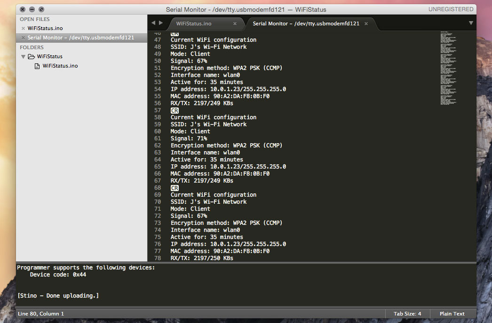

With either IDE you can go straight into the Bridge example sketches _files > examples > bridge_. 

The first one I tried was the **wifi-config** example. Load it to the Yún, open the serial monitor (at 115200) and you should see the configurations you set up initially. 

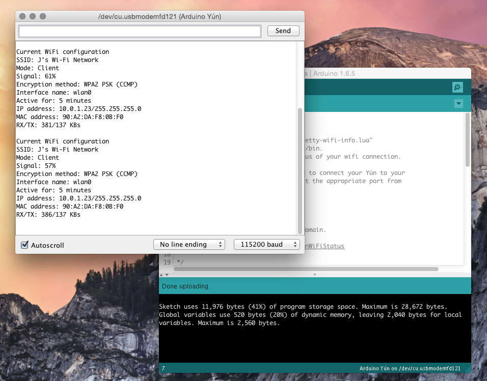

Next sketch I tried was to test the wifi strength. That's simply _files > examples > bridge > ShellCommands_

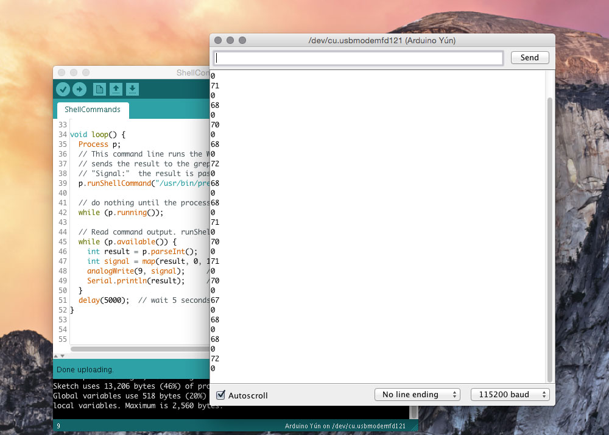

Or how about some ASCII art? That's _files > examples > bridge > bridge_

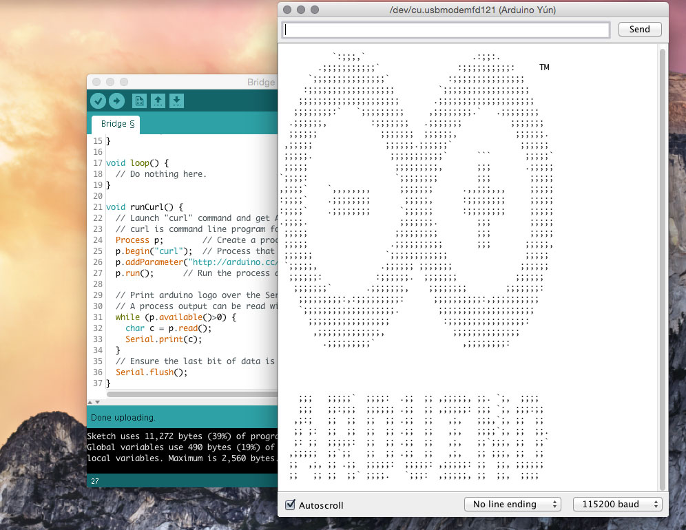

###Temboo

Lastly, you can also get weather reports from Yahoo through an online platform service called [Temboo](https://temboo.com/arduino/yun/). I haven't mentioned it yet but it's a great feature included with the Yún. It gives you access to over 100 APIs that you can integrate within your sketches, also allowing you to mix & match data coming from multiple platform - if you're feeling adventurous. 

There's a number of examples already included in the temboo folder inside Arduino: _files > examples > bridge > temboo_. 

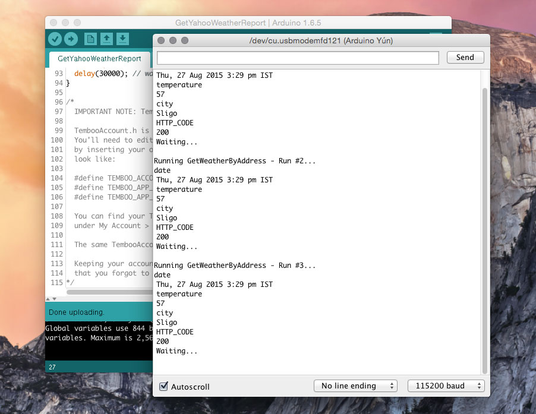

Above is the Yahoo weather report example, feeding back data through the serial monitor. Pretty cool if you ask me. 

###Conclusion

To put it simply, the Yún is the most exciting Arduino board I've ever used. It's brimming with possibilities and opportunities. For a complex board that includes a linux machine, network capabilites .etc, Arduino have made it incredibly simple to get started - right out of the box. That hasn't exactly been the case with other IoT boards I've explored in the past...

Others will always argue that other boards such as the Raspberry Pi, Beagleboard, PCduino, Redboard Photon, Intel Galileo .etc have so many more capabilites - and rightfully they do. Some even have great Arduino interfacing & have the same header layout for shields. 

However, in my opinion the Yún offers the easiest way for a novice to enter the world of IoT. The Yún is also unique in that it is designed and build by Arduino and has the best interface with the Arduino platform. 


There really isn't any work-arounds to consider when using it and it's designed for ease of use. The Arduino team really seemed to have known what they were doing when they built this board and the documentation, tutorials, resources .etc are spot on. 

In addition to all that, the bridge library does a seamless job in linking the AVR side of things to the Linux machine, and is the Yún's crowning feature in my mind. 

As a final word, I feel I can conclude by saying that the Yún has impressed me on all accounts and I certainly feel I can recommend it to those that might be considering breaking into IoT into the future. It's a sound & capable little board that deserves some attention.
